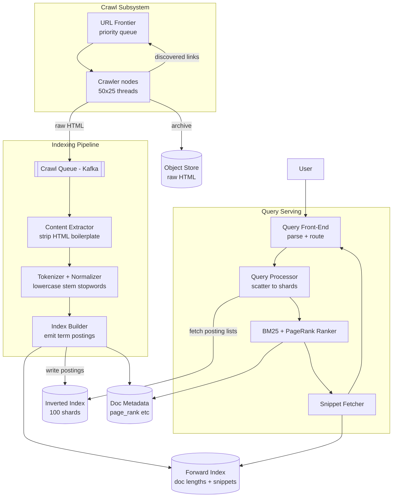

## Capacity Estimation

Start from the requirement numbers and derive everything else. Show the arithmetic so the interviewer sees the reasoning.

### Traffic

| Metric | Calculation | Result |
|---|---|---|
| Avg search QPS | 10B searches/day ÷ 86,400 s | **~115,000 QPS** |
| Peak search QPS (3× burst) | 115,000 × 3 | **~345,000 QPS** |
| Pages crawled per second | 100M pages/day ÷ 86,400 s | **~1,160 pages/s** |
| Index writes | 1,160 pages/s through pipeline stages | **~1,200 docs indexed/s** |

### Storage

| Component | Calculation | Result |
|---|---|---|
| Raw HTML (object store) | 10B docs × 100 KB avg | **1 PB** |
| Extracted text corpus | 10B docs × 10 KB avg | **100 TB** |
| Doc→URL mapping | 10B entries × 100 B | **1 TB** |
| Forward index (doc length + snippet text) | 10B docs × 200 B | **2 TB** |
| Posting list — raw | 10B docs × 500 unique terms/doc × 12 B/posting | **60 TB** |
| Posting list — compressed (8× via delta + varint) | 60 TB ÷ 8 | **~8 TB** |
| PageRank scores | 10B docs × 8 B | **80 GB** |
| Link-graph edges | ~100B edges × 16 B | **~1.6 TB** |

The **8 TB compressed inverted index** is the hot core. Spread across 100 shards it is ~80 GB per shard — fitting in the RAM of a single 256 GB server. This is the key insight that makes sub-100 ms queries possible: the posting lists are served from memory, not disk.

### Memory — Hot Index Tier

| Item | Calculation | Result |
|---|---|---|
| Compressed index per shard (80 GB × 100 shards) | holds all 10B docs | **8 TB total** |
| Hot in-memory segment (last 24 h, 100M new docs) | 100M × 500 terms × 3 B delta | **~150 GB across cluster** |
| Query result cache (top 1M queries × 2 KB) | popular queries cached entirely | **~2 GB per region** |

### Derived Infrastructure

- **Query-serving nodes:** 345K peak QPS ÷ 1,000 QPS/node = 345; provision **400 nodes** with headroom.
- **Index shards:** 100 primary shards, each with 2 replicas → **300 index-server instances**.
- **Crawler nodes:** 1,160 pages/s, each requiring ~1 s (DNS + TCP + fetch) = ~1,200 concurrent connections → **50 crawler nodes** × 25 threads.
- **Indexing pipeline workers:** 1,200 docs/s of CPU-heavy text processing → **40–60 pipeline workers**.
- **Object storage:** 1 PB raw HTML — see {}.

## API Design

The external API is deliberately narrow; all complexity is hidden behind it.

```
GET /search?q=<query>&page=1&size=10&lang=en
  200 → {
    "query": "machine learning tutorial",
    "corrected_query": null,
    "total_hits": 84_000_000,
    "took_ms": 73,
    "results": [
      { "rank": 1, "url": "...", "title": "...", "snippet": "..." },
      ...
    ],
    "next_page_token": "<opaque cursor>"
  }
  400 → empty or malformed query
  429 → rate-limited

GET /suggest?q=<prefix>&size=5
  200 → { "suggestions": ["machine learning", "machine learning tutorial", ...] }

POST /index    (internal, authenticated — used by the indexing pipeline)
  Body: { "url": "...", "raw_html": "<html>..." }
  202 → accepted for async processing
  409 → URL already indexed with identical content hash (no-op)
```

Pagination uses **cursor tokens** rather than numeric offsets. Offset-based pagination (`LIMIT N OFFSET K`) requires scoring all K earlier results on every page turn, which is prohibitively expensive at 345K QPS. Cursor tokens encode shard-level resume positions. See {}.

## Data Model

Each entity maps to a store optimised for its access pattern.

```
document                           -- metadata store (wide-column, keyed by doc_id)
  doc_id          BIGINT    PK
  url             TEXT      UNIQUE
  content_hash    BYTES(20)        -- SHA-1; skip re-index if unchanged
  fetch_ts        TIMESTAMP
  index_ts        TIMESTAMP
  page_rank       FLOAT
  lang            CHAR(8)

forward_doc                        -- scoring / snippet store (compressed columnar)
  doc_id          BIGINT    PK
  doc_length      INT              -- token count, needed for BM25 normalisation
  title           TEXT
  snippet_text    TEXT             -- first ~400 chars of extracted body text

link_edge                          -- web graph (flat files in object storage)
  from_doc_id     BIGINT
  to_doc_id       BIGINT
  -- consumed by batch PageRank job; no OLTP access
```

The **inverted index** is not a traditional database table. It lives in purpose-built segment files (see [Indexing Deep Dive]({})):

```
Dictionary (in memory):   term (string) → (byte offset, length) in postings file
Postings file (on disk):  delta-encoded doc_id list + freq + positions per term
```

## High-Level Architecture — v1

### Level 0 — Context


### Level 1 — First-Cut Components



**Component responsibilities and first-order justifications:**

- **URL Frontier.** A priority queue of pending URLs, ordered by crawl priority (PageRank of the page, staleness, discovery time). It enforces per-domain politeness (robots.txt, crawl-delay header). Without it the crawler would hammer the same popular sites repeatedly.
- **Crawler / Fetcher.** Stateless workers: resolve DNS, open TCP, fetch HTML, extract links back into the frontier. Statelessness allows horizontal scaling; 50 nodes × 25 threads covers our 1,160 pages/s budget.
- **Crawl Queue (Kafka).** Decouples the I/O-bound crawl step from the CPU-bound indexing pipeline. Acts as a durable buffer so a pipeline slowdown never stalls crawling. See {}.
- **Content Extractor → Tokenizer → Index Builder.** The three-stage pipeline: strip HTML tags and boilerplate (ads, navigation); tokenise body text, lowercase, remove stop-words, apply stemming; emit `(term, doc_id, freq, positions[])` postings into the inverted index.
- **Inverted Index Shards.** The latency-critical serving store. All 8 TB compressed fit in RAM across 300 index-server instances (100 shards × 3 replicas). Detail on the [Indexing Deep Dive]({}).
- **BM25 + PageRank Ranker.** Computes a final relevance score per candidate document. Detail on the [Ranking Deep Dive]({}).
- **Object Store.** Archives raw HTML for re-processing without re-crawling — essential when the indexing schema changes. See {}.

The most important weaknesses of v1 — crawl deduplication, the exact structure of the inverted index, how to shard it, and how to update it without downtime — are the focus of the [Indexing Deep Dive]({}). Scoring accuracy and caching are on the [Ranking Deep Dive]({}).
