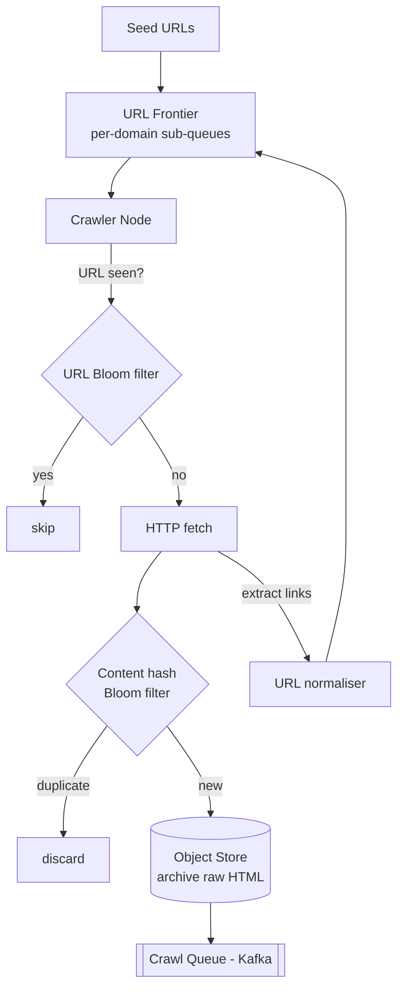
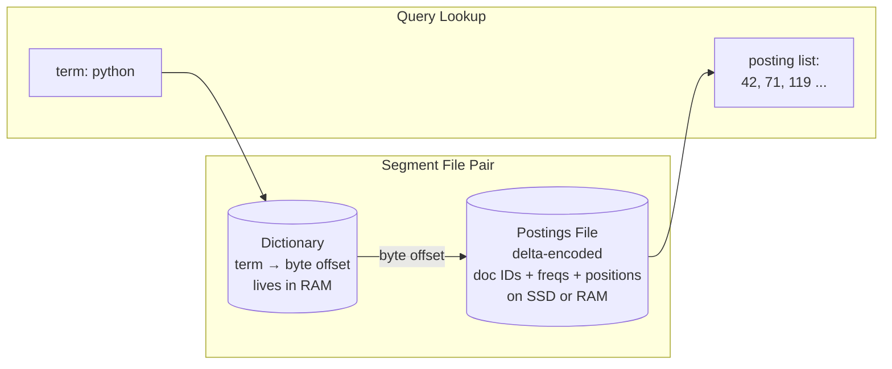
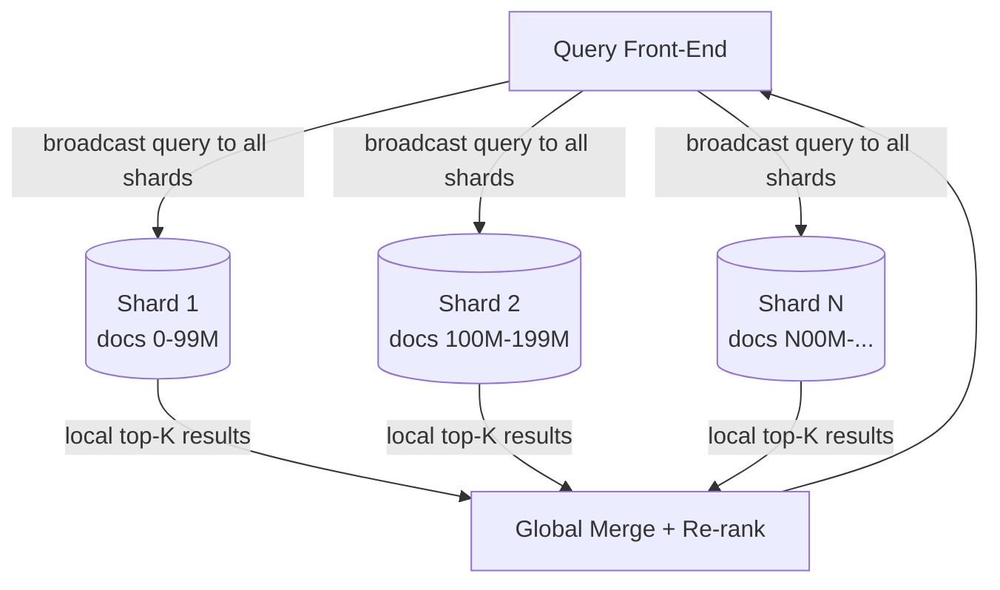
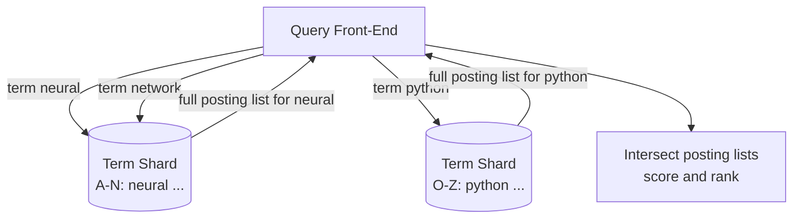
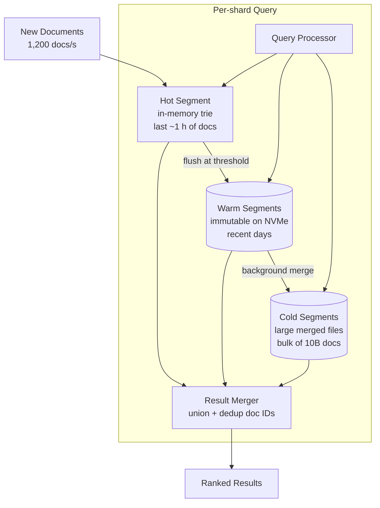
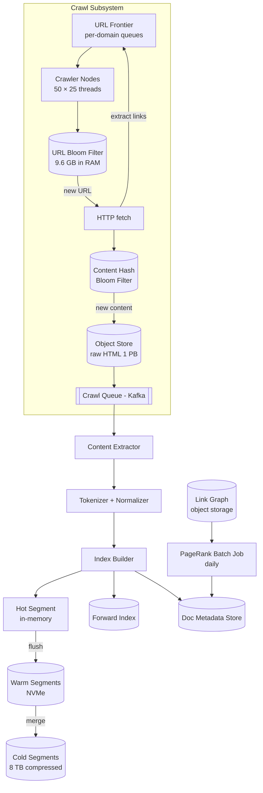

We evolve the indexing pipeline by attacking each weakness in turn: **Problem → Modification → Justification**. Each refinement carries its own diagram.

## Refinement 1 — Crawl Deduplication and Politeness

**Problem.** The v1 crawler fetches every URL in the frontier, but the same content appears at many URLs (HTTP vs HTTPS, `www` vs bare domain, query-param variants, syndicated articles). Re-indexing identical content wastes pipeline capacity and bloats the index. Aggressive crawling also violates robots.txt and causes the crawler to be blocked.

**Modification.** Three-layer deduplication:

1. **URL normalisation:** canonicalise URLs before enqueueing (strip tracking params, resolve redirects, choose canonical from `<link rel="canonical">`).
2. **URL-seen Bloom filter:** a Bloom filter of all crawled URLs prevents re-fetching. At 10B URLs, a 1% false-positive filter needs ~9.6 GB — fits in the RAM of each crawler coordinator.
3. **Content-hash deduplication:** after fetch, compute SHA-1 of the response body; check a second Bloom filter of seen hashes. Identical content (mirrors, scrapers) is discarded before the indexing queue.

Politeness is enforced by a **per-domain queue** inside the frontier. Each domain gets its own sub-queue with a configurable delay between requests (default: 1 request per second per domain), honouring `Crawl-delay` in robots.txt.



**Justification & trade-offs.**
- Two Bloom filters (one for URLs, one for content hashes) catch different duplication vectors. See {} for the maths.
- False positives in the URL filter cause a real page to be skipped — rare (1% FPR) and acceptable; the page will be re-discovered on the next crawl cycle.
- Per-domain sub-queues are a simple priority-queue-of-queues pattern; domain priority can be adjusted by inserting domains at different priority levels (popular/fresh domains get higher priority).

## Refinement 2 — Inverted Index Structure

**Problem.** v1 describes "index builder emits postings" but says nothing about the physical structure of the inverted index. The structure determines lookup latency, compression ratio, and update cost.

**Modification.** The inverted index is stored as two files per segment — a **dictionary** and a **postings file** — in the style of Apache Lucene:

```
Dictionary (loaded into memory):
  "neural"   → offset=0,    length=2.1 MB   # large posting list
  "network"  → offset=2.1M, length=1.4 MB
  "python"   → offset=3.5M, length=890 KB
  ...

Postings file (on SSD / RAM):
  Offset 0: [doc:42 freq:5 pos:[3,17,102,441,899],
              doc:71 freq:2 pos:[1,55],
              doc:119 freq:8 pos:[...]
              ...]       ← delta-encoded and VarInt-compressed
```

**Delta encoding** reduces storage dramatically. Instead of storing raw doc IDs (which can be up to 10B), we store the *gap* between consecutive IDs in a sorted posting list:

```
Raw posting:     [42,   71,   119,  300,  301,  500000]
Delta-encoded:   [42,   29,   48,   181,  1,    499700]
VarInt bytes:    [1B,   1B,   1B,   2B,   1B,   3B    ]
vs. raw 8B each: 9 bytes total vs 48 bytes — 5× compression
```

Additional PFOR-delta (Patched Frame Of Reference) block coding achieves 8–10× compression overall.



**Justification & trade-offs.** Keeping the dictionary in memory and postings on fast storage gives O(1) dictionary lookup plus sequential I/O for the posting list — ideal for both point lookups (single-term queries) and merge-based multi-term queries. This is the same layout used by Elasticsearch and Solr (both built on Lucene). Compare with {} for the broader context.

The posting list is sorted by doc ID, which makes **intersection** (AND queries) a linear-time sorted merge — the most common operation at query time.

## Refinement 3 — Distributed Index Sharding

**Problem.** 8 TB of inverted index cannot fit on a single machine, and no single server can handle 345K QPS. We must partition the index across machines.

**Two partitioning schemes — choose one (or both):**

### Document Partitioning (preferred)

Each shard holds the **complete inverted index** for a *subset of documents*. Shard 1 indexes docs 0–99M, Shard 2 indexes docs 100M–199M, etc.



**Trade-offs:** Every query fans out to all shards (scatter/gather). Each shard scores only its own documents, so each shard needs access to global IDF statistics (sent with the query or pre-computed). Adding a new shard only requires re-indexing a subset of documents. This is the approach used by Google, Elasticsearch, and most production systems. See {}.

### Term Partitioning (alternative)

Each shard owns the **complete posting list** for a *subset of terms*. Shard A-M holds all postings for terms beginning A–M; Shard N-Z holds the rest.



**Trade-offs:** A query only hits the shards that hold its query terms — no scatter to all N shards. But popular terms (e.g. "the", "is") create massive **hotspot shards** — see {}. Adding documents requires updating posting lists across many shards simultaneously, complicating consistency. In practice, document partitioning is almost universally preferred for web-scale search.

**Shard assignment** with {} ensures that adding or removing shard nodes only remaps a fraction of document IDs.

## Refinement 4 — Near-Real-Time Index Freshness

**Problem.** Rebuilding the full inverted index from scratch takes hours (or days at 10B doc scale). But our SLO requires new pages to appear in results within 4 hours. We need a way to add new documents without touching the bulk of the existing index.

**Modification.** A **tiered index** — modelled on LSM-tree segment compaction (see {}) — with three tiers:

1. **Hot segment (in-memory):** newly indexed documents land here. Write-optimised; the in-memory trie/hash map of postings is rebuilt as each document arrives. Serves queries in parallel with cold segments.
2. **Warm segments (on-disk, recent):** when the hot segment exceeds a size threshold (e.g. 1 GB) it is flushed to disk as an immutable segment file. Recent days' segments live here on fast NVMe.
3. **Cold segments (on-disk, bulk):** background merge jobs combine many small warm segments into fewer large ones, improving query performance (fewer segment files to union) and reclaiming space from deleted documents.



**Justification & trade-offs.** A query fans out to all tiers simultaneously and the results are unioned — a document appearing in multiple tiers (updated since last cold merge) keeps the newest version by timestamp. This mirrors how [LSM-trees]({}) handle compaction and reads. The freshness SLO (4 hours) is easily met: new docs land in the hot segment within seconds. Trade-off: more segment files = more I/O per query; tuning merge aggressiveness balances write amplification vs. query fan-out cost.

The pipeline is event-driven end-to-end, fitting the [batch vs. streaming]({}) pattern: crawling and initial indexing are streaming; PageRank computation is a periodic batch job over the link graph.

## Final Architecture — Indexing



## Drill-Down

### Indexing Pipeline — Step by Step

**1. Content Extraction.** Strip HTML tags, navigation, ads (heuristic DOM-tree pruning). Extract: title (from `<title>`), body text, meta-description, outbound links.

**2. Tokenisation.** Split on whitespace and punctuation. Lowercase. Apply language-specific stemming (Porter stemmer for English: "running" → "run"). Remove stop-words ("the", "is", "a") — they appear in every document and bloat posting lists without adding discriminative value.

**3. Posting Emission.** For each remaining token, emit `(term, doc_id, term_frequency, [positions])`. Positions allow phrase queries ("machine learning" as an exact phrase) and proximity scoring.

**4. Index Build.** Sort all emitted tuples by `(term, doc_id)`. Group by term; delta-encode doc_id within each group; VarInt-compress positions; write to the segment's postings file. Build the in-memory dictionary (term → file offset). This external sort scales to arbitrary corpus sizes regardless of RAM — see {}.

### Segment Merge Algorithm

```python
def merge_segments(input_segments, output_segment):
    # N-way merge over sorted dictionaries
    heap = []
    for seg in input_segments:
        it = seg.term_iterator()
        term = next(it, None)
        if term:
            heapq.heappush(heap, (term, it, seg))

    while heap:
        min_term, it, seg = heapq.heappop(heap)
        # Collect postings for min_term from ALL segments
        all_postings = []
        for s in input_segments:
            if s.has_term(min_term):
                all_postings.extend(s.get_postings(min_term))
        # Sort merged postings by doc_id, delta-encode, write
        all_postings.sort(key=lambda p: p.doc_id)
        output_segment.write_term(min_term, delta_encode(all_postings))
        # Advance the iterator for the segment we popped
        next_term = next(it, None)
        if next_term:
            heapq.heappush(heap, (next_term, it, seg))

    output_segment.finalize()
    atomically_replace(input_segments, output_segment)
```

Deleted documents are marked with a **tombstone bitmap** per segment; the merge step omits tombstoned doc IDs, physically reclaiming space.

### Data Structures

| Structure | Where | Why |
|---|---|---|
| **Bloom filter** (URL + content hash) | Crawler dedup | O(1) set-membership; 9.6 GB for 10B URLs at 1% FPR |
| **Priority queue of sub-queues** | URL Frontier | Per-domain politeness; O(log D) enqueue/dequeue |
| **Delta + VarInt + PFOR** | Posting list compression | 8–10× compression of sorted doc ID gaps |
| **In-memory hash map / trie** | Hot segment | O(1) term lookup, supports concurrent appends |
| **Min-heap** | Segment merge | N-way sorted merge in O(P log N) where P = total postings |
| **LSM-tree-style tiered segments** | Index freshness | Absorb writes without mutating immutable cold data |

### Crawl Scale — Edge Cases

- **Crawler traps:** Infinite-URL generators (calendars, search facets). Detected by URL depth limit (max 6 hops from seed) and per-domain URL count cap.
- **Robots.txt:** Fetched and cached per domain; honour `Disallow` and `Crawl-delay`. Stale robots.txt re-fetched every 24 hours.
- **DNS amplification:** Each crawler node maintains a local DNS cache (5-minute TTL) to avoid hammering resolvers at 1,160 fetches/s.
- **Large pages:** HTML pages > 5 MB are truncated before indexing. Binary content (PDFs, DOCs) handled by separate extractor plugins.
