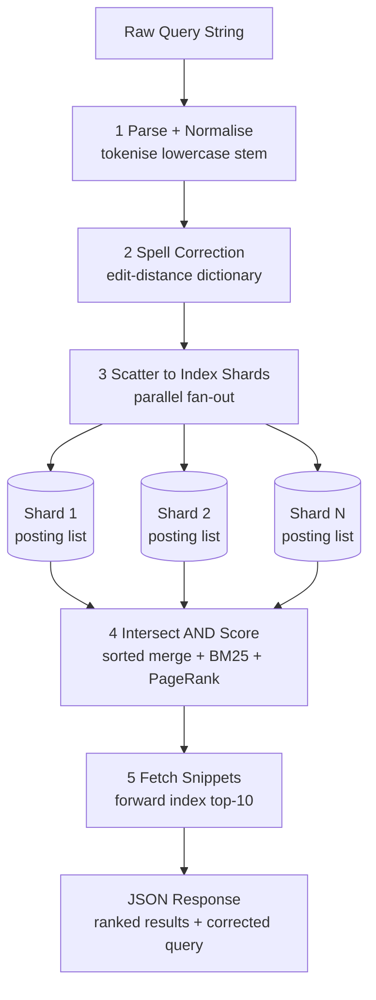
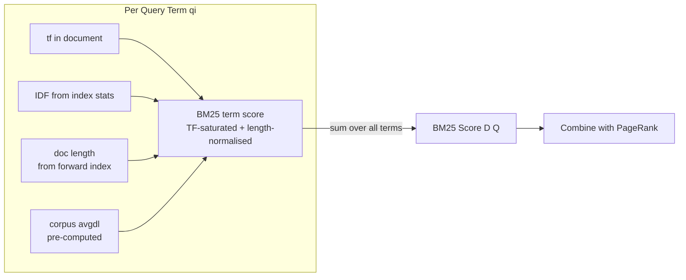
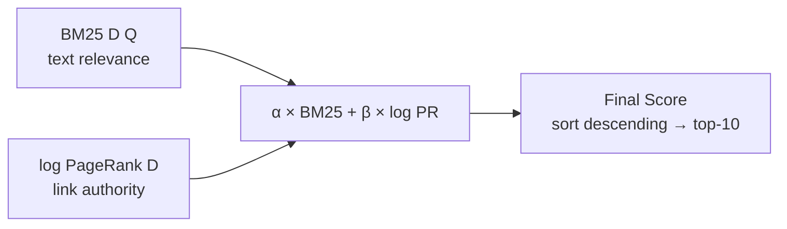
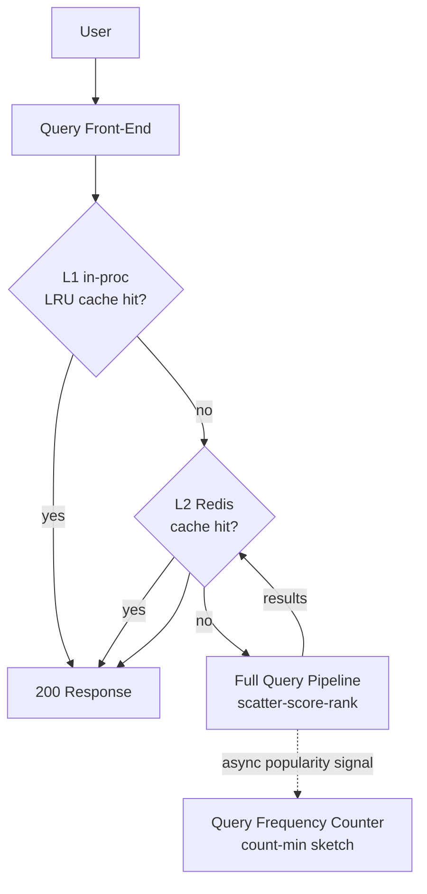
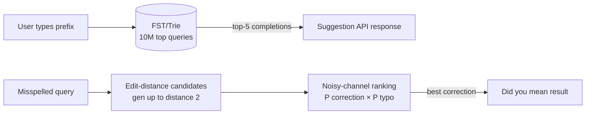
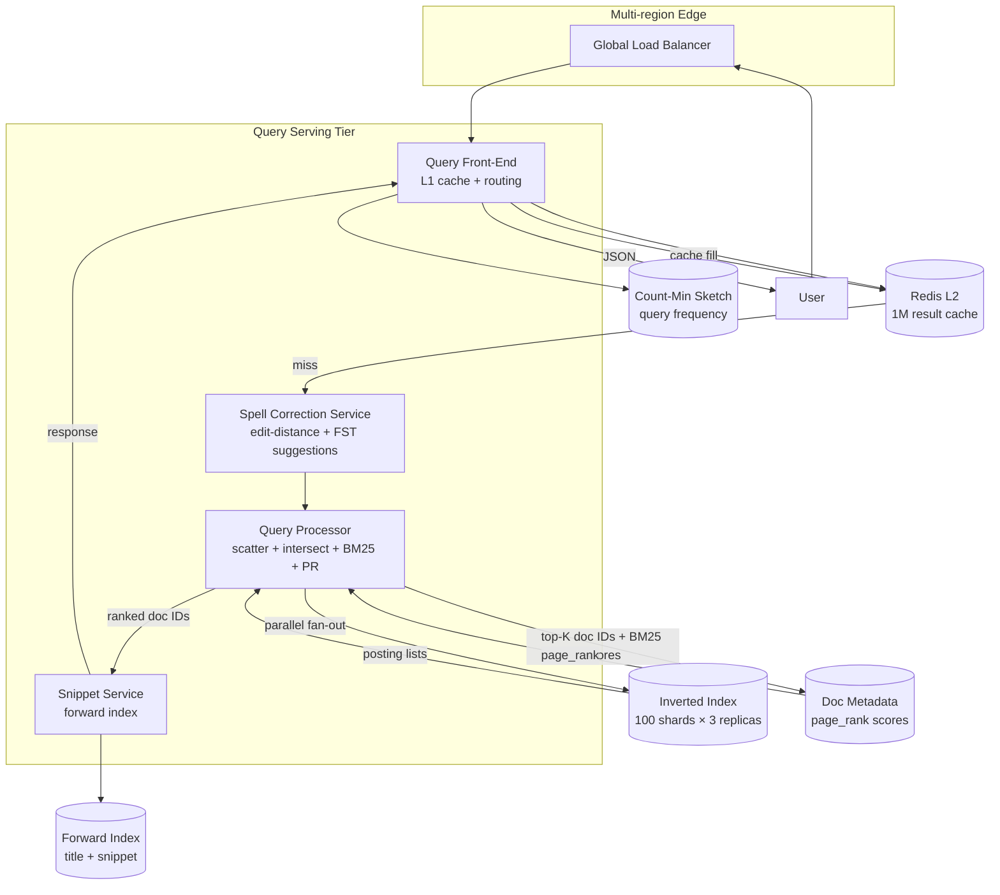

With the indexing infrastructure established, we now evolve the query-serving path: **Problem → Modification → Justification**. Each step carries its own diagram.

## Refinement 1 — Query Processing Pipeline

**Problem.** The v1 "Query Processor" is a black box. A 345K QPS serving system needs a precise, latency-budgeted pipeline that is fault-tolerant and observable.

**Modification.** Break query serving into five explicit stages, each with a hard latency budget:

| Stage | Budget | Action |
|---|---|---|
| Parse + Normalise | < 1 ms | Tokenise, lowercase, stem query terms; detect language |
| Spell-correct | < 5 ms | Check query against dictionary; generate correction candidates |
| Scatter — fetch posting lists | < 30 ms | Parallel fan-out to all index shards; each returns its local posting list |
| Intersect + Score | < 40 ms | Sorted merge (AND) or union (OR); compute BM25 + PageRank per candidate |
| Fetch snippets + Respond | < 20 ms | Pull title + snippet from forward index for top-10 docs; assemble response |

Total budget: ~100 ms p50, 200 ms p99.



**Justification & trade-offs.** Fixing a stage budget forces discipline: if spelling correction takes 40 ms (e.g. expensive neural spell check), it blows the p99 budget. Cheap edit-distance matching (stage 2) is good enough for the common case; heavier ML correction can run asynchronously and populate a suggestion cache. The scatter step uses a **deadline-propagation** pattern: shards that haven't responded within 25 ms are abandoned and the query is answered with partial results — better to return 90% of results in 100 ms than 100% in 300 ms.

## Refinement 2 — BM25 Scoring

**Problem.** A naive term-frequency ranker rewards documents that simply repeat query terms many times (keyword stuffing) and unfairly penalises long documents.

**Modification.** Use **BM25** (Okapi BM25), the standard probabilistic relevance model:

```
BM25(D, Q) = Σ  IDF(qi) × [ tf(qi, D) × (k1 + 1) ]
             i          ──────────────────────────────────────────
                        [ tf(qi, D) + k1 × (1 − b + b × |D|/avgdl) ]

where:
  IDF(qi) = log( (N − n(qi) + 0.5) / (n(qi) + 0.5) + 1 )
  tf(qi, D)   = frequency of term qi in document D
  |D|         = document length in tokens
  avgdl       = average document length across the corpus
  N           = total number of documents in the index
  n(qi)       = number of documents containing term qi
  k1 ∈ [1.2, 2.0]   — term frequency saturation (higher = more TF weight)
  b  = 0.75          — document length normalisation (0 = no normalisation)
```

**What BM25 solves:**
- **TF saturation:** the `(k1 + 1)` numerator grows sub-linearly with term frequency — the 100th occurrence of "python" contributes far less than the 1st. This defeats keyword stuffing.
- **Length normalisation:** the `b × |D|/avgdl` term penalises long documents that happen to contain the query term in a sea of unrelated text.
- **IDF:** rare terms contribute more to the score than common ones. "Python" in a document is more signal than "the".



**Justification & trade-offs.** BM25 parameters `k1` and `b` are tuned offline using labelled relevance data (human raters). `k1=1.5, b=0.75` are reasonable defaults. BM25 is purely text-signal — it does not account for the authority of the page. That's PageRank's job.

## Refinement 3 — PageRank Authority Score

**Problem.** BM25 ranks pages by how well their *text* matches the query, but a spammy page with optimised keyword density can outrank a authoritative reference. We need a query-independent quality signal derived from the link graph.

**Modification.** Add **PageRank** — a batch-computed per-document authority score derived from the web link graph. Because no concept page exists for PageRank, we explain it fully here.

### The Random-Surfer Model

Imagine a user browsing the web at random. They start on a random page and, at each step, they either:
- With probability **d** (damping factor, typically **0.85**): follow a uniformly random outgoing hyperlink.
- With probability **(1 − d)**: teleport to a completely random page in the web graph.

The **PageRank of a page A** is the long-run probability that this random surfer is on page A at any given moment. Highly-linked authoritative pages have high probability; isolated or spammy pages have low probability.

### Iterative Formula

```
PR(A) = (1 − d) / N  +  d × Σ  PR(B) / L(B)
                             B → A

where:
  N    = total number of pages
  B    = every page that has a hyperlink pointing to A
  L(B) = number of outgoing links from page B
  d    = damping factor (0.85)
```

The `(1 − d)/N` term ensures every page gets a baseline probability (the teleportation component), which also prevents **dangling nodes** (pages with no outgoing links) from being black holes that absorb rank without redistributing it.

### Power Iteration (Pseudocode)

```python
def compute_pagerank(graph, N, d=0.85, max_iter=100, tol=1e-6):
    # Initialise: uniform distribution over all pages
    PR = {node: 1.0 / N for node in graph.nodes()}

    for iteration in range(max_iter):
        new_PR = {}
        dangling_sum = sum(PR[n] for n in graph.dangling_nodes()) / N

        for node in graph.nodes():
            # Teleportation baseline + dangling redistribution
            rank = (1.0 - d) / N + d * dangling_sum
            # Accumulate rank from in-linking pages
            for predecessor in graph.in_neighbors(node):
                rank += d * PR[predecessor] / graph.out_degree(predecessor)
            new_PR[node] = rank

        # Check convergence: L1 norm of delta < tolerance
        delta = sum(abs(new_PR[n] - PR[n]) for n in graph.nodes())
        PR = new_PR
        if delta < tol:
            break   # typically converges in 50–100 iterations

    return PR  # PR[node] ∈ (0, 1), sums to 1
```

**At 10B page scale**, this is a distributed MapReduce or Spark job run over the link graph stored in object storage. Each iteration is a full graph traversal. With 100B edges, one iteration costs ~1.6 TB of I/O. Running 50 iterations daily at off-peak hours is feasible. Scores are written back to the document metadata store and read at query time.

### Combining BM25 and PageRank

Both scores are combined into a single final score. Because PageRank values span many orders of magnitude (top pages may score 1000× median), we log-transform before combining:

```
final_score(D, Q) = α × BM25(D, Q)  +  β × log(PR(D) + ε)

typical values:  α = 1.0,  β = 0.5,  ε = 1e-9  (avoid log(0))
```

The weights α and β are tuned per query type:
- **Navigational queries** (e.g. "youtube") → increase β (PageRank dominates; the user wants the official page).
- **Informational queries** (e.g. "how does a transformer work") → increase α (text relevance matters more; many authoritative pages exist).



**Justification & trade-offs.** PageRank is a global, query-independent signal computed once per day — cheap at query time (a single float lookup per candidate doc). Its major weakness is **link manipulation**: buying backlinks artificially inflates PR. Production engines add spam-detection heuristics (trust rank, topic-sensitive PR) on top of vanilla PageRank. The log-transform prevents a single extremely high-PR page from dominating every query.

## Refinement 4 — Caching Popular Queries

**Problem.** Trending queries (breaking news, seasonal events) can spike to 10× average QPS for the same query string. Re-running the full ranking pipeline on each identical request wastes 100 ms of compute per request unnecessarily.

**Modification.** A **two-tier query result cache** in front of the query processor:

1. **L1 — per-node in-process LRU cache:** top 10K queries by local frequency; hit returns in < 1 ms with zero network.
2. **L2 — distributed Redis cache:** 1M cached result sets × 2 KB avg = ~2 GB; TTL = 60–300 s depending on query freshness requirements.

Cache invalidation: results are cached with a short TTL (not invalidated on index update) because slight staleness is acceptable for most queries. Breaking-news queries get shorter TTLs (30 s). See {}.



A **count-min sketch** (space-efficient frequency estimator) tracks query popularity. The top-K queries by frequency are pre-warmed in L2 cache every 5 minutes by a background job. See {} for cache warming patterns.

**Justification & trade-offs.** A 99%+ cache hit ratio on the top 1M queries (which serve ~70% of traffic) offloads the majority of compute. Trade-off: cached results can be seconds to minutes stale — acceptable for search. The count-min sketch uses ~100 KB of RAM per query node to track millions of distinct query strings, which is an excellent space trade-off vs. a full hash map.

## Refinement 5 — Spell Correction and Query Suggestions

**Problem.** ~15% of queries contain misspellings ("pythn tutorial", "mahcine lernig"). These return zero or near-zero results, degrading user experience. Separately, users benefit from seeing query completions as they type.

**Modification.**

**Spell correction (offline build + online lookup):**
1. Build a **word frequency dictionary** from the indexed corpus (term → document frequency).
2. For each query term not in the dictionary, generate edit-distance-1 and edit-distance-2 candidates.
3. Rank candidates by `P(correction) × P(correction | original)` — a noisy-channel language model. `P(correction)` is the unigram frequency from the corpus; `P(original | correction)` models the keyboard error probability (adjacent keys, common transpositions).
4. If the top correction's probability is much higher than the original term's, prepend a "Did you mean: …" result.

**Query suggestions (autocomplete):**
A **Finite State Transducer (FST)** (or a trie) over the top 10M historical query strings. Given a prefix, return the top-5 completions ranked by search frequency. FSTs are more memory-efficient than tries for large string sets — a 10M-query FST fits in ~100 MB. See {} for deeper coverage.



**Justification & trade-offs.** Edit-distance generation is O(len² × alphabet) per term — fast enough for online correction. The FST is read-only and served from memory; it is rebuilt nightly from the updated query log. Trade-off: FST suggestions are popularity-biased (they reflect what past users searched, not necessarily the current user's intent). Personalisation and session-context signals can re-rank suggestions but are out of scope here.

## Final Architecture — Query Serving



## Drill-Down

### Query Intersection Algorithm (AND Semantics)

Given posting lists sorted by doc ID, AND intersection uses a **two-pointer merge**:

```python
def intersect_posting_lists(posting_lists):
    # Sort by posting list length ascending (shortest first = fewest candidates early)
    posting_lists.sort(key=len)
    result = list(posting_lists[0])  # start with the smallest

    for pl in posting_lists[1:]:
        result = sorted_intersect(result, pl)
        if not result:
            return []  # early exit: no common documents

    return result

def sorted_intersect(a, b):
    out, i, j = [], 0, 0
    while i < len(a) and j < len(b):
        if a[i].doc_id == b[j].doc_id:
            out.append(a[i])
            i += 1; j += 1
        elif a[i].doc_id < b[j].doc_id:
            i += 1
        else:
            j += 1
    return out   # O(|a| + |b|) time, O(|result|) space
```

For multi-term OR queries (e.g. `python OR java tutorial`), a sorted union replaces intersection; candidates are scored individually and top-K extracted with a min-heap.

### Full Query Processing Pseudocode

```python
def process_query(raw_query, k=10):
    # Stage 1: normalise
    terms = tokenize_and_stem(lowercase(raw_query))
    if not terms:
        return empty_response()

    # Stage 2: spell correction
    corrected_terms, correction_str = spell_correct(terms)

    # Stage 3: scatter to shards (parallel, 25 ms deadline)
    posting_lists = parallel_fetch_postings(corrected_terms, deadline_ms=25)

    # Stage 4: intersect and score
    candidates = intersect_posting_lists(posting_lists)
    heap = []  # min-heap of size k
    avgdl = get_corpus_avgdl()
    for doc in candidates:
        bm25 = compute_bm25(corrected_terms, doc, avgdl)
        pr   = get_pagerank(doc.doc_id)          # single float from metadata
        score = 1.0 * bm25 + 0.5 * math.log(pr + 1e-9)
        if len(heap) < k:
            heapq.heappush(heap, (score, doc.doc_id))
        elif score > heap[0][0]:
            heapq.heapreplace(heap, (score, doc.doc_id))

    top_k = sorted(heap, reverse=True)

    # Stage 5: fetch snippets
    results = fetch_snippets([doc_id for _, doc_id in top_k])

    return {
        "corrected_query": correction_str,
        "results": results,
        "took_ms": elapsed()
    }
```

### Database Schema (Index Shards)

Each index shard stores its segment files locally. There is no SQL schema — the index is a custom binary format:

```
segment_<id>.dict   — sorted terms + (offset, length) pairs into .post file
segment_<id>.post   — concatenated delta+VarInt encoded posting lists
segment_<id>.fwd    — forward index: doc_id → (doc_length, title_offset, snippet_offset)
segment_<id>.del    — tombstone bitmap: deleted doc IDs
```

The forward index uses a **columnar layout**: all `doc_length` values are stored consecutively (good for BM25 avgdl scans), then all title offsets, then snippet text. This allows SIMD-accelerated length lookups without loading full document records.

### Data Structures Summary

| Structure | Where | Why |
|---|---|---|
| **Inverted index segment** | Index shards | Core term → posting list mapping |
| **FST (Finite State Transducer)** | Spell correction + suggestions | 10M queries in ~100 MB; O(len) lookup |
| **Count-min sketch** | Query frequency tracking | Sub-linear space for top-K query detection |
| **Min-heap (size K)** | Top-K scoring | O(C log K) vs O(C log C) full sort |
| **Redis sorted set** | L2 result cache | Score-ordered eviction by popularity |
| **BM25 pre-computed IDF** | Index build time | Avoid per-query corpus scan; stored in segment dict |

### Edge Cases and Failure Handling

- **Shard unavailability:** if a shard replica is down, the query processor retries the next replica. If all replicas for a shard are down, the query is answered from remaining shards (partial results) rather than returning a 5xx error. The response includes a `"partial": true` flag.
- **Hot query storms:** a viral query bypasses the ranking pipeline via the L2 cache. If L2 is also overwhelmed (cache miss storm on an ultra-viral new event), the count-min sketch detects the spike and the query is pinned to L1 with a short TTL.
- **Crawler-triggered index bloat:** a site publishing millions of near-duplicate low-quality pages (parameter spam) is capped at a per-domain index quota. Excess documents are indexed at low priority and may be evicted from the warm tier during segment merging.
- **PageRank not yet computed (new pages):** new documents receive a default baseline PageRank score (median of the corpus) until the next daily batch run. This prevents them from being buried to rank 0 but also prevents a spam campaign from immediately getting high PR.
