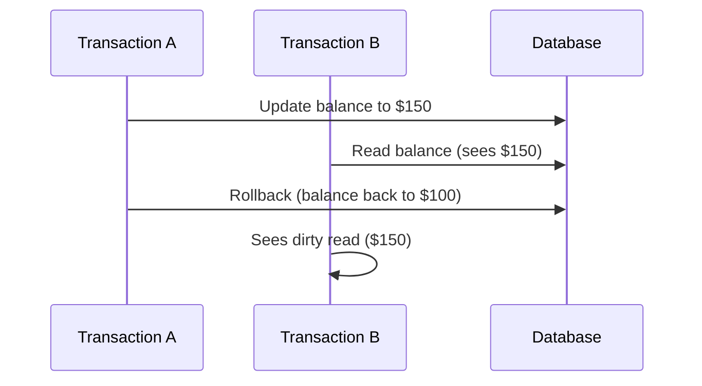
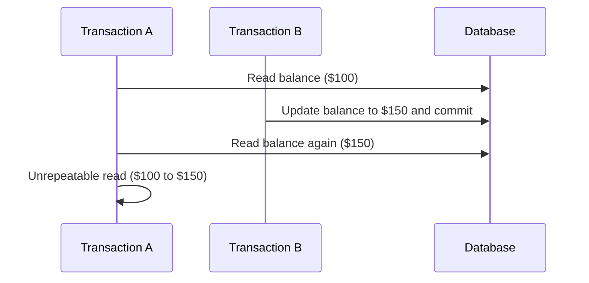
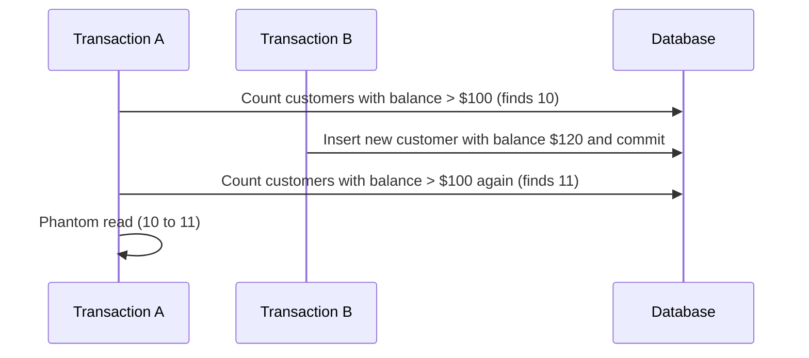

### 1. Dirty Reads

**Definition:**
A dirty read happens when a transaction reads data that has been modified by another transaction but not yet committed. If the other transaction rolls back, the data read becomes invalid.

### 2. Unrepeatable Reads

**Definition:**
An unrepeatable read happens when a transaction reads the same data twice but gets different values each time because another transaction has modified the data in between.

### 3. Phantom Reads

**Definition:**
A phantom read occurs when a transaction executes a query that returns a set of rows satisfying a condition, but a subsequent execution of the same query returns a different set of rows because another transaction inserted or deleted rows.

