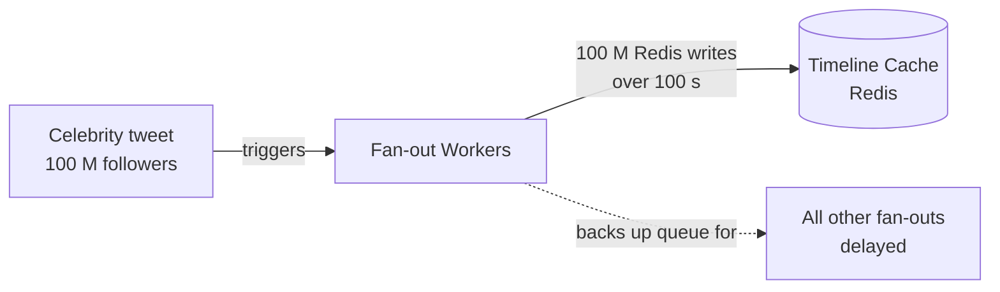
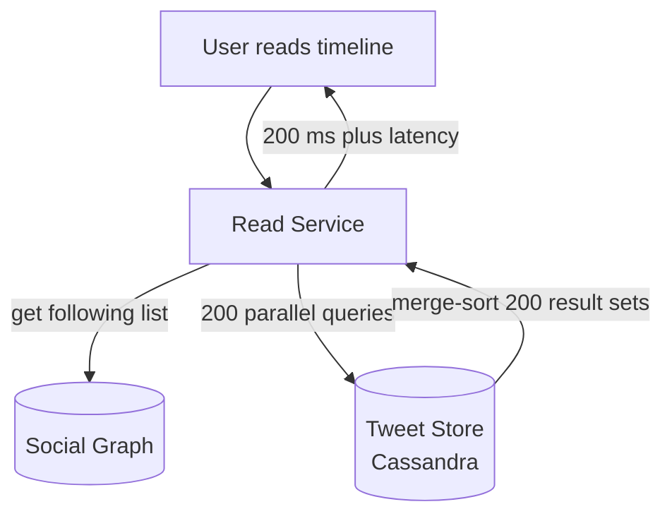
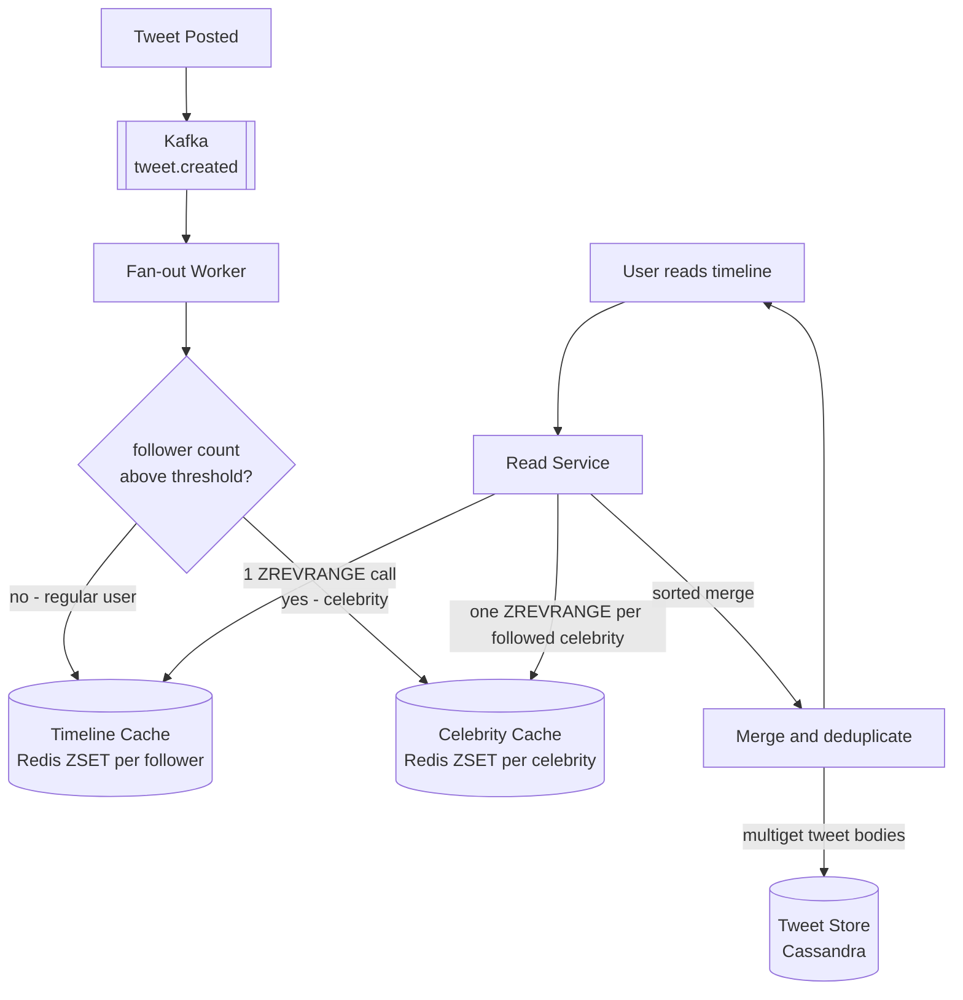

We evolve the v1 design by attacking each fan-out weakness in turn: **Problem → Modification → Justification**. Every step carries its own diagram.

## Refinement 1 — The Celebrity Problem: Write Amplification Math

**Problem.** Fan-out on write treats all accounts equally: for each tweet, write to every follower's timeline sorted set. For a typical user this is fine. For a celebrity, a single tweet triggers tens of millions of writes.

Work through the numbers explicitly — this is what the interviewer wants to see:

| Account type | Followers | Fan-out writes per tweet | Time to complete at 1 M writes/s |
|---|---|---|---|
| Regular user | 200 | 200 | < 1 ms |
| Power user | 50,000 | 50,000 | ~50 ms |
| Mid-tier celebrity | 5,000,000 | 5 M | ~5 s |
| Top celebrity | 100,000,000 | 100 M | **~100 s** |

If a top celebrity posts 5 tweets during a live event, that is **500 million fan-out writes** — the system's entire write budget for ~8 minutes, devoted to one account. All other users' fan-outs queue behind it.



**Modification.** Introduce a **celebrity threshold** T (follower count at which fan-out on write becomes impractical). Accounts above T switch to **fan-out on read**. This is the foundational decision of the hybrid model.

---

## Refinement 2 — Pure Fan-Out on Read: Read Amplification Math

**Problem.** Before committing to the hybrid, examine the opposite extreme. Pure fan-out on read means: on each timeline request, fetch the user's following list, query the tweet store for recent tweets from each followed account, then merge N result sets.

| User behaviour | Following | DB queries per read | At 34,700 reads/s |
|---|---|---|---|
| Light user | 50 | 50 queries | 1.7 M queries/s |
| Typical user | 200 | 200 queries | 6.9 M queries/s |
| Power user | 1,000 | 1,000 queries | 34.7 M queries/s |

6.9 million Cassandra queries per second for average users — not viable. Read amplification is the mirror image of write amplification; neither extreme scales at Twitter's numbers.



**Key insight:** fan-out on write gives O(1) reads and O(followers) writes. Fan-out on read gives O(1) writes and O(following) reads. The hybrid applies each strategy only where it excels.

---

## Refinement 3 — The Hybrid Model: Threshold Decision

**Problem.** We need fast timelines without write amplification for high-follower accounts.

**Modification.** Split accounts by follower count at threshold T:

- **Below T (regular users):** fan-out on write. Fan-out workers push tweet IDs into each follower's `timeline:{user_id}` sorted set. Timeline reads hit Redis only.
- **At or above T (celebrities):** fan-out on read. The fan-out worker instead writes the tweet ID into a compact per-celebrity sorted set `celebrity:{user_id}:tweets`. At read time, the Read Service pulls from this cache for each followed celebrity and merges with the precomputed timeline.

**Threshold decision — the trade-off math:**

| Threshold T | Max fan-out writes per tweet | Fan-out write rate at 1,740 tweets/s | Read overhead per timeline (extra pulls) |
|---|---|---|---|
| 1,000 | 1,000 | 1.74 M/s | Negligible |
| 10,000 | 10,000 | 17.4 M/s | ~few celebrities |
| 100,000 | 100,000 | 174 M/s | ~very few |

For a boundary account at T = 10,000, the write QPS is 1,740 /s × 10,000 = 17.4 M/s — acceptable if a celebrity's followers are distributed uniformly across Redis shards (which they are, since sharding is by `follower_id`, not `author_id`). The Twitter-documented threshold is approximately **10,000–50,000 followers** in practice.

The **average** follower count for non-celebrity accounts is ~200, so the effective fan-out QPS for the write path remains ~348,000 /s as computed in the capacity estimate — perfectly manageable.

Celebrity read overhead: a user who follows 50 celebrities makes 50 extra Redis lookups per timeline read. At 34,700 reads/s and 50 lookups each, that is 1.75 M extra Redis calls/s — cheap compared to 7 M Cassandra queries/s.



---

## Refinement 4 — Redis Timeline Structure and Atomic Trim

**Problem.** With 50 M active timelines, each holding up to 800 tweet IDs, the Redis data structure must be memory-efficient, atomically updatable, and ordered by time with no separate timestamp field.

**Modification.** Use Redis sorted sets with Snowflake tweet IDs as both member and score:

```
Key:    timeline:{user_id}
Type:   ZSET
Score:  tweet_id (64-bit Snowflake — high bits = millisecond timestamp, naturally sortable)
Member: tweet_id (as decimal string)
Max:    800 members
TTL:    7 days (cold users' timelines expire; rebuilt on next access)
```

Every fan-out insert is a two-command pipeline, executed atomically per key:

```redis
ZADD timeline:{follower_id} <tweet_id_score> "<tweet_id_member>"
ZREMRANGEBYRANK timeline:{follower_id} 0 -801   -- keep only newest 800
```

The sorted set gives O(log n) insert and O(log n + k) range query. Because Snowflake IDs encode creation time in the high bits, `ZREVRANGE` returns tweets in newest-first order without storing a separate timestamp. See [Hotspot Problems]({}) for sharding this across Redis nodes.

**Celebrity cache structure:**

```
Key:    celebrity:{user_id}:tweets
Type:   ZSET
Score:  tweet_id (same Snowflake convention)
Member: tweet_id
Max:    200 entries (deeper cache; celebrities post more frequently)
TTL:    1 hour (refreshed by each new tweet publish)
```

**Cold timeline rebuild** (user not seen in 7 days, or new user):

1. Read `follows_by_follower` for the user — all followed accounts.
2. Separate into celebrity and non-celebrity buckets.
3. For non-celebrities: query `tweets_by_user` table in Cassandra for each, fetch last 20 tweets, union.
4. For celebrities: read their `celebrity:{user_id}:tweets` cache.
5. Merge all candidates, take newest 800, ZADD into `timeline:{user_id}`.

Cold rebuild is expensive but infrequent. A cache-miss budget of ~1 % of reads at the 34,700 /s peak = ~347 cold rebuilds/s — well within Cassandra capacity.

---

## Pseudocode — Post-Tweet Fan-Out

```python
# ---------- Write Service (synchronous, blocks until Cassandra ack) ----------
def post_tweet(user_id, text, media_ids):
    tweet_id = snowflake_gen.next()            # see id-generation
    tweet = Tweet(
        tweet_id=tweet_id,
        user_id=user_id,
        text=text,
        media_ids=media_ids,
        created_at=utcnow(),
        deleted_at=None,
        edit_chain=[],
    )
    cassandra.insert("tweets", tweet)           # durable write first
    kafka.publish("tweet.created", {            # async fan-out trigger
        "tweet_id":  tweet_id,
        "author_id": user_id,
        "score":     tweet_id,                  # Snowflake IS the sort key
    })
    return tweet_id                             # 201 to client

# ---------- Fan-Out Worker (Kafka consumer group, async) ----------
CELEBRITY_THRESHOLD = 10_000
CELEBRITY_CACHE_MAX = 200
TIMELINE_CACHE_MAX  = 800
FAN_OUT_BATCH       = 1_000

def handle_tweet_created(event):
    author_id = event["author_id"]
    tweet_id  = str(event["tweet_id"])
    score     = event["score"]

    follower_count = users_db.get_follower_count(author_id)

    if follower_count >= CELEBRITY_THRESHOLD:
        # Celebrity path: update per-celebrity cache only
        key = f"celebrity:{author_id}:tweets"
        redis.zadd(key, {tweet_id: score})
        redis.zremrangebyrank(key, 0, -(CELEBRITY_CACHE_MAX + 1))
        redis.expire(key, 3600)               # 1-hour TTL
        return

    # Regular user: fan-out to all followers in batches
    cursor = None
    while True:
        batch, cursor = social_graph.get_followers(
            author_id, cursor=cursor, batch_size=FAN_OUT_BATCH
        )
        pipe = redis.pipeline(transaction=False)
        for follower_id in batch:
            tl_key = f"timeline:{follower_id}"
            pipe.zadd(tl_key, {tweet_id: score})
            pipe.zremrangebyrank(tl_key, 0, -(TIMELINE_CACHE_MAX + 1))
        pipe.execute()
        if cursor is None:
            break
```

---

## Pseudocode — Timeline Read with Merge

```python
CELEBRITY_PULL_LIMIT = 100   # recent tweets to pull per followed celebrity
OVER_FETCH_FACTOR    = 5     # over-fetch before merge to ensure enough candidates

def get_home_timeline(user_id, limit=20, cursor=None):
    min_score = 0 if cursor is None else cursor

    # 1. Pre-computed timeline — non-celebrity accounts (fan-out on write)
    push_ids = redis.zrevrangebyscore(
        f"timeline:{user_id}",
        max="+inf", min=min_score,
        start=0, count=limit * OVER_FETCH_FACTOR,
    )

    # 2. Followed celebrities — fan-out on read
    celebrities = social_graph.get_followed_celebrities(user_id)
    celeb_ids = []
    for celeb_id in celebrities:
        ids = redis.zrevrangebyscore(
            f"celebrity:{celeb_id}:tweets",
            max="+inf", min=min_score,
            start=0, count=CELEBRITY_PULL_LIMIT,
        )
        celeb_ids.extend(ids)

    # 3. Merge: deduplicate and sort descending by score (tweet_id = time)
    all_ids = sorted(set(push_ids + celeb_ids), key=int, reverse=True)[:limit]

    # 4. Hydrate tweet bodies in one batch (Redis tweet cache → Cassandra fallback)
    tweets = tweet_hydration_service.mget(all_ids)

    # 5. Filter soft-deleted tweets (deleted_at field check happens in hydration)
    tweets = [t for t in tweets if t.deleted_at is None]

    next_cursor = int(all_ids[-1]) - 1 if all_ids else None
    return tweets, next_cursor
```

---

## Database Schema — Follow Graph

The follow graph uses two denormalised Cassandra tables to serve both traversal directions efficiently:

```sql
-- Fan-out workers: "who follows author X?" — page through followers for fan-out
CREATE TABLE followers_by_followee (
  followee_id  BIGINT,
  follower_id  BIGINT,
  created_at   TIMESTAMP,
  PRIMARY KEY  (followee_id, follower_id)
  -- Partition: followee_id → all rows in one partition per author
  -- Clustering: follower_id ASC → cursor-based pagination is efficient
);

-- Timeline merge: "which celebrities does user Y follow?" — read path
CREATE TABLE follows_by_follower (
  follower_id  BIGINT,
  followee_id  BIGINT,
  is_celebrity BOOLEAN,
  PRIMARY KEY  (follower_id, followee_id)
  -- Filter by is_celebrity = true to get celebrity list in O(following count)
);
```

For celebrities with 100 M followers, the `followers_by_followee` partition for that author holds 100 M rows. Fan-out workers page through this with cursor-based batching at 1,000 rows per page — but since celebrities use fan-out on read, this partition is **never traversed** for those accounts. The large partition exists but is dormant during normal fan-out. See [Wide-Column Stores]({}).

---

## Read vs Write Amplification Summary

| Strategy | Write cost per tweet | Read cost per timeline | Best for |
|---|---|---|---|
| Fan-out on write only | O(followers) writes | O(1) Redis read | Regular users < T followers |
| Fan-out on read only | O(1) write | O(following) DB reads | Nothing — too slow at scale |
| **Hybrid (threshold T)** | O(min(followers, T)) writes | O(1) push + O(celebrities followed) Redis reads | **All users** |

See [Batch vs Streaming]({}) for the broader pattern of precomputation vs lazy evaluation, which is the principle underlying this trade-off.

---

## Edge Cases and Failure Handling

**Unfollow during fan-out:** A user unfollows an author after the fan-out starts. The tweet may already be in the follower's timeline sorted set. It is harmless — the Read Service can check the follow relationship during hydration and filter, or the user can simply ignore the stale tweet. The next timeline load will be clean.

**Follower count crosses the celebrity threshold:** When a regular user suddenly goes viral and crosses T followers, in-flight fan-out workers for their latest tweets may write to individual timelines normally. The transition is eventually consistent. A background job sets `is_celebrity = true`; subsequent tweets use the celebrity cache path. The dual representation (some timeline entries in push timelines, subsequent ones in celebrity cache) is handled correctly by the merge step.

**Kafka consumer lag:** After a deployment or partial failure, fan-out workers may fall behind. Timelines become stale by the lag duration (bounded by Kafka's retention window, typically hours). Tweets are not lost — they remain in Cassandra and are reachable once the lag drains. This is a durability vs freshness trade-off acceptable under our eventual-consistency NFR.

**Redis node failure:** The [Caching Patterns]({}) cache-aside model applies: a timeline cache miss triggers a cold rebuild from Cassandra + celebrity caches. No data is lost; latency for that user spikes once during rebuild. Replication (factor 2 per shard) makes this rare.

**Fan-out backpressure:** If fan-out workers cannot keep up with inbound Kafka messages, [back-pressure]({}) is applied by Kafka consumer group lag monitoring. Alerts fire when lag exceeds a threshold; the operator scales out worker pods horizontally — fan-out is stateless and trivially parallelisable.
