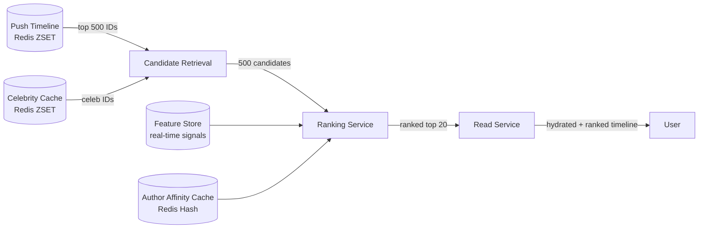
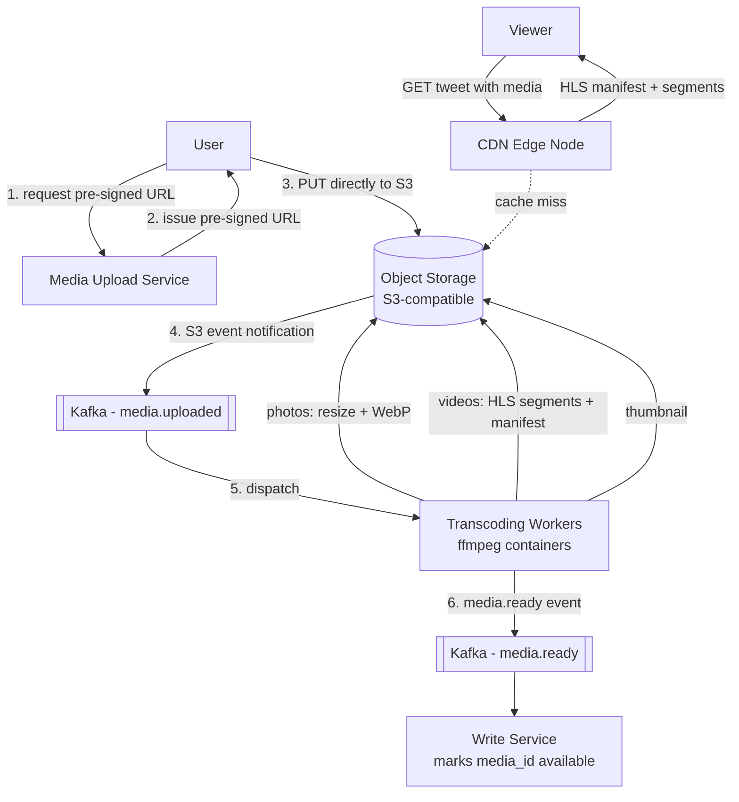
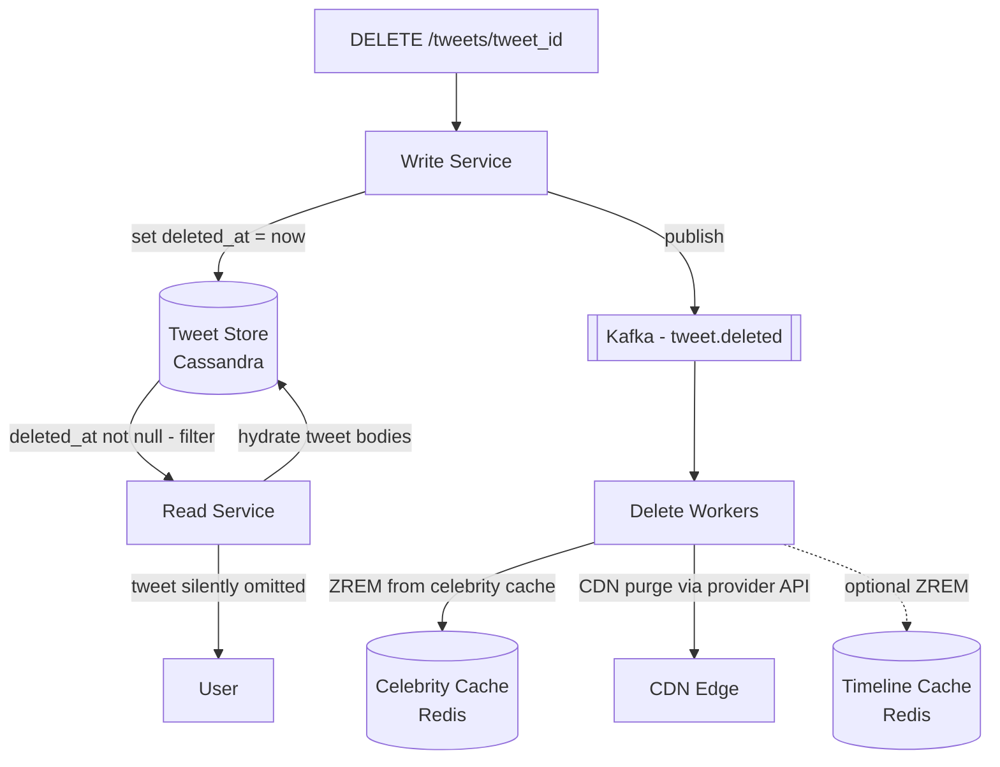
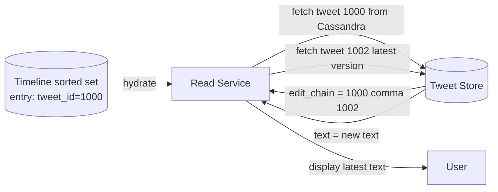
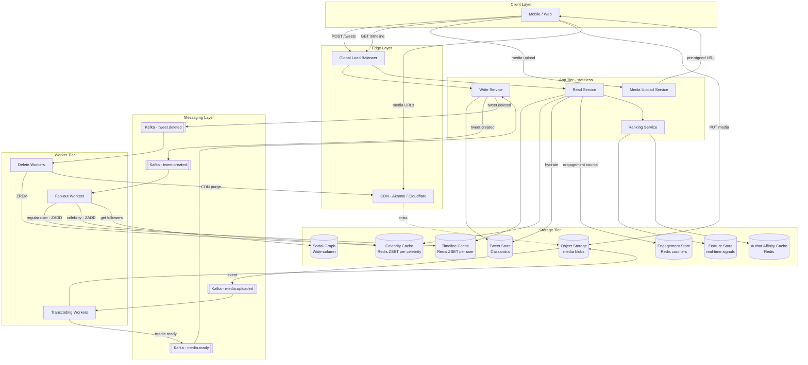

With the fan-out mechanics settled, we drill into three remaining design areas: how the timeline is ordered (chronological vs ML-ranked), how media is stored and delivered at scale, and how tweet deletions and edits propagate consistently.

## Refinement 5 — Timeline Ranking

**Problem.** A purely chronological timeline (newest first) can bury high-quality tweets from infrequent posters under noise from prolific accounts. Twitter offers both a "Latest" mode and an algorithm-ranked "For You" mode that scores candidates by predicted engagement.

**Modification.** Add a **two-stage ranking pipeline** that sits between candidate retrieval and response serialisation:

```
Stage 1 — Candidate retrieval (existing hybrid merge):
  Pull top 500 tweet IDs from the user's push timeline + celebrity caches.
  This is the ~O(1) Redis operation described in the Fan-Out Deep Dive.

Stage 2 — Re-ranking model:
  Score each candidate tweet using a lightweight model:
    - Author affinity score   (how often does this user engage with this author?)
    - Engagement velocity     (like and retweet rate in last 5 minutes)
    - Content type preference (user's historical preference for video vs text)
    - Recency decay           (exponential decay: score × e^(-λ × age_in_hours))
  Sort by model score descending; return top N.
```



**Justification & trade-offs:**

| Mode | Read latency added | Relevance | User control |
|---|---|---|---|
| Chronological | 0 ms | OK | High — predictable order |
| ML-ranked (full) | +15–30 ms | High | Low — opaque to user |
| Ranked within recency window | +5–10 ms | Good | Medium |

The ranking service adds ~10–20 ms per call at p99. To avoid penalising every read, ranked results are **cached per user for 30 seconds**: if the same user refreshes rapidly, the cached rank is returned immediately. The ranking cache is invalidated on the next Kafka fan-out event for that user.

Real-time signals (engagement velocity, trending topics) are served from a [Feature Store]({}). The underlying ML model architecture follows the two-tower retrieval + ranking pattern described in [Recommendation Systems]({}).

**Serving both modes:** the API accepts a `ranked=true|false` query parameter. The default is user-preference stored in the user profile. Chronological mode skips Stage 2 entirely; candidates are returned directly sorted by score (tweet_id).

---

## Refinement 6 — Media Handling

**Problem.** 45 million media items per day (photos and videos) cannot flow through the application tier. Raw uploads cannot be stored in a relational or wide-column database. Videos need transcoding before playback at multiple resolutions.

**Modification.** A dedicated **Media Pipeline** using object storage, async transcoding workers, and CDN delivery:



**Upload flow step-by-step:**

1. Client calls `POST /v1/media/upload` with file type and size.
2. Media Upload Service generates a **pre-signed S3 URL** (10-minute expiry) and returns it. The app server never touches the bytes.
3. Client uploads directly to object storage. This removes the app tier from the data path entirely.
4. An S3 event notification triggers a Kafka message `media.uploaded`.
5. Transcoding workers (containerised ffmpeg jobs, auto-scaled by queue depth) process the upload:
   - **Photos:** resize to 1080 px, 720 px, 400 px; convert to WebP; generate 40 px thumbnail.
   - **Videos:** transcode to H.264 at 1080p / 720p / 480p / 360p; package as HLS `.m3u8` manifest + `.ts` segments; generate animated thumbnail.
6. All outputs written back to object storage under content-addressed paths (SHA-256 of content → path). Content-addressed URLs are **immutable** — CDN can cache them with `Cache-Control: max-age=31536000, immutable`.
7. `media.ready` event marks the `media_id` usable; the tweet is only served to timelines after this event.

**CDN delivery:** the CDN origin points at the object storage bucket. For video, the CDN serves the HLS manifest; the client player requests the appropriate bitrate segment based on bandwidth. See [CDN]({}). For photos, a single CDN-cached WebP URL is embedded in the tweet response.

**De-duplication:** a perceptual hash (pHash) is computed at upload time. Near-identical images share a single object storage entry; the tweet stores only the pHash key. This saves significant storage for meme / repost-heavy content.

**Object storage capacity:** 67 TB/day of new media → 24 PB/year. Object storage is elastic and billed by GiB-month; it scales without pre-provisioning. See [Object Storage]({}).

---

## Refinement 7 — Tweet Deletion Propagation

**Problem.** When a tweet is deleted it may exist in: the Cassandra tweet store, the Redis timeline sorted sets of all followers, the per-celebrity Redis cache, CDN edge caches, and the ranking candidate pool. A deleted tweet must not be visible to any user within seconds.

**Modification.** A two-tier deletion strategy — **soft delete** in the tweet store + **selective cache invalidation** for caches that cannot self-evict:



**Execution path:**

1. Write Service sets `deleted_at = now()` in Cassandra (soft delete) synchronously.
2. Publishes `tweet.deleted` event to Kafka.
3. Delete Workers consume the event and:
   - `ZREM celebrity:{author_id}:tweets <tweet_id>` — removes from celebrity cache immediately.
   - Call the CDN provider's invalidation API to purge any cached media URLs.
   - Optionally `ZREM timeline:{follower_id} <tweet_id>` for the author's followers — but this is expensive for high-follower accounts.

**Why explicit ZREM for timelines is optional:** the Read Service always hydrates tweet bodies from Cassandra and checks `deleted_at`. A tweet ID remaining in a sorted set but with `deleted_at != null` is silently omitted from the response. The timeline sorted set is eventually self-correcting as entries age out (800-entry cap + 7-day TTL). The **operational trade-off** is:

| Approach | Consistency | Cost | Use when |
|---|---|---|---|
| Read-time filter only | Eventually consistent (visible until hydration) | Cheap — no fan-out | Acceptable for most cases |
| Active ZREM fan-out | Strongly consistent (removed immediately) | Expensive — same fan-out cost as posting | Required for legal/safety takedowns |

For legal takedowns (DMCA, court orders), the active ZREM fan-out is used; for user-initiated deletes, read-time filtering is sufficient.

---

## Refinement 8 — Tweet Edit Propagation

**Problem.** If edits are modelled as in-place mutations, every cached copy of the tweet (in CDN, in application-level tweet caches, in denormalised stores) becomes stale simultaneously — a distributed cache invalidation problem at scale.

**Modification.** Model edits as an **immutable edit chain** rather than in-place mutation:

```
Original tweet:  tweet_id=1000, text="old text", edit_chain=[1000, 1002]
Edit v2:         tweet_id=1002, text="new text", original_tweet_id=1000, edit_chain=[1000, 1002]
```

Every edit creates a **new Snowflake tweet_id** linked to the original. The timeline sorted sets and celebrity caches continue to hold the **original `tweet_id` as their entry**. At hydration time, the Read Service detects a non-empty `edit_chain` and fetches the latest version (last element of `edit_chain`). The user always sees the most recent text; the tweet URL / embed stays stable (points to `tweet_id=1000`).



**Edit propagation is implicit** — no fan-out required. Only the tweet store entry changes; all downstream caches and timelines self-correct at the next hydration. This is the key advantage of the immutable-chain model: it converts a distributed cache invalidation problem into a single Cassandra point read.

**Edit window enforcement:** the Write Service checks `created_at` against `now()` and rejects edits submitted more than 30 minutes after the original tweet. Edit history is accessible via `GET /v1/tweets/{tweet_id}/history`.

---

## Final Architecture — Full System



---

## Drill-Down — Database Schema Summary

| Store | Engine | Partition / Shard Key | Replication | Purpose |
|---|---|---|---|---|
| tweets | Cassandra | tweet_id | 3× | Durable tweet bodies; point lookup only |
| tweets_by_user | Cassandra | user_id | 3× | Profile page; denormalised |
| followers_by_followee | Cassandra | followee_id | 3× | Fan-out worker cursor traversal |
| follows_by_follower | Cassandra | follower_id | 3× | Celebrity lookup at read time |
| timeline:{user_id} | Redis ZSET | user_id — consistent hash ring | 2× | Precomputed push timeline |
| celebrity:{user_id}:tweets | Redis ZSET | user_id — same ring | 2× | Celebrity recent tweets for pull |
| engagement:{tweet_id} | Redis Hash | tweet_id | 2× | Like / RT / reply counters |
| Media blobs | S3-compatible | content-addressed path | Object store redundancy | Immutable media storage |

---

## Drill-Down — Data Structures and Why

| Structure | Where used | Why |
|---|---|---|
| **Snowflake ID** | tweet_id, score in every sorted set | Time-sortable 64-bit ID; doubles as creation timestamp; no separate timestamp field needed |
| **Redis sorted set** | timeline:{user_id}, celebrity:{user_id}:tweets | O(log n) insert + O(log n + k) range query; score = tweet_id eliminates secondary sort |
| **LSM tree** | Cassandra tweet store | Append-friendly; fast sequential writes; compaction handles old versions |
| **Immutable edit chain** | edit_chain field in tweets | Avoids distributed cache invalidation on edit; converts problem to a single DB read |
| **Perceptual hash** | Media dedup | Near-duplicate detection for images; O(1) lookup; stores one object for many references |
| **HLS adaptive bitrate** | Video delivery | Client-side quality adaptation; CDN caches individual segments; seamless quality switches |

---

## Drill-Down — Edge Cases

- **User follows 5,000 celebrities:** the celebrity merge step makes 5,000 Redis lookups per timeline read. At 34,700 reads/s, this is 173 M Redis calls/s — potentially a bottleneck. Mitigate by batching celebrity cache reads into a single Redis `ZUNIONSTORE` or by capping the displayed celebrity count per read.
- **Tweet ID wraparound:** Snowflake IDs use 41 bits for millisecond timestamps, good until ~2088. Not a near-term concern.
- **Engagement counter loss on Redis failure:** counters are periodically flushed to Cassandra (every 60 s). A Redis node failure loses at most 60 s of counts — acceptable under eventual-consistency NFR. See [Caching Patterns]({}).
- **Fan-out for a user who unfollows at scale:** if a user with 8 M followers (just below the celebrity threshold) unfollows, the 8 M timeline entries containing their old tweets remain and age out naturally. No active cleanup needed.
- **Media upload timeout:** pre-signed URLs expire in 10 minutes. If the client upload fails, the `media_id` is never marked ready and cannot be attached to a tweet. No cleanup required — the orphaned S3 object is removed by a lifecycle policy after 24 h.
