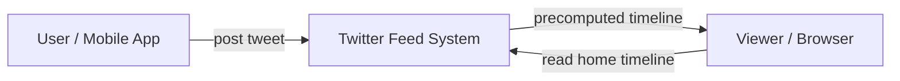
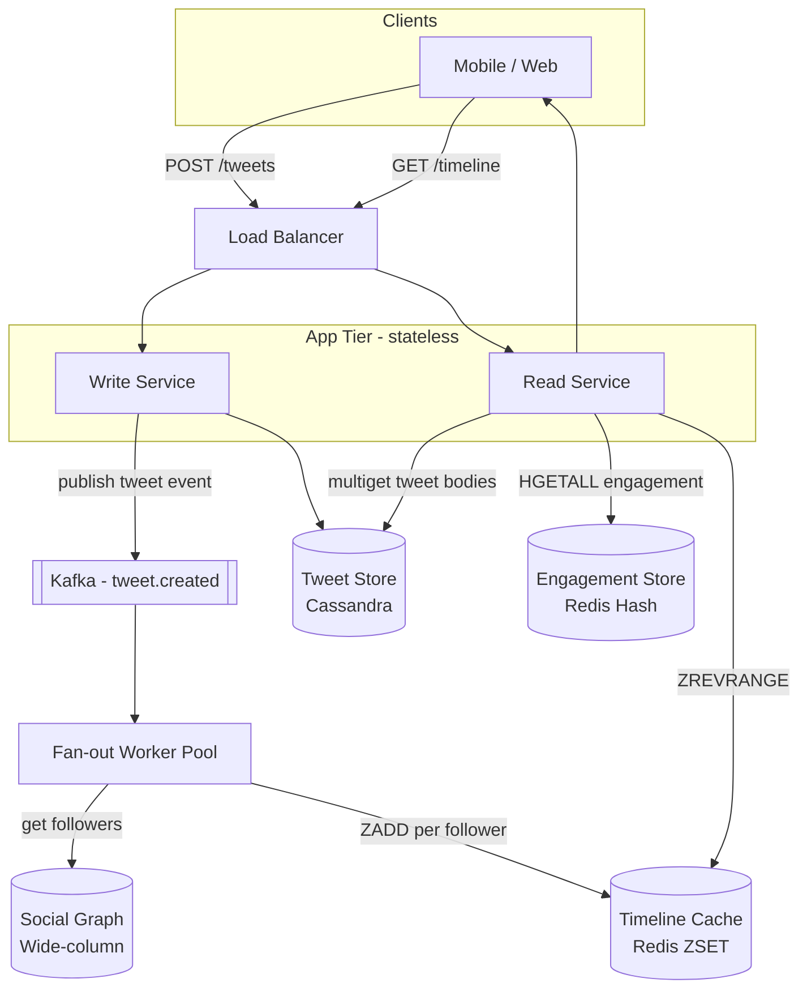

## Capacity Estimation

Start from the stated numbers and derive everything else. The arithmetic reveals which path is the bottleneck.

### Traffic

| Metric | Calculation | Result |
|---|---|---|
| Tweet write QPS | 150 M tweets/day ÷ 86,400 s | **~1,740 /s** |
| Peak write QPS | 1,740 × 3 burst factor | **~5,200 /s** |
| Timeline read QPS | 300 M DAU × 10 reads/day ÷ 86,400 s | **~34,700 /s** |
| Peak read QPS | 34,700 × 3 | **~104,000 /s** |

Read:write ratio for timelines is roughly **20:1** — read-heavy but nowhere near as skewed as a URL shortener, because every timeline read fetches 20 tweets.

### Fan-Out Write Amplification

This is the dominant multiplier on the write path and the crux of the design.

| Metric | Calculation | Result |
|---|---|---|
| Avg followers — non-celebrity | power-law median | **~200** |
| Fan-out write QPS — regular users | 1,740 /s × 200 | **~348,000 /s** |
| Peak fan-out write QPS | 348,000 × 3 | **~1,044,000 /s** |
| Single celebrity tweet — 100 M followers | 1 tweet × 100 M writes | **100 M writes** |
| Time to drain celebrity fan-out at 1 M writes/s | 100 M ÷ 1 M | **~100 seconds** |

A single celebrity tweet would consume the entire fan-out write budget for nearly two minutes. This is the motivating failure case for the hybrid model.

### Storage — Tweet Store

| Metric | Calculation | Result |
|---|---|---|
| Bytes per tweet | 8 B tweet_id + 8 B user_id + 280 B text + ~50 B metadata | **~400 B → ~500 B with overhead** |
| Tweet storage / day | 150 M × 500 B | **~75 GB/day** |
| Tweet storage / year | 75 GB × 365 | **~27 TB/year** |
| 5-year archive | 27 TB × 5 | **~135 TB** |

### Storage — Timeline Cache

| Metric | Calculation | Result |
|---|---|---|
| Active users with cached timelines | 300 M × ~17 % recently active | **~50 M users** |
| Entries per timeline | last 800 tweet IDs cached | 800 |
| Bytes per sorted-set entry | tweet_id 8 B + score 8 B + Redis skiplist overhead ~15 B | **~31 B** |
| Total timeline cache RAM | 50 M × 800 × 31 B | **~1.24 TB** |

A sharded Redis cluster of 14 primary nodes × 128 GB RAM (with replication) covers this comfortably. See [Key-Value Stores]({}).

### Storage — Media

| Metric | Calculation | Result |
|---|---|---|
| Tweets with media | 150 M × 30 % | **45 M media items/day** |
| Average stored size per item | photos ~500 KB, videos ~10 MB — blended | **~1.5 MB avg** |
| Media ingress / day | 45 M × 1.5 MB | **~67 TB/day** |
| CDN origin growth / year | 67 TB × 365 | **~24 PB/year** |

Media lives entirely in [Object Storage]({}) and is served via [CDN]({}) — never through the application tier.

### Bandwidth

| Direction | Calculation | Result |
|---|---|---|
| Timeline egress (text + metadata) | 34,700 /s × 20 tweets × 1 KB | **~694 MB/s** |
| Media egress | CDN-offloaded to edge nodes | not counted at origin |

### Derived Infrastructure

- **App servers:** ~20 read nodes, ~5 write nodes; autoscale ×3 for peak.
- **Fan-out workers:** ~40 Kafka consumer pods, each processing ~25 K fan-out writes/s.
- **Redis cluster:** 14 primary nodes × 128 GB, 2× replica = 42 Redis instances; sharded by `user_id`.
- **Cassandra cluster:** ~135 TB over 5 years × 3 replicas = ~405 TB; ~20-node cluster sized for write IOPS headroom, growing annually.
- **Social graph store:** 300 M users × avg 200 follows = 60 B edges in a wide-column store.

---

## API Design

Authentication is via OAuth 2.0 bearer token enforced at the API gateway.

### Post Tweet

```
POST /v1/tweets
Authorization: Bearer <token>
Body:
{
  "text": "Hello, world!",
  "media_ids": ["media_abc123"],
  "reply_to_tweet_id": null,
  "quote_tweet_id": null
}

201 Created
{
  "tweet_id": "1818913045678592001",
  "text": "Hello, world!",
  "author": { "user_id": "42", "username": "alice" },
  "created_at": "2025-06-01T10:00:00Z",
  "media": []
}

400 Bad Request  — text > 280 chars or invalid media_id
401 Unauthorized — missing or invalid token
```

### Read Home Timeline

```
GET /v1/timeline/home?limit=20&cursor=<opaque_cursor>
Authorization: Bearer <token>

200 OK
{
  "tweets": [
    {
      "tweet_id": "1818913045678592001",
      "text": "...",
      "author": { ... },
      "engagement": { "likes": 142, "retweets": 31, "replies": 7 },
      "created_at": "2025-06-01T10:00:00Z",
      "media": [ { "url": "https://cdn.twitter.com/media/..." } ]
    },
    ...
  ],
  "next_cursor": "eyJ0aW1lc3RhbXAiOjE2NTAwMDAwMDB9",
  "has_more": true
}
```

The cursor is an opaque base64 value encoding the score (tweet_id) of the last item returned. See [Pagination]({}) for cursor-based pagination design.

### Delete Tweet

```
DELETE /v1/tweets/{tweet_id}
Authorization: Bearer <token>

204 No Content
403 Forbidden — caller is not the tweet's author
404 Not Found  — tweet does not exist
```

### Media Upload (two-step)

```
POST /v1/media/upload
Body: { "media_type": "image/jpeg", "size_bytes": 2097152 }

200 OK
{
  "media_id": "media_abc123",
  "upload_url": "https://media-upload.twitter.com/presigned/...",
  "expires_in": 600
}
```

Client uploads directly to the pre-signed URL; the app server never proxies bytes. Media processing is asynchronous; the `media_id` can be included in a tweet only after the media pipeline marks it ready.

---

## Data Model

### Tweet Store — Cassandra (wide-column)

```sql
-- Primary table: point lookup by tweet_id
CREATE TABLE tweets (
  tweet_id    BIGINT PRIMARY KEY,   -- Snowflake ID (time-sortable)
  user_id     BIGINT,
  text        TEXT,
  media_ids   LIST<TEXT>,
  reply_to    BIGINT,               -- NULL for top-level tweets
  quote_of    BIGINT,               -- NULL if not a quote-tweet
  deleted_at  TIMESTAMP,            -- soft-delete; NULL = active
  edit_chain  LIST<BIGINT>,         -- ordered tweet_id versions (empty if never edited)
  created_at  TIMESTAMP
);

-- Secondary table: all tweets by a user (profile page)
CREATE TABLE tweets_by_user (
  user_id   BIGINT,
  tweet_id  BIGINT,
  PRIMARY KEY (user_id, tweet_id)
) WITH CLUSTERING ORDER BY (tweet_id DESC);
```

See [Wide-Column Stores]({}) for the LSM-tree internals and partition key selection.

### Follow Graph — Wide-Column Store (Cassandra)

```sql
-- Forward: "who does user X follow?" — celebrity lookup at read time
CREATE TABLE follows_by_follower (
  follower_id BIGINT,
  followee_id BIGINT,
  created_at  TIMESTAMP,
  PRIMARY KEY (follower_id, followee_id)
);

-- Reverse: "who follows user X?" — fan-out workers page through this
CREATE TABLE followers_by_followee (
  followee_id BIGINT,
  follower_id BIGINT,
  PRIMARY KEY (followee_id, follower_id)
);
```

### Timeline Cache — Redis Sorted Set

```
Key:    timeline:{user_id}
Type:   Sorted Set (ZSET)
Score:  tweet_id (64-bit Snowflake — high bits encode creation time, so ZREVRANGE = newest first)
Member: tweet_id as string
Max:    800 members (ZREMRANGEBYRANK trims the oldest on every insert)
TTL:    7 days (cold timelines expire and are rebuilt on first access)
```

Because Snowflake IDs encode timestamp in the high bits, score order equals chronological order — no separate `created_at` column needed in the sorted set. See [Caching Patterns]({}).

### User / Account Store — PostgreSQL (RDBMS)

```sql
CREATE TABLE users (
  user_id         BIGINT PRIMARY KEY,
  username        VARCHAR(50) UNIQUE NOT NULL,
  display_name    VARCHAR(100),
  follower_count  INT DEFAULT 0,
  following_count INT DEFAULT 0,
  is_celebrity    BOOLEAN DEFAULT FALSE,  -- pre-computed; true when follower_count >= 10,000
  created_at      TIMESTAMP
);
```

`is_celebrity` is updated by a background job when follower count crosses the threshold, avoiding real-time computation on every fan-out.

### Engagement Counters — Redis Hash

```
Key:    engagement:{tweet_id}
Type:   Hash
Fields: likes, retweets, replies, quotes, views
TTL:    48 hours (periodically flushed to Cassandra for durability)
```

---

## Architecture v1 — Naive Fan-Out on Write

The simplest design: when a tweet is posted, immediately push the tweet ID into every follower's timeline list via an async worker pool.

### Level 0 — Context



### Level 1 — First-Cut Components



**Component responsibilities:**

- **Write Service:** validates and persists the tweet to Cassandra (synchronous), then publishes a `tweet.created` event to Kafka. The client receives a 201 as soon as the DB write succeeds — fan-out is asynchronous and does not block the response.
- **Kafka — tweet.created:** decouples the write path from fan-out. The tweet is durable before fan-out begins; a fan-out worker outage cannot lose the tweet. See [Kafka]({}).
- **Fan-out Workers:** consumer group reading from Kafka; for each event they page through the author's followers via the Social Graph and write the tweet_id (scored by tweet_id) into each `timeline:{follower_id}` sorted set.
- **Social Graph Service:** owns the denormalised follow/follower tables. Exposes `get_followers(author_id, cursor, batch_size=1000)` for paginated fan-out traversal.
- **Redis Timeline Cache:** sorted set per user, capped at 800 entries. A single `ZREVRANGE` call returns a user's latest tweet IDs in O(log n + k). See [Caching Patterns]({}).
- **Read Service:** calls `ZREVRANGE` for the user's timeline, bulk-fetches tweet bodies from Cassandra (or a tweet cache), and merges engagement counts. All reads are served from Redis at steady state.
- **Cassandra — Tweet Store:** append-friendly, wide-column store for tweet bodies. Partitioned by `tweet_id` for O(1) point lookups; no scans on the read path. See [Wide-Column Stores]({}).

**First-order trade-offs of v1:**

| Aspect | v1 Behaviour | Status |
|---|---|---|
| Timeline read latency | One Redis call + batch Cassandra fetch | Good — < 10 ms from cache |
| Regular user fan-out | 200 writes/tweet — entirely manageable | Good |
| Celebrity fan-out | 100 M writes/tweet at ~1 M writes/s → 100 s | **Fatal** |
| Fan-out queue back-pressure | Celebrity tweet blocks all other fan-outs | **Fatal** |
| Timeline freshness | Async; < 5 s for regular accounts | Acceptable |

The [Fan-Out Deep Dive]({}) resolves the celebrity problem with a hybrid model. The [Ranking, Media and Mutations Deep Dive]({}) covers ML ranking, media pipelines, and deletion propagation.
