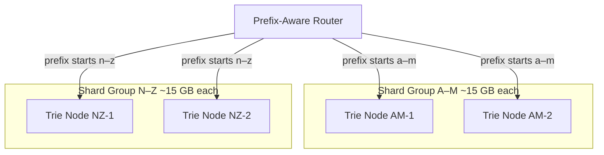
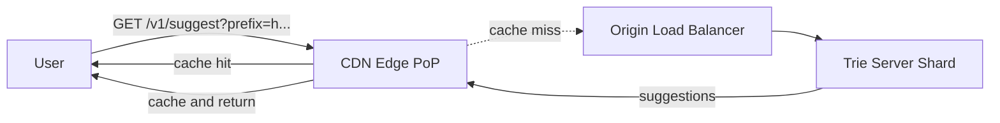
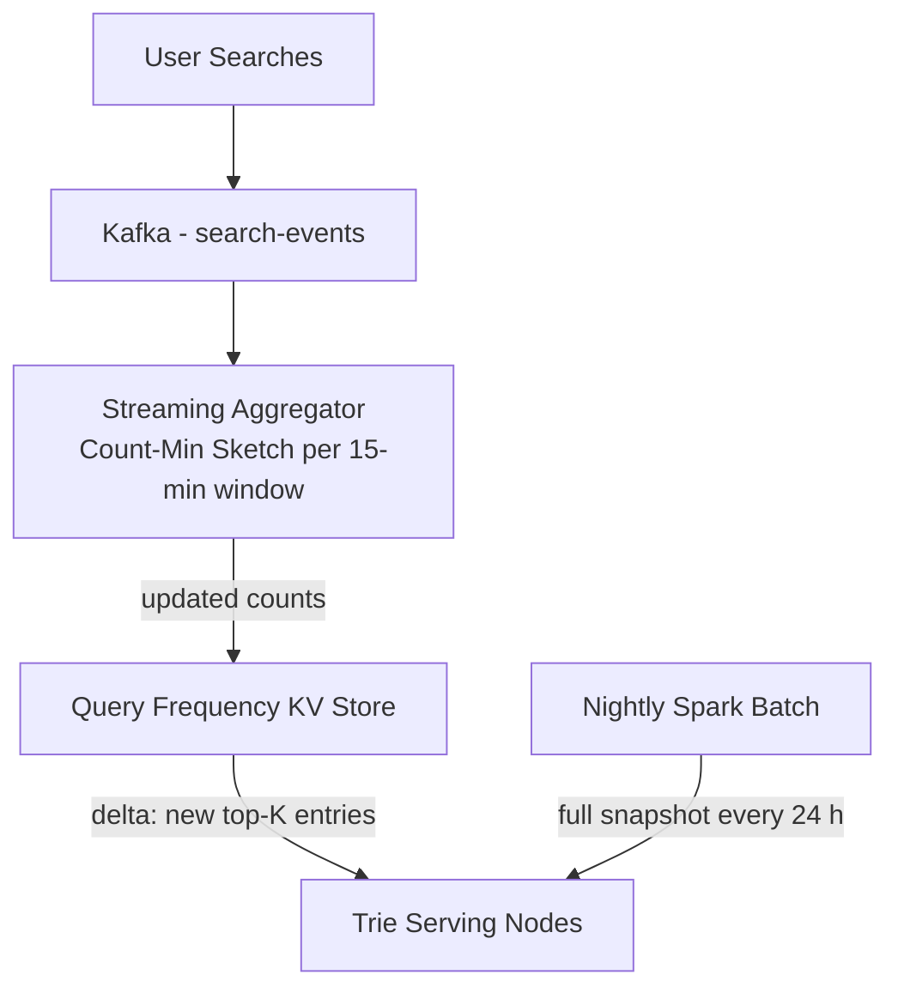
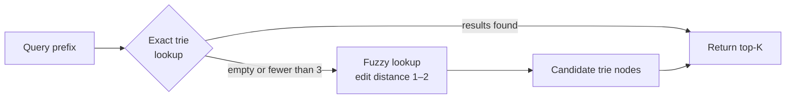
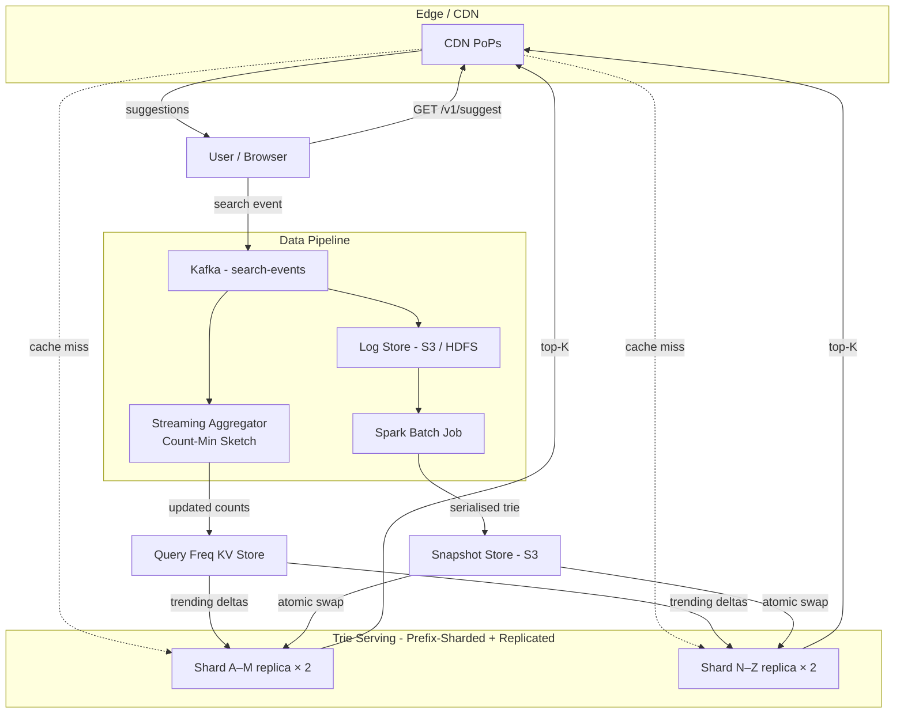

We evolve the v1 design by attacking each weakness: **Problem → Modification → Justification & trade-offs**, each with an updated diagram. Then we drill into the data structures, algorithms, and edge cases that interviewers probe.

---

## Refinement 1 — Sharding the Trie by Prefix Range

**Problem.** Every serving node holds the full ~30 GB trie. Adding nodes for read capacity adds RAM linearly but doesn't let the trie grow beyond what one node can hold. As the indexed vocabulary grows (more languages, longer tail of queries), this becomes a hard ceiling.

**Modification.** Partition the trie **by first-character prefix range**. A prefix-aware router at the load balancer reads the first character (or first two characters for finer granularity) and forwards to the responsible shard. Each shard holds a sub-trie and is replicated for availability.



**Justification & trade-offs.**

- **Horizontal scale:** each shard holds ~15 GB instead of 30 GB. Adding a third character range cuts it further without redesigning the lookup.
- **Language shards:** non-Latin scripts (CJK, Arabic, Cyrillic) live in dedicated shards so the Unicode sparse-map overhead only applies where needed.
- **Trade-off:** if the query distribution is skewed (most queries start with common letters like "s", "h", "w"), shards are uneven. Mitigate by splitting at the **second character** (26² = 676 buckets) or using [consistent hashing]({}) on a hash of the first two characters rather than a raw range.
- **Trade-off:** the router must know the shard map; keep it in a lightweight config store (ZooKeeper or etcd) so shard changes propagate without redeploying.

---

## Refinement 2 — CDN / Edge Caching of Hot Prefixes

**Problem.** Short prefixes like `"h"`, `"ho"`, `"how"`, `"how "`, `"how d"` are requested by millions of users every minute. The top-K result for these is identical for all users. Routing every request to origin wastes capacity and adds network latency.

**Modification.** Put a [CDN]({}) in front of the trie serving tier. Cache prefix responses at edge PoPs with a short TTL (30–60 seconds for short prefixes; 5–10 seconds for longer, more specific prefixes).



**Justification & trade-offs.**

- **Load reduction:** the top-1000 most common prefixes receive ~60% of total traffic. Caching them at the edge cuts origin load by half with a small CDN working set (~5 MB).
- **Latency win:** edge PoPs are physically close to users—cache hits arrive in <10 ms regardless of origin location.
- **Freshness vs. latency:** a 30-second TTL means suggestions can lag by up to 30 seconds on very common prefixes. This is acceptable given our 15-minute freshness SLO.
- **Cache key:** `prefix + lang` (and optionally region for localized ranking). Personalized results must **bypass** the shared CDN cache—served directly from origin or a user-scoped edge cache.
- **Use [caching patterns]({}):** cache-aside at the CDN; the serving node is the authoritative source on a miss.

---

## Refinement 3 — Real-Time Trending with Kafka Streaming

**Problem.** A major news event (e.g. a celebrity announcement or a natural disaster) can make a query go from near-zero to millions of occurrences within minutes. The 24-hour batch rebuild means users see no relevant suggestions for hours after the trend begins.

**Modification.** Add a **streaming aggregation pipeline** alongside the batch job. A Kafka consumer reads search events as they arrive, maintains an approximate frequency count using a **Count-Min Sketch**, and pushes incremental top-K deltas to serving nodes—all without triggering a full trie rebuild.



**How the delta update works:**

1. The streaming consumer tracks a **sliding 15-minute window** of query counts using a Count-Min Sketch (sub-linear memory, small over-count error).
2. Every 60 seconds it computes a **delta list**: queries whose windowed count exceeds a threshold (i.e. they are trending).
3. Serving nodes receive the delta and **merge** it with the current trie's top-K caches at the affected prefix nodes. No full trie rebuild; only the nodes along the path from root to the trending query's last character are updated.
4. The nightly Spark batch remains the authoritative source of truth; the streaming layer only **augments** it with recency signal.

**Justification & trade-offs.**

- **Freshness:** trending queries surface within the 15-minute SLO.
- **Count-Min Sketch:** uses [streaming]({}) approximate counting to track millions of distinct queries with a small, fixed memory footprint (a few hundred MB vs. an exact hash map that could be GBs). Over-counts by at most ε × total_count with probability 1 − δ; configurable.
- **Trade-off:** the in-memory delta state on serving nodes is lost on restart. On restart, nodes load the latest batch snapshot (≤ 24 h old) and wait up to 15 min for the streaming layer to re-populate the delta—acceptable per our SLO.
- **Trade-off:** streaming and batch scores may disagree transiently. A query can appear in both the batch trie top-K and the streaming delta; the serving node takes the **max** of the two scores to avoid downranking a genuinely popular query.
- [Kafka]({}) provides durable, replayable event log: if the aggregator crashes, it replays from the last committed offset with no event loss.

---

## Refinement 4 — Time-Decay Scoring

**Problem.** A query popular six months ago (e.g. `"world cup 2022 final"`) accumulates a large raw count and may outrank a query that went viral today, even though it's stale. Raw frequency alone is a poor ranking signal.

**Modification.** Replace raw count with a **time-decayed score**. Each query event contributes a weight that decays exponentially with age:

```
score(q) = Σ  exp(−λ × age_in_days(event))  for each event e in query q
```

With **λ = 0.1** (≈ 7-day half-life), an event from 7 days ago contributes ~50% of a fresh event's weight. An event from 30 days ago contributes ~5%.

**Practical approximation in the batch job:**

```
# Per-bucket aggregation (e.g. daily buckets for 7 days)
score(q) = Σ_{d=0}^{6}  count(q, day=d) × exp(−λ × d)
```

This avoids storing timestamps per event; only per-day bucket counts are needed.

**Justification & trade-offs.**

- **λ tuning:** smaller λ gives a longer memory (evergreen content stays ranked); larger λ reacts quickly to trends but depresses older popular queries. Tune per product line (news search: high λ; product search: lower λ).
- **Interaction with streaming layer:** the streaming aggregator applies the same decay function to its 15-minute windows. The serving node blends batch score + streaming delta, with the streaming score receiving higher recency weight.
- **Trade-off:** scores must be recomputed in every batch run even if query counts haven't changed, because the decay factor changes with time.

---

## Refinement 5 — Typo Tolerance

**Problem.** Users mistype prefixes (`"amaxon"`, `"googel"`, `"netfli"`). An exact prefix match fails silently—no suggestions—leading to user abandonment. This is especially common on mobile keyboards.

**Modification.** Add a **fuzzy fallback path**. When the exact prefix lookup returns fewer than 3 results (or zero), trigger a secondary lookup using **edit-distance search** on the trie.



**Implementation approach — DFA traversal:**

Build a **Levenshtein automaton** (DFA) for the query prefix that accepts all strings within edit distance k. Traverse the trie simultaneously with this DFA: at each node, advance the DFA; prune branches where the DFA rejects all continuations early. This is far more efficient than naïve per-word distance computation.

**Justification & trade-offs.**

- **Latency cost:** fuzzy traversal is O(|prefix| × |alphabet| × k²) per node visited—significantly slower than exact lookup. Only trigger on the miss path; most requests pay zero cost.
- **Candidate explosion:** edit distance 2 on a short prefix can match thousands of nodes. Cap at distance 1 for prefixes shorter than 4 characters; allow distance 2 only for prefixes ≥ 6 characters.
- **Trade-off:** adds implementation complexity. An alternative is to pre-build a mapping of common misspellings → canonical forms offline, then correct the prefix before trie lookup—simpler but requires curated data.
- This is related to [full-text search]({}) fuzzy matching, though typeahead operates on a much smaller candidate set (prefixes, not document bodies).

---

## Refinement 6 — Personalization Hook

**Problem.** A user who frequently searches for `"python"` probably wants `"python tutorial"` ranked above `"python snake"` even if the global popularity says otherwise.

**Modification.** After the trie returns the global top-K, a **personalization re-ranker** adjusts scores using the user's recent query history, stored in a fast low-latency user-profile store.

- The re-ranker runs **server-side** if session_id is present; results bypass the shared CDN cache and are served with a `Cache-Control: private` header.
- Re-ranking is applied **after** the trie lookup so the trie itself remains shared and stateless—only the final sort order changes.
- Personalization is out of scope for the core design but the `session` parameter in the API is the extension point.

---

## Final Architecture



---

## Drill-Down

### Trie Node Structure and Top-K Lookup

The annotated trie is the core data structure. Each node stores not just a character and children but a **pre-computed top-K list** so that a lookup never traverses the subtree at query time.

```python
class TrieNode:
    def __init__(self, char: str):
        self.char = char
        self.is_terminal = False
        self.frequency: int = 0         # raw 7-day count for this exact query
        self.top_k: list[Completion] = []  # top-K for this prefix, sorted desc
        self.children: dict[str, 'TrieNode'] = {}

class Completion:
    query: str
    score: float  # time-decayed frequency

def lookup(root: TrieNode, prefix: str, k: int) -> list[Completion]:
    node = root
    for char in prefix:
        if char not in node.children:
            return []          # no suggestions for this prefix
        node = node.children[char]
    return node.top_k[:k]     # O(1) — pre-cached
```

**Time complexity:** O(|prefix|) — one pointer traversal per character, then a slice of the pre-built list. No subtree scan at query time.

### Log → Trie Build Pipeline

The Spark batch job runs nightly and produces the next serving snapshot:

```python
# Step 1: Aggregate 7-day query logs into (query, daily_bucket, count) tuples
logs = spark.read.parquet("s3://logs/search-events/last-7-days/")
counts = (
    logs
    .groupBy("query_text", day_bucket("occurred_at"))
    .count()
)

# Step 2: Compute time-decayed score per query
LAMBDA = 0.1   # 7-day half-life
def decay_score(rows):
    return sum(row.count * exp(-LAMBDA * row.day_offset) for row in rows)

query_scores = counts.groupBy("query_text").apply(decay_score)

# Step 3: Filter out low-frequency queries (privacy floor)
query_scores = query_scores.filter(col("score") >= MIN_SCORE_THRESHOLD)

# Step 4: Build trie in memory on driver node
root = TrieNode("")
for query, score in query_scores.collect():
    insert_into_trie(root, query, score)

# Step 5: Annotate every node's top-K (bottom-up DFS)
def annotate_topk(node: TrieNode, k: int):
    completions = []
    if node.is_terminal:
        completions.append(Completion(node.query, node.score))
    for child in node.children.values():
        completions.extend(annotate_topk(child, k))
    node.top_k = sorted(completions, key=lambda c: -c.score)[:k]
    return node.top_k

annotate_topk(root, k=10)

# Step 6: Serialize and upload
snapshot = serialize(root)               # e.g. Protocol Buffers or FlatBuffers
upload_to_s3(snapshot, "snapshots/trie-{timestamp}.pb")
update_version_pointer("snapshots/latest")
```

**Memory note:** for 50M distinct queries, the trie build on the Spark driver requires ~30 GB of heap. For very large tries, the build is split by prefix range (parallel-build one shard per Spark job).

### Database Schema (Query Frequency KV Store)

The streaming layer writes to and reads from this store:

```
Table: query_frequency
  Primary key: query_hash   BIGINT     FNV-64 of normalised(query_text)
  Columns:
    query_text    TEXT
    count_7d      BIGINT        -- rolling 7-day count (batch-authoritative)
    delta_1h      BIGINT        -- streaming increment in last 1 hour
    score         FLOAT         -- combined time-decayed score
    language      VARCHAR(10)
    last_updated  TIMESTAMP
```

The serving node reads `score = max(batch_score, streaming_score)` when deciding the delta top-K. This table is the source for the streaming aggregator's delta pushes, not the serving trie itself.

### Multi-Language and Unicode Handling

- **Normalization:** apply Unicode NFC normalization before inserting into the trie or hashing for the KV store. `"café"` and `"cafe\u0301"` must hash identically.
- **Locale-aware lowercasing:** Turkish `"I"` lowercases to `"ı"`, not `"i"`. Use locale-aware casing from the `lang` parameter.
- **CJK characters:** Chinese, Japanese, Korean scripts have no word boundary spaces; trie shards for CJK use character-level nodes with a Unicode-range router. A node's children map uses a hash map (sparse) rather than a 26-slot array.
- **Script detection:** at ingestion time, detect the script of each query (Unicode script property) and route to the correct language-specific trie shard. English + Latin-script queries share a shard; CJK, Arabic, Cyrillic each get their own.

### Edge Cases and Failure Handling

| Scenario | Handling |
|---|---|
| **Serving node crashes during snapshot swap** | The swap is atomic: build in shadow buffer, then swap pointer. Crash before swap → old trie remains active. Crash after swap → new trie is live. No partial state. |
| **Spark batch job fails** | Serving nodes continue with the previous snapshot (at most 48 h stale). Alert fires; next night's run is retried automatically. |
| **Kafka lag spikes** | Streaming aggregator falls behind but Kafka retains events for 24 hours. On catch-up, replays from last committed offset. No data loss. See [back-pressure]({}). |
| **Privacy floor query leaks** | Queries with count < threshold are stripped during the Spark aggregation step before building the trie—they never enter the trie or the snapshot. |
| **Empty result for a prefix** | Return empty array with `200 OK`. Client shows no dropdown. Do not return a 404—the prefix is valid, just has no indexed completions yet. |
| **Very long prefix (> 50 chars)** | Reject at the API gateway with 400. The trie depth is bounded; deep traversals are not the intended use case. |
| **Shard unavailability** | Replicas absorb traffic (see [leader-based replication]({})). If all replicas for a shard are down, return stale CDN-cached results or an empty response rather than a 503. |
