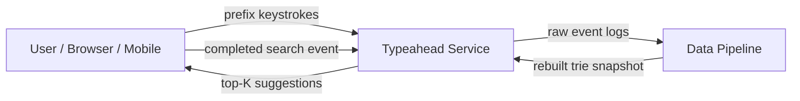
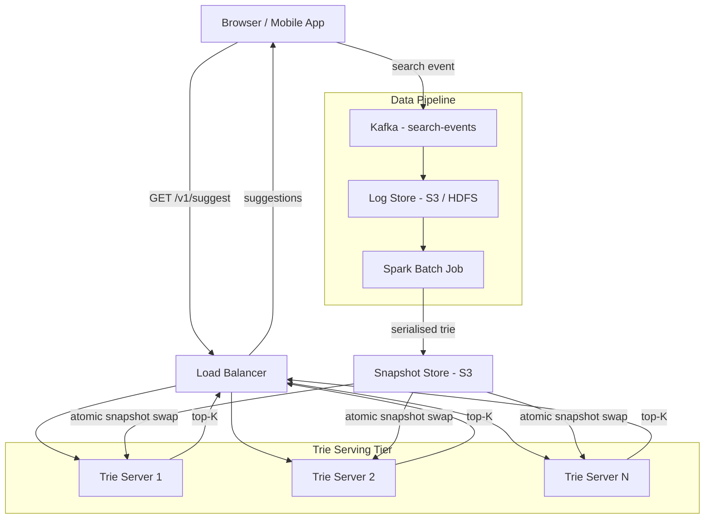

## Capacity Estimation

Drive every number from the requirement figures and show the arithmetic.

### Traffic

| Metric | Calculation | Result |
|---|---|---|
| Searches/day | 500M DAU × 3 searches/user | 1.5B searches/day |
| Autocomplete requests/day | 1.5B × 4 keystrokes/search (avg) | **6B req/day** |
| Average read QPS | 6B ÷ 86,400 s | **~69,000 req/s** |
| Peak read QPS (3× burst) | 69,000 × 3 | **~207,000 req/s** |
| Search events logged/day | 1 per completed search | 1.5B events/day |
| Log ingestion rate | 1.5B ÷ 86,400 s | **~17,000 events/s** |

The read-to-write ratio on the serving tier is extreme: **the write path is the log pipeline, not live request writes**. Every optimization decision targets the read path.

### Storage

**Raw query logs:**

| Field | Bytes |
|---|---|
| Query text (avg 30 chars UTF-8) | 30 |
| Anonymised session ID | 8 |
| Timestamp | 8 |
| Language + region metadata | ~20 |
| **Per log event** | **~66 B → round to 100 B** |

| Metric | Calculation | Result |
|---|---|---|
| Log volume/day | 1.5B × 100 B | 150 GB/day |
| 90-day log retention | 150 GB × 90 | **~13.5 TB** |

**Trie in-memory footprint (serving tier):**

A trie node for English ASCII allocates up to 26 child pointers plus a top-K list. For Unicode, children switch to a sparse hash map.

| Field per node | Bytes |
|---|---|
| Children array (26 × 8B pointer, ASCII) | 208 |
| Frequency counter | 8 |
| Top-K list (10 entries × ~60 B each) | 600 |
| Flags + char + padding | ~8 |
| **Per node** | **~824 B → ~1 KB with alignment** |

| Metric | Calculation | Result |
|---|---|---|
| Distinct queries indexed | ~50M after low-frequency suppression | 50M queries |
| Distinct trie nodes | ~30M (heavy prefix sharing reduces raw node count) | 30M nodes |
| Trie RAM per serving node | 30M × 1 KB | **~30 GB** |

Thirty gigabytes is large for a single process but fits on modern high-memory instances. After sharding (see Deep Dive), each shard holds a fraction of this.

### Memory and Bandwidth

| Metric | Calculation | Result |
|---|---|---|
| Hot prefixes (top-10K most common, CDN-cached) | 10K × ~500 B response | ~5 MB CDN working set |
| Egress bandwidth | 69,000 req/s × 500 B avg response | **~35 MB/s** |
| Log ingestion bandwidth | 17,000 events/s × 100 B | **~1.7 MB/s** |

### Derived Infrastructure

| Resource | Sizing | Count |
|---|---|---|
| Trie serving nodes (7 K req/s each) | 207 K ÷ 7 K | **~30 nodes / region** |
| Kafka brokers (17 K events/s) | standard sizing | 3–5 brokers |
| Spark batch workers (nightly, 150 GB log scan) | — | 10–20 workers |
| Snapshot object store | ~30 GB snapshot + versioning | S3 / GCS |

---

## API Design

One primary public endpoint; all other interactions are internal pipeline.

```
GET /v1/suggest?prefix={text}&limit={K}&lang={bcp47}&session={sid}
```

| Parameter | Type | Required | Notes |
|---|---|---|---|
| `prefix` | string | yes | 1–50 chars, URL-encoded UTF-8 |
| `limit` | int | no | default 10, max 20 |
| `lang` | string | no | BCP 47 tag, e.g. `en-US`; used to select the right language shard |
| `session` | string | no | opaque session ID—personalisation hook for future extension |

**Response (200 OK):**
```json
{
  "prefix": "how do i",
  "suggestions": [
    { "text": "how do i lose weight",    "score": 0.97 },
    { "text": "how do i make pancakes",  "score": 0.94 },
    { "text": "how do i get a passport", "score": 0.91 }
  ],
  "source": "trie-snapshot-2024-07-22"
}
```

**Status codes:** `200 OK` | `400 Bad Request` (empty or over-length prefix) | `503 Service Unavailable` (serving node unavailable—clients fall back to stale local cache).

**Client-side debouncing:** clients wait 50–150 ms of idle time before firing a request. This reduces actual server load by 40–60% compared to firing on every keystroke. The serving tier is sized for the undebounced worst case.

---

## Data Model

### Trie (in-memory, serving tier)

The trie is **not** stored in a relational database. It lives as a serialized blob on disk and is mmapped (or fully loaded) into process memory on each serving node. Reads are pure in-process pointer traversals—zero network calls on the hot path.

```
TrieNode
  char          rune                   -- character on the edge from parent
  is_terminal   bool                   -- true if a complete query ends here
  frequency     uint64                 -- raw 7-day query count
  top_k         []Completion           -- cached top-K completions, sorted desc by score
  children      map[rune] → *TrieNode  -- sparse for Unicode; [26]*TrieNode for ASCII

Completion
  query         string                 -- full suggestion text
  score         float64                -- time-decayed frequency score
```

### Query Frequency Table (pipeline side)

The streaming layer needs to read and update per-query frequency without touching the immutable serving trie. This lives in a [key-value store]({}):

```
query_frequency
  query_hash    BIGINT  PRIMARY KEY    -- FNV-64 of normalised query text
  query_text    TEXT
  count_7d      BIGINT                -- rolling 7-day count
  score         FLOAT                 -- time-decayed rank score
  last_seen_at  TIMESTAMP
  language      VARCHAR(10)
```

### Query Event Log (raw stream)

```
search_event
  event_id      UUID
  session_id    BYTES(8)              -- anonymised
  query_text    TEXT                  -- what the user submitted
  language      VARCHAR(10)
  region        VARCHAR(5)
  occurred_at   TIMESTAMP
```

Raw events are ingested via [Kafka]({}) and stored in S3/HDFS for batch processing.

---

## Architecture v1

### Level 0 — Context



### Level 1 — First-Cut Components



**Component responsibilities and first-order trade-offs:**

- **Load Balancer / stateless app tier.** Routes `/v1/suggest` requests round-robin across serving nodes. In v1, every node holds a full copy of the ~30 GB trie, so any node can answer any prefix—no routing logic needed. Statelessness lets us scale out by adding nodes.
- **Trie Serving Nodes.** At startup, load the latest serialized snapshot into memory. On each request, traverse root → prefix node in O(|prefix|) and return the pre-cached `top_k` list—no database calls on the critical path. When a new snapshot arrives, they build it in a shadow buffer and atomically swap the serving pointer (zero downtime).
- **Kafka.** Decouples search event production from log storage. App servers write events at ~17 K events/s; Kafka absorbs bursts and fans out to consumers. See [Kafka]({}).
- **Spark Batch Job.** Runs nightly. Reads the 7-day log window from S3, counts query frequencies, applies time-decay scoring, builds the annotated trie, serializes it, and pushes the snapshot. Classic [batch processing]({}).
- **Snapshot Store.** S3 or equivalent object store. Serving nodes poll for new snapshot versions; a version pointer (e.g. a `latest` symlink / DynamoDB row) controls which snapshot is active.

**First-order weaknesses of v1:**

| Weakness | Impact |
|---|---|
| Every node holds the full 30 GB trie | RAM-bound; hard to scale past trie size |
| Batch-only refresh, 24-hour lag | Trending queries invisible for hours |
| No CDN—every request hits origin | Wastes capacity on repeated hot prefixes |
| No typo tolerance—exact prefix only | Poor UX on mistyped prefixes |
| English-only trie structure | Breaks for CJK, Arabic, etc. |

The [Deep Dive]({}) addresses each weakness in turn.
