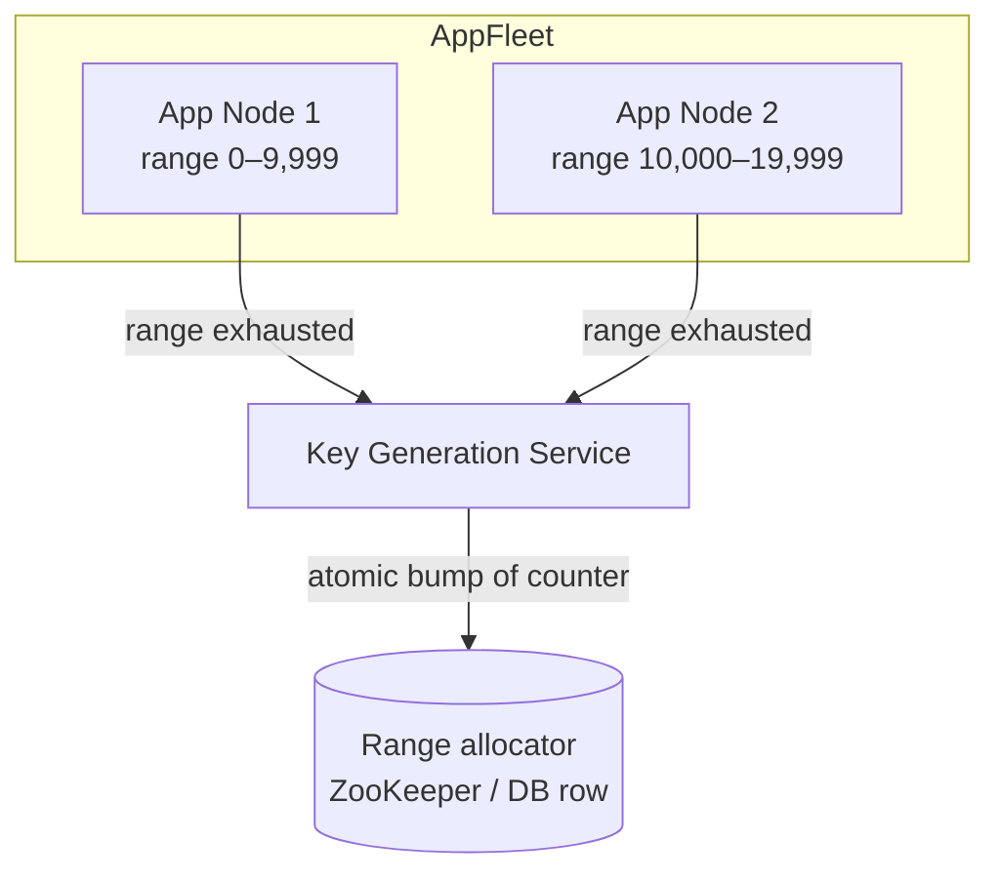
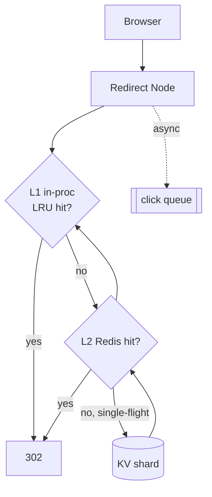
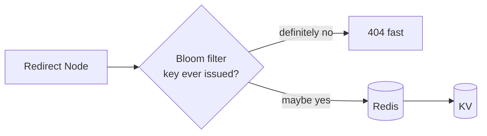
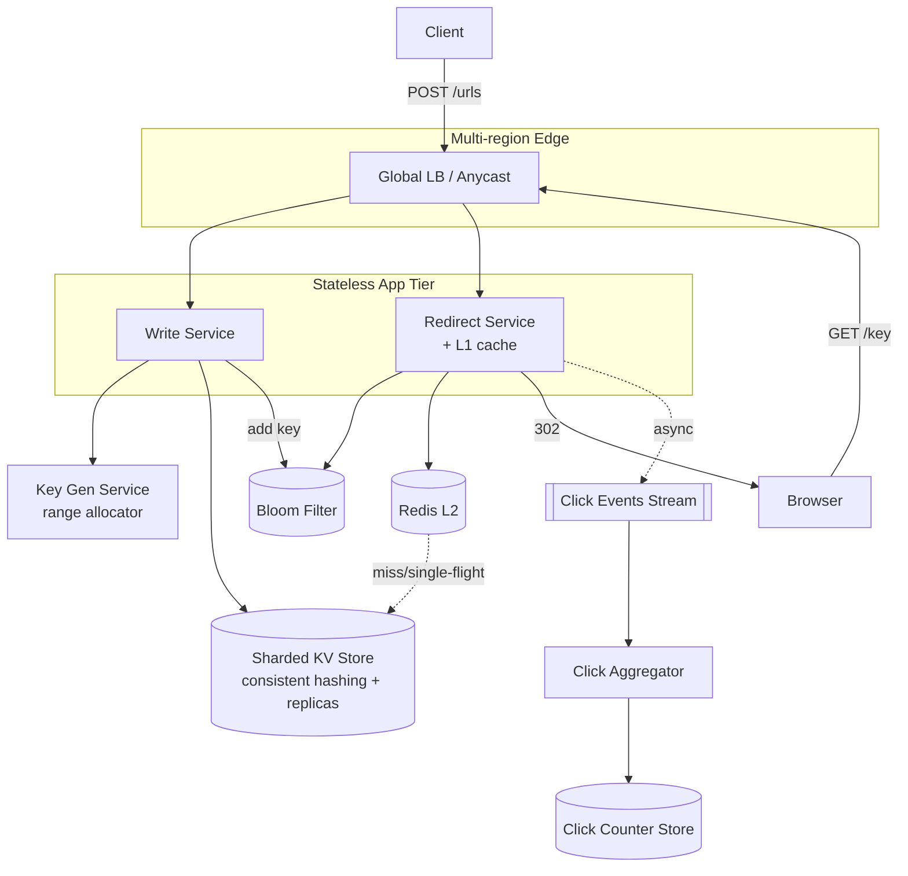

We now evolve the v1 design by attacking each weakness in turn: **Problem → Modification → Justification**. Every step carries its own diagram so the architecture's evolution is visible.

## Refinement 1 — Generating unique keys without collisions

**Problem.** In v1, if each write server generates a random 7-char key and checks the DB for a collision, then at scale we pay a read-before-write on every creation, and as the keyspace fills, collision retries climb. Worse, two servers can race on the same random key.

**Modification.** Use a **Key Generation Service** built on a distributed counter. A monotonic 64-bit ID is allocated per URL and **base62-encoded** into the short key. To avoid a central bottleneck, the KGS hands out **ranges** (e.g. 10,000 IDs at a time) to each app server; the server burns through its local range in memory and only calls back when exhausted.



**Justification & trade-offs.**
- **No collisions by construction** — each ID is unique, so each base62 key is unique. No read-before-write.
- **No hot path to the allocator** — a range lasts a node ~250 s at 40 writes/s spread over 50 nodes, so allocator QPS is negligible.
- **Trade-off:** keys are roughly sequential ⇒ **guessable/enumerable**. If that matters (privacy, scraping), XOR the counter with a secret or run it through a keyed bijective permutation (e.g. Feistel) before base62 — you keep uniqueness but destroy ordering. This is the classic counter-vs-random tension; see {}.
- **Trade-off:** a node crash **wastes** its unused range. At 3.5T keys that's irrelevant.

**Custom aliases** bypass the counter: we do a conditional insert (`INSERT … IF NOT EXISTS`) on the requested key and return **409** if taken. This is the one creation path that needs a strongly-consistent uniqueness check.

## Refinement 2 — Serving redirects at 350k/s: cache stampede & hot keys

**Problem.** Cache-aside means a cache miss falls through to the DB. When a **viral link expires from cache**, thousands of concurrent requests miss simultaneously and stampede the DB shard for that key. A single celebrity link can also make one shard a hotspot.

**Modification.** Three layers of defence:

1. **Request coalescing (single-flight):** on a miss, only the first request per key fetches from the DB; concurrent requests for the same key wait for that result.
2. **Longer TTL + async refresh** for hot keys, so popular links rarely expire from cache.
3. **Read replicas / local in-process cache** on each app node for the top-N keys, absorbing the true hotspots before Redis.



**Justification & trade-offs.** A two-tier cache (in-process L1 + shared Redis L2) turns a hot key into a **local** RAM read with essentially zero downstream cost. Single-flight bounds DB load to *one* query per key per miss window regardless of concurrency. This directly uses {} and {}. Trade-off: L1 adds a small window of staleness on target changes/deletes — acceptable given our eventual-consistency stance, and bounded by a short L1 TTL (e.g. 10 s).

## Refinement 3 — Cheaply rejecting unknown keys

**Problem.** Bots and stale embeds hammer the service with keys that were never issued or have expired. Each becomes a cache miss **and** a DB miss — the most expensive possible path — for a result we could have known was absent.

**Modification.** Put a **Bloom filter** of all issued keys in front of the datastore. A negative from the filter is definitive ("never issued") and returns 404 without touching the DB.



**Justification & trade-offs.** A Bloom filter for 1.2B keys at 1% false-positive needs ~1.4 GB — cheap. False positives merely fall through to the normal (cache→DB) path, so correctness is preserved; false negatives never occur, so we never wrongly 404 a real key. See {}. Expired keys are handled separately (below) since a Bloom filter can't delete.

## Final Architecture



## Drill-Down

### Detailed APIs

Creation response includes the canonical short URL and, for idempotency, echoes a client-supplied `Idempotency-Key` header so a retried POST returns the *same* key instead of minting a second one for the same long URL+owner.

```
POST /api/v1/urls
Headers: Authorization: Bearer <key>, Idempotency-Key: <uuid>
Body:    { "long_url": "...", "custom_alias": "...", "ttl_days": 365 }
201:     { "key": "aB3xZ9", "short_url": "https://sho.rt/aB3xZ9", "expires_at": "2026-02-01T..." }
```

### Database schema & sharding

- **Partition key:** `key`. Distributed with {} so adding shards only remaps a fraction of keys.
- **Storage engine:** an LSM-tree KV store (e.g. Cassandra/DynamoDB-style). Writes are append-friendly; reads are point lookups by primary key — no range scans, no joins.
- **Replication:** 3 replicas per shard, quorum or async depending on the consistency knob. Redirects tolerate replica lag, so reads can hit the nearest replica.
- **Secondary index** on `owner_id` only if the "list my URLs" feature is needed; kept out of the redirect path.

### Data structures used

| Structure | Where | Why |
|---|---|---|
| **Distributed counter + base62** | KGS | Collision-free short keys; compact |
| **Bloom filter** | Redirect fast-path | O(1) negative lookups, ~1.4 GB for 1.2B keys |
| **LRU (L1) + Redis (L2)** | Redirect cache | Absorb hot keys, keep p99 < 50 ms |
| **LSM tree** | KV store | Write-optimised durable mapping |
| **Stream + counter** | Click pipeline | Non-blocking approximate analytics |

### Key algorithm — base62 encoding

```
BASE62 = "0-9A-Za-z"   # 62 symbols
def encode(n):                 # n = 64-bit unique id from KGS
    s = ""
    while n > 0:
        s = BASE62[n % 62] + s
        n //= 62
    return s.rjust(7, '0')      # pad to fixed width
```
Decoding is the inverse; but we never need to decode — the `key` is itself the DB primary key.

### Edge cases & failure handling

- **Expiration:** store `expires_at`; the redirect path checks it and returns 404 if past. A background sweeper (or the store's native TTL) reclaims rows. The Bloom filter isn't updated on expiry (it can't delete) — expired-but-in-filter keys simply fall through and get a 404 from the freshness check.
- **Idempotent creation:** dedupe on `(owner_id, long_url, idempotency_key)` so retries don't mint duplicates.
- **Custom alias collision:** conditional insert → 409.
- **Cache/DB inconsistency on delete:** deletes invalidate L2 and rely on short L1 TTL to converge.
- **KGS unavailable:** app nodes still have a local range buffered, so creation survives a brief allocator outage — a key resiliency win of the range approach.
