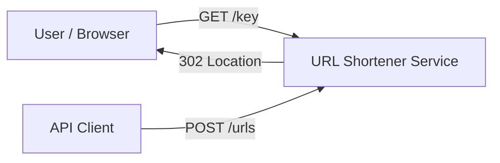
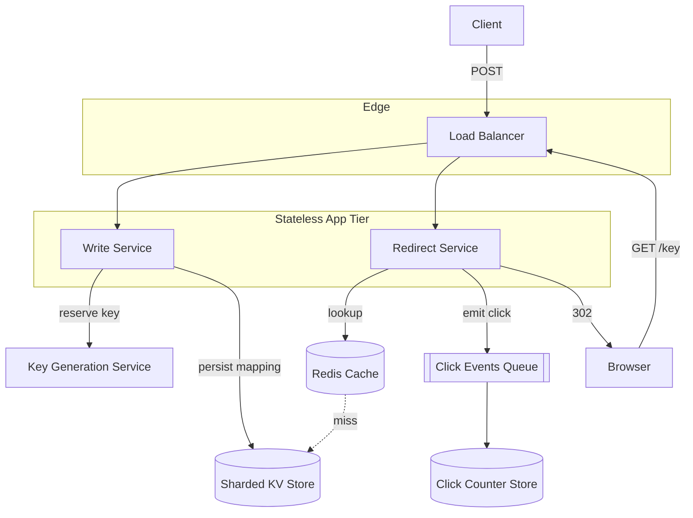

## Capacity Estimation

Start from the requirement numbers and derive everything else. Show the arithmetic — an interviewer wants to see the reasoning, not a memorised answer.

### Traffic

| Metric | Calculation | Result |
|---|---|---|
| Writes (new URLs) | 100M / month ÷ (30 × 86400 s) | **~40 writes/s** |
| Reads (redirects) | 10B / day ÷ 86400 s | **~115,000 reads/s** |
| Read:write ratio | 115,000 / 40 | **~2900:1** |
| Peak reads (×3 burst) | 115,000 × 3 | **~350,000 reads/s** |

The system is overwhelmingly a **read path**. Every design decision optimises redirect reads first.

### Storage

| Field | Bytes |
|---|---|
| short key (7 chars) | 7 |
| long URL (avg) | 500 |
| metadata (created_at, ttl, owner, click stub) | ~100 |
| **Per record** | **~617 B → round to ~1 KB with overhead/indexes** |

| Metric | Calculation | Result |
|---|---|---|
| New records/year | 100M × 12 | **1.2B / year** |
| Storage/year | 1.2B × 1 KB | **~1.2 TB / year** |
| 5-year retention | 1.2 TB × 5 | **~6 TB** |

Six terabytes is small — it fits comfortably in a sharded key-value store, and the **hot subset** fits in RAM.

### Memory (cache working set)

Click distributions are heavily skewed (Zipfian): a small fraction of links get most traffic. Assume the **hot 20%** of a day's *active* links serve ~80% of reads.

| Metric | Calculation | Result |
|---|---|---|
| Distinct links read/day | ~estimate 500M active | 500M |
| Hot set (20%) | 500M × 0.2 | 100M entries |
| Entry size in cache (key+URL) | ~530 B | — |
| Cache RAM needed | 100M × 530 B | **~53 GB** |

That fits in a small Redis cluster (a handful of nodes with replicas). Cache hit ratio target: **> 95%**, so the datastore only sees ~5% of 350k = ~17k reads/s at peak.

### Bandwidth

| Direction | Calculation | Result |
|---|---|---|
| Redirect responses (egress) | 115,000/s × ~500 B header/body | ~58 MB/s |
| Write ingress | 40/s × 1 KB | negligible |

Bandwidth is trivial; redirects are tiny HTTP 301/302 responses.

### Derived infrastructure

- **App servers:** at ~10k req/s per node, peak 350k/s ⇒ ~35 stateless nodes + headroom ⇒ **~50 nodes** behind a load balancer across regions.
- **Cache:** ~53 GB working set ⇒ 3–6 Redis nodes (with replicas) per region.
- **Datastore shards:** 6 TB with replication ⇒ a modest sharded cluster (e.g. 6–12 shards) sized for write IOPS headroom, not capacity.

## API Design

A tiny, REST-ish contract. Creation is authenticated (API key at the gateway); redirect is public.

```
POST /api/v1/urls
  Body: { "long_url": "https://…", "custom_alias": "my-brand"?, "ttl_days": 365? }
  201 → { "short_url": "https://sho.rt/aB3xZ9", "key": "aB3xZ9", "expires_at": "…" }
  409 → custom_alias already taken
  400 → malformed URL

GET /{key}
  302 → Location: <long_url>        (redirect)
  404 → unknown / expired key

GET /api/v1/urls/{key}              (metadata, authenticated)
  200 → { "long_url", "created_at", "expires_at", "click_count" }

DELETE /api/v1/urls/{key}           (authenticated, owner only)
  204
```

**Why 302 vs 301?** A **301 (permanent)** is cached by browsers and intermediaries, so subsequent visits skip our server entirely — great for load, terrible for click analytics (we never see the repeat visit). A **302 (found/temporary)** forces the browser back to us each time, so we can count clicks and change the target later. Most shorteners use **302** to preserve analytics and flexibility. State this trade-off explicitly in an interview.

## Data Model

A single logical mapping table, sharded by key.

```
url_mapping
  key            VARCHAR(7)   PRIMARY KEY    -- base62 short key
  long_url       TEXT         NOT NULL
  owner_id       BIGINT                       -- from API gateway
  created_at     TIMESTAMP
  expires_at     TIMESTAMP    NULL            -- null = never
  is_custom      BOOLEAN
```

```
click_counter          -- separate, high-write, approximate
  key            VARCHAR(7)
  count          BIGINT       -- incremented asynchronously
```

We deliberately **split** the durable mapping from the hot click counter: the mapping is written once and read constantly; the counter is written constantly and read rarely. Different access patterns ⇒ different stores.

## High-Level Architecture — v1

### Level 0 — Context



### Level 1 — First-cut components



**Component responsibilities & first-order justification:**

- **Load Balancer / stateless app tier.** Redirect and write services are stateless, so we scale horizontally and place them in multiple regions. Statelessness is what lets a 50-node fleet absorb 350k req/s.
- **Key Generation Service (KGS).** The crux of the design. We must produce unique 7-char keys without two servers ever colliding. v1 approach (refined next section): a central counter that hands out ranges. See {}.
- **Redis cache.** Fronts every redirect. With a >95% hit ratio the datastore is barely touched. Uses {} (cache-aside) and {} (LRU/LFU) for the hot set.
- **Sharded KV store.** The durable source of truth, partitioned by key using {}. A key-value engine is the natural fit — we only ever look up by primary key. See {}.
- **Click queue + counter store.** Redirects emit a click event asynchronously so the redirect response is never blocked on a counter write. Approximate counting is acceptable per requirements.

The obvious weaknesses of v1 — how KGS avoids collisions at scale, cache stampedes, hot keys, and negative lookups for non-existent keys — are exactly what the {} tackles.
