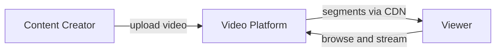
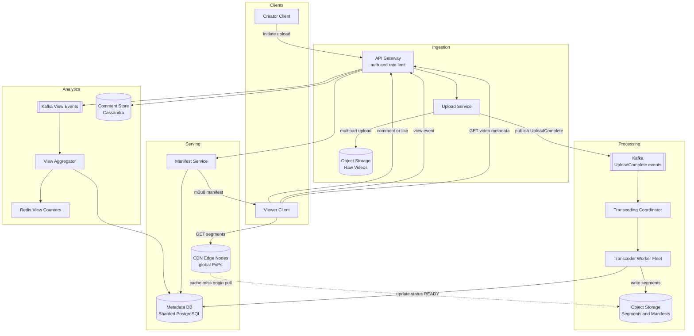

## Capacity Estimation

### Traffic

| Metric | Calculation | Result |
|---|---|---|
| Content uploaded | 500 hrs/min × 60 min | **30,000 hrs of video/day** |
| Videos uploaded/day | 30,000 hrs × 60 min/hr ÷ 10 min avg | **~180,000 videos/day** |
| Upload write QPS | 180,000 ÷ 86,400 s | **~2 uploads/s** |
| Concurrent streams (avg) | 1B hrs/day ÷ 24 hrs | **~40M concurrent streams** |
| Segment requests/s (avg) | 40M streams ÷ 6 s/segment | **~6.7M segment requests/s** |
| Peak concurrent streams | avg × 2 burst factor | **~80M streams** |
| Peak segment requests/s | 80M ÷ 6 | **~13M segment requests/s** |

The system is overwhelmingly **read-dominated at the CDN layer**. Uploads are rare events; every second of a stream is a segment fetch.

### Storage — Rendition Ladder

Every hour of raw video is transcoded into six renditions. The table below shows how storage compounds.

| Rendition | Bitrate | Storage per hour of content |
|---|---|---|
| 240p | 300 kbps | 300 × 3600 ÷ 8 ÷ 1024 = **135 MB** |
| 360p | 500 kbps | **225 MB** |
| 480p | 1 Mbps | **450 MB** |
| 720p | 2.5 Mbps | **1,125 MB** |
| 1080p | 5 Mbps | **2,250 MB** |
| 4K | 15 Mbps | **6,750 MB** |
| **All renditions combined** | — | **≈ 10,935 MB ≈ 11 GB/hr** |
| Raw source stored | ~8 Mbps avg upload | **~2 GB/hr** |
| **Total per hour of content** | — | **~13 GB/hr** |

| Metric | Calculation | Result |
|---|---|---|
| New storage per day | 30,000 hrs/day × 13 GB/hr | **~390 TB/day ≈ 400 TB/day** |
| Transcoding storage multiplier | 11 GB transcoded ÷ 2 GB raw | **~5.5×** |
| Storage growth per year | 400 TB × 365 | **~146 PB/year** |

The **5.5× transcoding multiplier** is the most important storage insight: storing every rendition costs far more than just the original. Object storage must be exabyte-scale.

### CDN Bandwidth — The Dominant Cost Driver

| Metric | Calculation | Result |
|---|---|---|
| Avg egress bandwidth | 40M streams × 2 Mbps avg quality | **~80 Tbps** |
| Peak egress bandwidth | 80M streams × 3 Mbps | **~240 Tbps** |
| Origin pull (CDN cache hit 99%) | 80 Tbps × 0.01 | **~800 Gbps to origin** |

CDN egress at **80–240 Tbps** is the single biggest infrastructure cost and the reason CDN design is central to this system. Netflix similarly peaks at ~100–150 Tbps. See {}.

### Metadata and Event Scale

| Metric | Calculation | Result |
|---|---|---|
| Video metadata records/day | 180,000 × 1 KB | **~180 MB/day** (trivial) |
| View events/day | 1B views × 100 bytes | **~100 GB/day event stream** |
| Comments/day | ~10M × 200 bytes | **~2 GB/day** |

Metadata is tiny. The view event stream is the interesting write volume — it feeds the approximate view count pipeline.

### Derived Infrastructure

- **Transcoder workers:** A 10-min video produces 300 × 2 s segments × 6 renditions = 1,800 encoding jobs. With 2 uploads/s average, that is ~3,600 jobs/s continuously. At 100 ms per encode job (H.264 fast preset on a CPU core), the fleet needs thousands of worker cores, auto-scaled via a managed job queue. See {}.
- **CDN edge nodes:** Hundreds of PoPs globally via major CDN providers. The 99% cache hit rate means the ~800 Gbps origin pull is handled by a much smaller origin tier.
- **Metadata store:** tens of millions of video records — comfortably fits in a sharded relational DB or document store.
- **View counter tier:** Redis cluster absorbing ~10K increment events/s, flushed to durable store in batches.

## API Design

### Upload Flow

```
POST /api/v1/videos/initiate-upload
  Body: { "title": "...", "description": "...", "filesize_bytes": 10737418240, "mime_type": "video/mp4" }
  201 → { "video_id": "v_abc123", "upload_id": "up_xyz", "upload_url": "https://storage.../...", "part_size_bytes": 5242880 }

PUT /api/v1/videos/up_xyz/parts/{partNumber}       (client uploads directly to object storage)
  Body: <binary chunk>
  200 → { "etag": "..." }

POST /api/v1/videos/up_xyz/complete
  Body: { "parts": [{"part": 1, "etag": "..."}, ...] }
  202 → { "video_id": "v_abc123", "status": "PROCESSING" }
```

### Playback

```
GET /api/v1/videos/{videoId}
  200 → { "video_id", "title", "uploader_id", "duration_s", "status", "manifest_url", "thumbnail_url", "view_count", "like_count" }
  404 → video not found or still processing

GET /api/v1/videos/{videoId}/manifest.m3u8        (or .mpd for DASH)
  200 → HLS master playlist
  (Served via CDN with long-lived cache headers once status = READY)

GET /cdn.example.com/v/{videoId}/{rendition}/seg_{N}.ts   (segment, served by CDN)
  200 → binary segment data
  (Cache-Control: max-age=31536000, immutable)
```

### Social and Search

```
POST /api/v1/videos/{videoId}/views      (idempotent per session)
  204

POST /api/v1/videos/{videoId}/like       (toggle)
  200 → { "liked": true, "like_count": 42301 }

GET  /api/v1/videos/{videoId}/comments?page_token=...&limit=50
  200 → { "comments": [...], "next_page_token": "..." }

POST /api/v1/videos/{videoId}/comments
  Body: { "text": "..." }
  201 → { "comment_id": "...", "created_at": "..." }

GET  /api/v1/search?q=cats+playing&limit=20&page_token=...
  200 → { "videos": [...], "next_page_token": "..." }
```

## Data Model

### Video Record — Relational DB (e.g. PostgreSQL, sharded by `video_id`)

```
videos
  video_id       UUID          PRIMARY KEY
  uploader_id    BIGINT        NOT NULL
  title          TEXT          NOT NULL
  description    TEXT
  tags           TEXT[]
  status         ENUM          -- UPLOADING | PROCESSING | READY | FAILED
  duration_s     INT
  raw_path       TEXT          -- s3://bucket/raw/{video_id}/source.mp4
  uploaded_at    TIMESTAMP
  published_at   TIMESTAMP     NULL
  view_count     BIGINT        DEFAULT 0    -- cached approximate
  like_count     BIGINT        DEFAULT 0    -- cached approximate
```

### Segments and Manifests — Object Storage only (no DB rows)

Segments and manifests are addressed by a naming convention; no database is needed:

```
s3://segments-bucket/v/{videoId}/master.m3u8          (HLS master)
s3://segments-bucket/v/{videoId}/manifest.mpd          (DASH)
s3://segments-bucket/v/{videoId}/{rendition}/playlist.m3u8
s3://segments-bucket/v/{videoId}/{rendition}/seg_{N}.ts
```

Immutability is by design. Once a segment is written it never changes — this is what makes CDN caching trivially correct with infinite TTLs.

### Comments — Wide-Column Store (Cassandra, partitioned by `video_id`)

```
comments
  video_id     UUID      PARTITION KEY
  comment_id   TIMEUUID  CLUSTERING KEY DESC   -- newest first
  user_id      BIGINT
  text         TEXT
  like_count   COUNTER
  created_at   TIMESTAMP
```

See {}.

### Likes — Key-Value Store (Redis bitmap or set per video)

- `likes:{videoId}` → HyperLogLog or bitmap of user_id, flushed to DB periodically.
- Strong uniqueness (one like per user per video) enforced by `SADD likes:{videoId} {userId}` returning 0 if already present.

See {}.

### View Events — Stream (Kafka → aggregator → DB)

View events flow through Kafka and are aggregated in batch or streaming to update `view_count` in the video record. See {}.

## Architecture v1

### Level 0 — Context



### Level 1 — Components



**Component responsibilities:**

- **API Gateway.** Authentication, rate limiting, and routing. All client traffic enters here.
- **Upload Service.** Issues presigned multipart upload URLs so the creator client uploads binary data directly to object storage — the service never proxies raw video bytes. On completion it publishes an `UploadComplete` event to Kafka. See {}.
- **Object Storage (raw and segments).** Durable, scalable, and inexpensive storage for both raw uploads and the transcoded segments. See {}.
- **Kafka.** Decouples the upload ingestion path from the transcoding pipeline. A burst of uploads queues naturally without back-pressure on the upload response. See {}.
- **Transcoding Coordinator.** Reads from the `UploadComplete` topic, submits a transcoding DAG, and tracks job progress. Marks video status `READY` when all renditions complete.
- **Transcoder Worker Fleet.** Stateless workers that each consume a single encode job (one segment × one rendition), encode it, and write the output segment to object storage. Fully horizontal — scale out with more workers during upload bursts.
- **CDN Edge Nodes.** Cache segments at hundreds of global PoPs. The 99% cache hit rate means the origin (object storage) sees only a fraction of viewer traffic. Manifests for VOD content are also cached with long TTLs.
- **Manifest Service.** Serves the HLS master playlist and per-rendition playlist files for a video. It reads from the Metadata DB to find the segment paths and builds (or retrieves) the manifest.
- **Redis View Counters.** Absorbs high-frequency view increment events in-memory, periodically flushing to the Metadata DB. Approximate — exact counts are not required. See {}.
- **Comment Store (Cassandra).** Handles high write volume of comments with fast reads by `video_id`. Wide-column model fits the "all comments for a video" query pattern naturally.

The glaring weaknesses of this v1: the transcoding pipeline is underspecified (how does a fleet of workers handle a 2-hour video efficiently?), the streaming model needs detail (how does a player pick quality?), the view counter can lose data, and the CDN strategy for popular vs. long-tail content differs. These are addressed in the deep dives.
