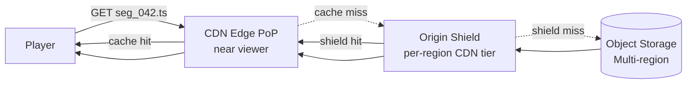
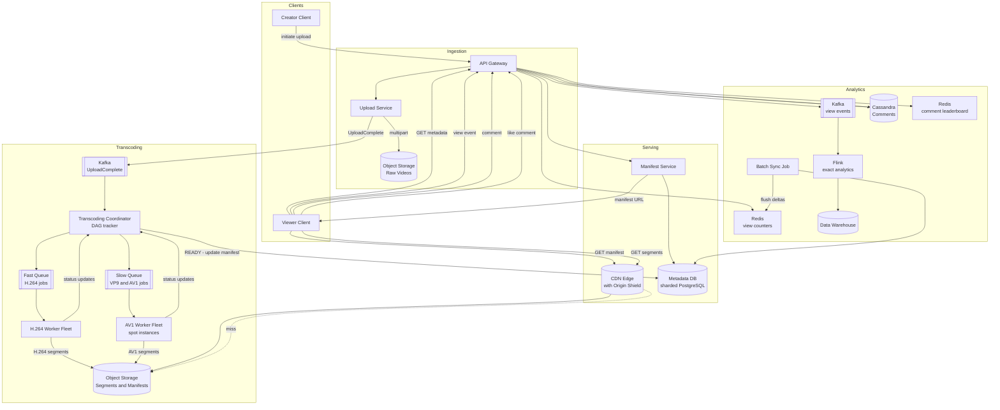

This page covers the **read and delivery path**: how a player fetches a video, how it adapts quality to network conditions, how CDN caching works at petabyte scale, and how view counts and comments operate at YouTube-level write volumes.

## Concept: Adaptive Bitrate Streaming (HLS and DASH)

Adaptive Bitrate (ABR) streaming is the mechanism that lets a video start playing immediately on a slow connection, and automatically upgrade to 4K when bandwidth allows — all without the user touching a quality selector. It is built on two ideas: **chunked delivery** (video is split into independently decodable segments) and **multiple renditions** (each segment exists at multiple quality levels). The player fetches segments one at a time and is free to switch renditions between any two segments.

### The Manifest Files

The client never fetches a video file directly. Instead it fetches a **manifest** — a small text file that describes what is available and where to fetch it.

**HLS** (HTTP Live Streaming, `.m3u8`) is the most widely deployed format, supported natively on Apple devices and in most browsers via Media Source Extensions (MSE).

**Master playlist — `master.m3u8`**

```
#EXTM3U
#EXT-X-VERSION:6

# Lowest quality — fallback for very poor connections
#EXT-X-STREAM-INF:BANDWIDTH=300000,RESOLUTION=426x240,CODECS="avc1.42e01e,mp4a.40.2"
240p/playlist.m3u8

#EXT-X-STREAM-INF:BANDWIDTH=500000,RESOLUTION=640x360,CODECS="avc1.42e01e,mp4a.40.2"
360p/playlist.m3u8

#EXT-X-STREAM-INF:BANDWIDTH=2500000,RESOLUTION=1280x720,CODECS="avc1.64001f,mp4a.40.2"
720p/playlist.m3u8

#EXT-X-STREAM-INF:BANDWIDTH=5000000,RESOLUTION=1920x1080,CODECS="avc1.640028,mp4a.40.2"
1080p/playlist.m3u8

# AV1 codec variant — higher efficiency for capable devices
#EXT-X-STREAM-INF:BANDWIDTH=3000000,RESOLUTION=1920x1080,CODECS="av01.0.08M.08"
1080p-av1/playlist.m3u8
```

**Per-rendition playlist — `720p/playlist.m3u8`**

```
#EXTM3U
#EXT-X-VERSION:6
#EXT-X-TARGETDURATION:6
#EXT-X-MEDIA-SEQUENCE:0
#EXT-X-PLAYLIST-TYPE:VOD

#EXTINF:6.006,
https://cdn.example.com/v/abc123/720p/seg_000.ts
#EXTINF:6.006,
https://cdn.example.com/v/abc123/720p/seg_001.ts
#EXTINF:6.006,
https://cdn.example.com/v/abc123/720p/seg_002.ts
...
#EXT-X-ENDLIST
```

Key tags:
- `#EXT-X-TARGETDURATION` — maximum segment duration; players use this to time buffer reads.
- `#EXT-X-PLAYLIST-TYPE:VOD` — signals that the playlist is complete and immutable; players may cache it aggressively.
- `#EXT-X-ENDLIST` — marks the end of the video; absent in live streams where the playlist grows.
- `#EXTINF:6.006` — the exact duration of the following segment in seconds.

**DASH** (`.mpd`) uses an XML manifest with the same conceptual model — a single MPD file lists `AdaptationSets` (one per codec) containing `Representations` (one per rendition), each pointing to segment URLs. DASH is more flexible (it supports multi-period content and wider codec variety) but HLS enjoys wider native device support. Most large platforms serve both.

### Segments and GOP Alignment

Each `.ts` or `.m4s` segment starts on an IDR (keyframe) boundary — a **GOP boundary** — so it can be decoded independently without reference to any prior segment. This is why the transcoder splits on GOP boundaries (see the {} page). Typical segment durations:

- **2 s segments:** finer ABR granularity, more frequent quality switches, higher manifest overhead.
- **6 s segments:** good balance — the reference in industry (YouTube, Netflix).
- **10 s segments:** lower overhead, coarser quality adaptation, longer ramp-up from a seek.

### ABR Client Algorithm

The player runs a control loop before fetching each new segment. The core decision: "given my current network estimate and buffer level, which rendition do I request next?"

```python
def select_next_rendition(download_history, buffer_seconds, renditions):
    """
    download_history: list of (bytes, duration_s) for recent segment downloads
    buffer_seconds:   seconds of video buffered ahead of playhead
    renditions:       list of Rendition(label, bitrate_bps) sorted by bitrate ascending
    """
    # Step 1: estimate throughput from the last 3 segment downloads
    if len(download_history) == 0:
        throughput_bps = renditions[0].bitrate_bps  # conservative start
    else:
        recent = download_history[-3:]
        throughput_bps = sum(b * 8 for b, _ in recent) / sum(d for _, d in recent)

    # Step 2: apply a safety margin to handle bandwidth fluctuation
    safe_bps = throughput_bps * 0.8

    # Step 3: if buffer is running low, be extra conservative to avoid rebuffering
    if buffer_seconds < 10:
        safe_bps *= 0.7          # throttle quality to rebuild buffer

    # Step 4: if buffer is very healthy, allow an upswitch aggressively
    if buffer_seconds > 30:
        safe_bps = throughput_bps * 1.0   # no safety margin needed

    # Step 5: pick the highest rendition whose bitrate fits
    selected = renditions[0]   # start at lowest
    for r in renditions:
        if r.bitrate_bps <= safe_bps:
            selected = r

    return selected
```

Real players (e.g. the open-source `hls.js` and `shaka-player`) use more sophisticated variants — BOLA (Buffer Occupancy-based Lyapunov Algorithm) or MPC (Model Predictive Control) — but this captures the core logic.

**Why segment-based streaming enables seamless switching:** Because each segment starts at a GOP boundary, the player can switch renditions between any two segments with no decoding artifacts. It simply fetches `seg_042.ts` from the `720p` playlist and then `seg_043.ts` from the `1080p` playlist. The decoder starts cleanly on the new segment's IDR frame.

---

## Refinement 4 — CDN Caching Strategy

**Problem.** The v1 architecture assumes the CDN caches everything uniformly. In practice, a video uploaded 5 years ago and watched 3 times per day will never stay warm in CDN cache. If a long-tail segment cache-misses on every request, the origin (object storage) bears the load directly — and CDN egress costs money even for misses.

**Modification.** Differentiate caching policy by content popularity:

1. **Segments (all videos):** `Cache-Control: max-age=31536000, immutable`. Segments never change once written — an infinite TTL is correct. Hot segments stay in edge cache permanently; cold ones are evicted naturally by LRU.
2. **Manifests (VOD):** `Cache-Control: max-age=3600` (1 hour). VOD manifests are immutable once `READY`, but a shorter TTL than segments allows the slow-path AV1 manifest update (Refinement 3) to propagate to CDN edges within ~60 s.
3. **Popular video warm-up:** When a video is about to go viral (e.g., a major channel publishes), proactively push the first 30 s of segments (the highest-engagement window) to all CDN PoPs via a CDN push API before viewers arrive. This avoids a wave of simultaneous cache misses.
4. **Long-tail origin shield:** For rarely watched segments, configure an **origin shield** — a single intermediate CDN tier per region that absorbs cache misses from the many edge PoPs before reaching object storage. This collapses many parallel cold misses into a single origin fetch.



**Justification and trade-offs.** Immutable segments make CDN caching trivially correct — there is no cache invalidation problem. The origin shield pattern collapses N edge-miss fetches for the same cold segment into 1 origin fetch per region. This is crucial for long-tail content: a video watched once a week by 50 globally scattered users would otherwise generate 50 separate origin GETs. With a shield, it generates at most one per region per TTL window. See {} and {}.

## Refinement 5 — View Count Aggregation at Scale

**Problem.** 1 billion views/day = ~11,600 views/s average, peaking far higher. Writing a SQL `UPDATE view_count = view_count + 1` to the Metadata DB on every view event is a write hotspot — one row per video being hammered by thousands of concurrent writes. See {}.

**Modification.** Decouple view counting into three tiers:

1. **Client-side buffering:** the player emits a single view event after 30 s of watch time (not per-second pings). This bounds the event rate to the number of concurrent streams / 30 ≈ 1.3M events/s.
2. **Redis approximate counter:** the API receives view events and issues `INCRBY views:{videoId} 1` in Redis. A Redis cluster handles millions of increments/s with sub-millisecond latency. The counter is approximate and can lose data if a Redis node crashes without persistence.
3. **Batch sync to DB:** a background job reads Redis counters every 60 s and flushes deltas to the Metadata DB with `UPDATE videos SET view_count = view_count + $delta WHERE video_id = $id`. The DB sees ~180,000 updates per flush cycle — manageable, not a hotspot.
4. **Exact counts (analytics):** Kafka receives every view event and feeds a stream processing pipeline (Flink or Spark Streaming) for exact analytics, segmented by time, geography, and watch duration.

```mermaid
flowchart TB
    P[Player sends view event after 30 s]
    AG[API Gateway]
    RC[Redis INCRBY<br/>views:{videoId}]
    KF[[Kafka view events topic]]
    BS[Batch Sync Job<br/>every 60 s]
    MD[(Metadata DB<br/>view_count column)]
    FL[Flink Stream Processor<br/>exact analytics]
    DW[(Data Warehouse)]

    P --> AG
    AG --> RC
    AG --> KF
    BS -->|read Redis deltas| RC
    BS -->|flush deltas| MD
    KF --> FL --> DW
```

**Justification and trade-offs.** Redis absorbs the write spike; the DB sees only batched updates. The view count a user sees may lag by up to 60 s — acceptable per requirements (approximate). Exact analytics are available from Kafka → Flink with a few seconds of delay. This is the canonical **read-fast, write-buffered** pattern for high-cardinality counters. See {} and {}.

## Refinement 6 — Comments at Scale

**Problem.** A popular video can receive 10,000 comments per hour immediately after publishing. Reading the top comments requires sorting by like count or recency. A single relational table per video becomes a hotspot on both reads and writes.

**Modification.** Use Cassandra (wide-column store) partitioned by `video_id` with `comment_id` as a time-ordered clustering key. This gives:

- **O(1) writes:** every comment write goes to the partition for that video_id on the responsible replica set. No global coordination.
- **Efficient pagination:** reading the first 50 comments ordered by `created_at DESC` is a single partition scan with the clustering key.
- **Like counts on comments:** use Cassandra's native `COUNTER` column type — increments are commutative CRDTs, safe under concurrent writes with no locking.

```
comments
  video_id     UUID       PARTITION KEY
  comment_id   TIMEUUID   CLUSTERING KEY DESC    -- newest first
  user_id      BIGINT
  text         TEXT
  like_count   COUNTER
  created_at   TIMESTAMP
```

**Top-comment ranking** (by likes) is a separate problem — maintaining a sorted leaderboard per video in Redis (`ZADD top_comments:{videoId} {like_count} {comment_id}`) for the top-N is efficient for reads, updated asynchronously whenever a comment is liked.

**Justification and trade-offs.** Cassandra's partition-per-video model means no single node is responsible for all videos — load distributes naturally. The trade-off: Cassandra does not support efficient `ORDER BY like_count DESC` across all comments in a partition (its clustering key is fixed at schema time). Ranked comment ordering requires the Redis leaderboard sidecar or a batch re-rank. See {}.

## Final Architecture



## Drill-Down

### Detailed Streaming APIs

**Initiate playback:**
```
GET /api/v1/videos/v_abc123
200 → {
  "video_id": "v_abc123",
  "title": "How the Internet Works",
  "status": "READY",
  "duration_s": 614,
  "manifest_url": "https://cdn.example.com/v/abc123/master.m3u8",
  "thumbnail_url": "https://cdn.example.com/v/abc123/thumb.jpg",
  "view_count": 1432891,
  "like_count": 84201
}
```

The `manifest_url` points directly to CDN. Once the player has this URL, **no further backend calls are needed** for the streaming path — all segment fetches go directly to CDN.

### Database Schema — Video Metadata

```sql
-- Sharded by video_id (consistent hashing across shards)
CREATE TABLE videos (
    video_id      UUID         PRIMARY KEY,
    uploader_id   BIGINT       NOT NULL,
    title         TEXT         NOT NULL,
    description   TEXT,
    tags          TEXT[],
    status        TEXT         NOT NULL DEFAULT 'UPLOADING',
    duration_s    INT,
    raw_path      TEXT,
    manifest_path TEXT,           -- s3://segs/v_abc123/master.m3u8
    uploaded_at   TIMESTAMPTZ  NOT NULL DEFAULT NOW(),
    published_at  TIMESTAMPTZ,
    view_count    BIGINT       NOT NULL DEFAULT 0,  -- approximate, batch-updated
    like_count    BIGINT       NOT NULL DEFAULT 0
);

CREATE INDEX idx_videos_uploader ON videos (uploader_id, published_at DESC);
CREATE INDEX idx_videos_status   ON videos (status) WHERE status != 'READY';
```

### Data Structures

| Structure | Where | Why |
|---|---|---|
| **Kafka topics** | Upload events, view events | Durable, ordered, replayable event streams; backpressure-safe |
| **DAG completion bitmap** | Coordinator, per video | Track which Seg × Rendition jobs are done with O(1) set and check |
| **Redis INCRBY counter** | View counting | Atomic integer increment at millions/s; in-memory speed |
| **Redis ZADD sorted set** | Comment leaderboard | O(log N) insert and O(1) top-N retrieval |
| **Cassandra COUNTER** | Comment likes | CRDT counter — commutative under concurrent increments, no locking |
| **Perceptual hash index** | Deduplication | 64-bit fingerprints indexed in Redis for fast similarity lookup |
| **Wide-column partition** | Comments by video | One partition per video; range scan on clustering key for pagination |

### Key Algorithm — ABR Startup and Seek

**Startup:** the player begins by requesting the `master.m3u8`. It has no throughput estimate yet, so it picks the **second-lowest rendition** (not the lowest, to avoid an immediately visible quality bump). After the first segment download it computes throughput and immediately upswitches if bandwidth allows.

**Seek:** the player computes the target segment index as `floor(seek_position_s / segment_duration_s)`. It fetches that single segment's URL from the cached per-rendition playlist. Because all segments start on IDR frames, playback can start immediately at the seek position.

### Edge Cases and Failure Handling

- **CDN node failure:** the DNS or Anycast layer routes the next request to an adjacent PoP. The player re-requests the same segment URL; the new PoP fetches from the origin shield if needed. Transparent to the viewer.
- **Manifest not found (video still PROCESSING):** the Metadata DB returns `status: PROCESSING`. The player shows a "processing" screen and polls with exponential backoff rather than hammering the CDN.
- **Segment 404 on CDN:** the player retries the same segment up to 3 times, then falls back to the next-lower rendition's copy of the same segment (same timestamp, different quality). If all fail, it reports a playback error.
- **Redis view counter node failure:** the Redis replica takes over within seconds (Redis Sentinel / Cluster failover). In-memory counts not yet persisted to the replica are lost — the view_count may be slightly under-counted for that window. Acceptable; approximation is in the requirements.
- **Comment write hotspot on viral video:** Cassandra distributes writes to the token range for that `video_id` across its replication factor of 3. Each of the 3 replicas independently accepts writes at full speed. Even at 100 comments/s, this is trivial for Cassandra. The real hotspot risk is on **reads** of the first page of comments for a viral video — mitigated by caching the top-50 comments response in Redis with a 30 s TTL.
- **Like deduplication:** to enforce one like per user per video, the API checks `SADD likes:{videoId} {userId}` before incrementing the counter. If `SADD` returns 0 (already a member), the like is rejected idempotently. The set is periodically flushed to a `video_likes` table in the DB for durability.
