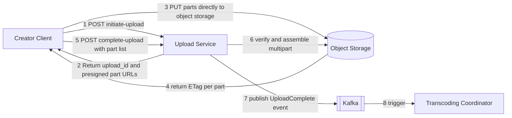
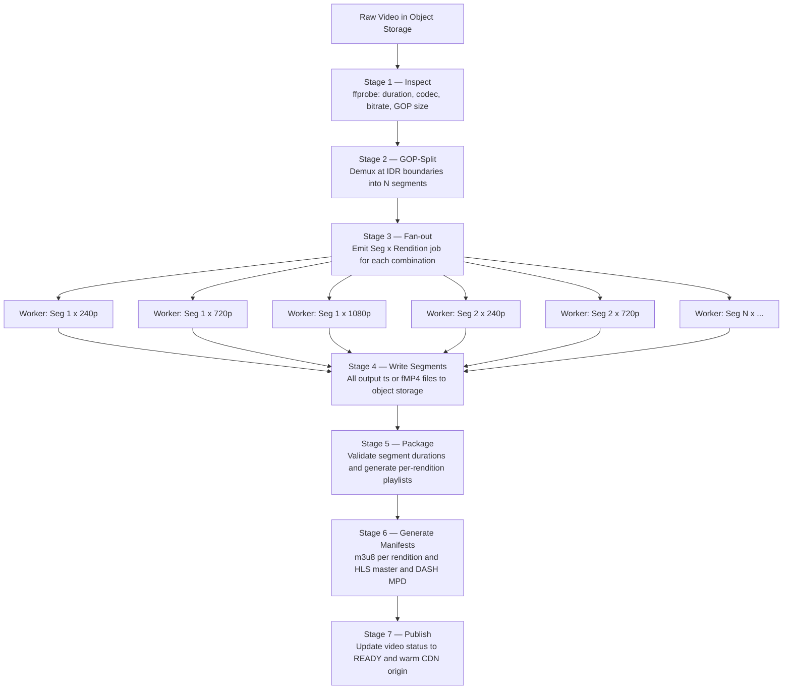
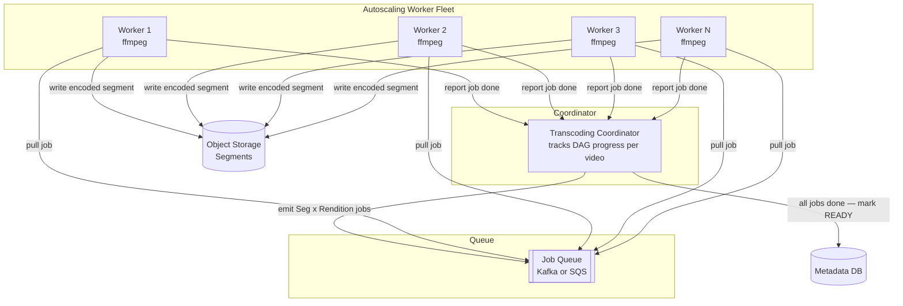
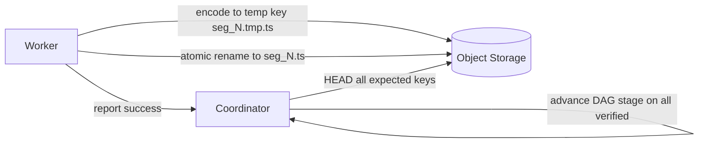
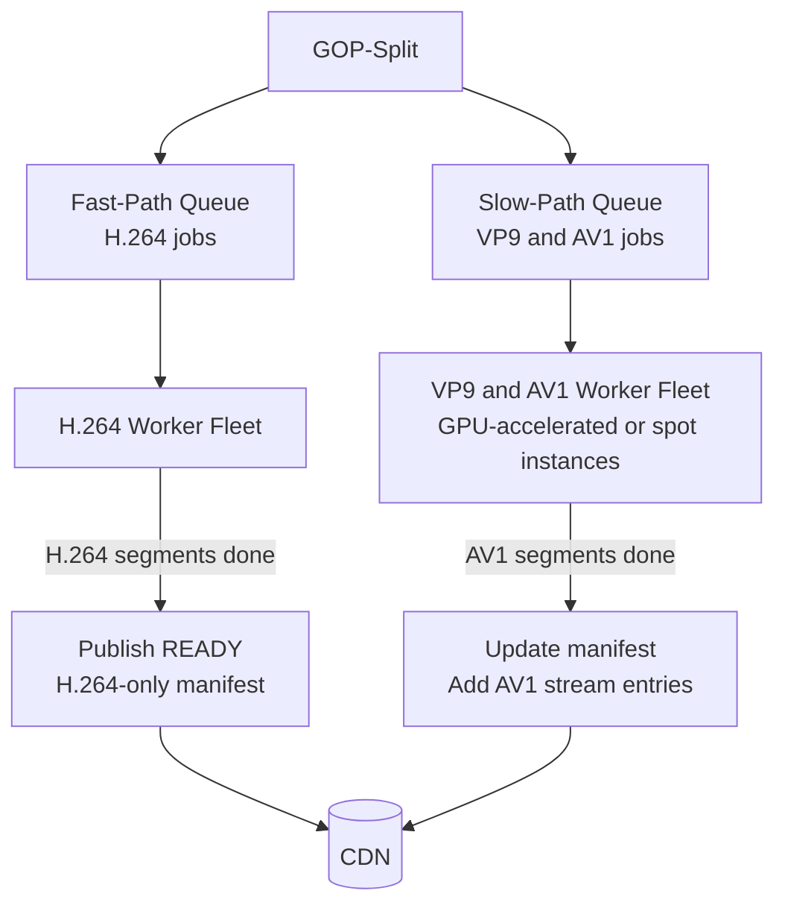

This page covers the **write and processing path**: how a raw video file goes from a creator's device to a fleet of transcoder workers and ends up as thousands of immutable segments ready to stream. Two core concepts are explained in depth here because no separate concept pages exist: **resumable chunked uploads** and the **video transcoding pipeline**.

## Concept: Resumable Chunked Upload

A video file can easily be 10–50 GB. Uploading it as a single HTTP body is unreliable over consumer internet — a dropped connection at 99% completion loses everything. The solution is **multipart upload**, a protocol supported natively by S3 and compatible object stores.

### Upload Flow



**How it works:**

1. The client requests an upload session and receives an `upload_id` plus a presigned URL for each 5 MB part.
2. The client uploads parts in parallel (e.g., 4 concurrent streams), maximising throughput on a fast connection.
3. Each part upload returns an `ETag`. The client tracks which parts succeeded.
4. On completion, the client POSTs the ordered `[{part, ETag}]` list. The object store atomically assembles the file from the parts.
5. **Resume:** if the connection drops mid-upload, the client calls `GET /upload/{upload_id}/parts` to discover which ETags it has, and re-uploads only the missing parts. No bytes are re-sent.

This pattern keeps the Upload Service stateless — it only brokers the session and holds no video bytes itself. All binary data flows directly between the client and object storage.

## Concept: Video Transcoding Pipeline

Transcoding is the most compute-intensive and architecturally interesting part of the system. Naively, you could feed the raw file to a single `ffmpeg` process and wait — but a 2-hour 4K video might take **12–24 hours** to transcode on one machine. The solution is to exploit massive parallelism at two levels: **per segment** and **per rendition**.

### What Is a GOP and Why Does It Matter?

A raw video is not a flat stream of independent frames. Modern codecs (H.264, HEVC, VP9, AV1) compress by encoding **Groups of Pictures (GOPs)**: a full keyframe (IDR frame) followed by a sequence of P-frames (which reference the previous frame) and B-frames (which reference both directions). A 2-second GOP at 30 fps contains 1 keyframe and 59 dependent frames.

**Why this matters for parallelism:** you cannot split a video at an arbitrary byte boundary and independently decode the two halves — a P-frame without its reference frame is meaningless. You must split **on IDR boundaries**. Once you do, every resulting segment is independently decodable, which enables:

1. **Parallel transcoding:** each segment can be sent to a different worker simultaneously.
2. **Client-side random seek:** the player can jump to any segment and start decoding immediately, with no need to decode from the beginning.
3. **ABR switching:** the player can switch renditions at any segment boundary without artifacts.

### Transcoding DAG

The pipeline is structured as a directed acyclic graph (DAG) of stages. A coordinator dispatches and tracks these stages; each stage's output is the next stage's input.



**Parallelism math:** a 10-minute video at 2 s/segment = 300 segments × 6 renditions = **1,800 independent encode jobs**. With 200 workers, the wall-clock time is roughly `1800 / 200 × encode_time_per_segment`. At 200 ms/job (H.264 fast preset on a modern CPU core), wall time ≈ **1.8 seconds** — far faster than real-time. This is the fan-out advantage.

### Codec Ladder

Each job specifies a target codec as well as a resolution and bitrate. Multiple codecs are used because different viewers have different device capabilities and bandwidth costs.

| Codec | Open? | Compression vs H.264 | Encoding speed | Browser / device support |
|---|---|---|---|---|
| **H.264 / AVC** | Royalty fees (MPEG-LA pool) | Baseline | Very fast | Universal — every device |
| **H.265 / HEVC** | Royalty fees | ~40% better | Moderate | Most modern devices and Safari |
| **VP9** | Open (Google) | ~40% better | Moderate | Chrome, Firefox, most Android |
| **AV1** | Open (Alliance for Open Media) | ~30% better than VP9 | Slow (10–50× slower than H.264) | Chrome, Firefox, Edge, modern TVs |

**Why maintain multiple codecs?** A viewer on a 2018 iPhone might only decode H.264 in hardware. A viewer on a modern desktop Chrome can use AV1, which at the same perceptual quality uses ~30% less bandwidth — a meaningful CDN cost reduction at scale. The HLS master manifest lists alternate streams for each codec; the player picks the best it can decode.

**Practical strategy:** always encode H.264 first (fast path — video is available in minutes); enqueue VP9 and AV1 asynchronously (slow path — available hours later). Viewers start watching in H.264 and seamlessly get AV1 once segments are published. This is Refinement 3 below.

### Video Deduplication — Content Fingerprinting

Many uploads are re-uploads of the same content (user re-encodes a clip, duplicate accounts, piracy). Re-transcoding identical content wastes enormous compute.

**How it works:**

1. Before submitting transcoding jobs, the coordinator samples keyframes from the raw video (every 10 s) and computes a **perceptual hash** (pHash) of each — a 64-bit fingerprint that is robust to minor re-encoding, bitrate change, and small crops.
2. It queries a hash index (Redis sorted set or Cassandra) for the fingerprints.
3. On a match above a threshold (e.g., >90% of keyframe hashes match), it **reuses the existing video's segments** rather than re-encoding — just creating a new `video_id` pointing to the same paths in object storage.
4. An **exact-content check** (SHA-256 of the raw file) catches bit-identical duplicates instantly at zero cost.

This can eliminate 10–20% of transcoding jobs at scale.

---

## Refinement 1 — From Single Transcoder to Worker Fleet

**Problem.** v1 described a "Transcoding Coordinator" and "Transcoder Worker Fleet" without explaining how jobs flow. A naive implementation — one process per video, doing all renditions serially — cannot keep up with 2 uploads/s × 1,800 jobs/upload = 3,600 jobs/s.

**Modification.** The Transcoding Coordinator submits each `(videoId, segmentPath, rendition)` tuple as an independent message to a **work queue** (e.g., a Kafka topic or SQS FIFO queue). A fleet of stateless worker processes, each running `ffmpeg`, pulls one job at a time, encodes the segment, writes the output, and ACKs the message.



**Justification and trade-offs.** A queue-backed fleet has natural elasticity: during upload bursts, add more workers; at night, scale to zero. Job granularity at the segment level ensures even load distribution (no single long job blocks the queue). The coordinator tracks a **completion bitmap** per video — when all `N_segments × N_renditions` bits are set, it advances to packaging. See {} and {}.

**Trade-off:** coordinating thousands of small jobs requires a reliable job tracking store (the coordinator must be fault-tolerant). A crash of the coordinator before all jobs are ACKed must not double-enqueue. Solve by persisting the DAG state durably (e.g., a row per job in a DB) before emitting to the queue.

## Refinement 2 — Handling Worker Failures (Idempotent Jobs)

**Problem.** A worker crashes mid-encode or the process is killed by an OOM. The job is still in the queue (or requeued after a visibility timeout). Re-running the same job must produce the same result without side effects.

**Modification.** Make every encode job **idempotent** by design:

1. The output path is deterministic: `s3://segs/{videoId}/{rendition}/seg_{N}.ts`. Re-running the job overwrites the same key.
2. Workers write to a **staging key** first (`seg_{N}.tmp.ts`), then do an atomic rename/copy to the final key only on success.
3. The coordinator does not advance to packaging until it can verify all final segment keys exist via a manifest check (`HEAD` request on each expected key).
4. The queue uses **at-least-once delivery** with an appropriate visibility timeout (longer than the longest expected encode time). Duplicate delivery is safe because of (1).



**Justification and trade-offs.** Idempotent jobs are the foundation of reliable distributed pipelines. At-least-once + idempotency = exactly-once effect, without expensive distributed transactions. The coordinator's `HEAD`-based verification catches silent worker crashes where the job silently disappeared without completing. See {}.

## Refinement 3 — Fast Path and Slow Path for Codecs

**Problem.** AV1 encoding is 10–50× slower than H.264. If we wait for all AV1 renditions to complete before marking a video `READY`, a 10-minute video might take 30+ minutes to publish. That is a bad creator experience.

**Modification.** Split transcoding into two phases with separate publish gates:

1. **Fast path (< 5 min):** Encode all renditions in H.264 only. Mark video `READY` once H.264 segments are complete. Viewers can start watching immediately.
2. **Slow path (async, hours later):** Encode VP9 and AV1 renditions. As each rendition completes, **atomically update the master manifest** to add the new stream. Existing viewers continue using H.264; new players fetching the manifest get AV1 if capable.



**Justification and trade-offs.** Creators see their video live within minutes. AV1 bandwidth savings (CDN cost reduction) arrive asynchronously. The manifest update is an atomic key overwrite in object storage, so viewers either see the old manifest or the new one — no partial state. The CDN's manifest TTL must be short enough (e.g., 60 s) that edge nodes pick up the updated manifest within a minute of AV1 becoming available. This is a small consistency trade-off: some viewers may serve H.264 for up to 60 s after AV1 is ready.

Trade-off: VP9/AV1 workers are expensive. Use spot/preemptible instances (acceptable because jobs are idempotent and retryable).

## Drill-Down: Transcoding Pipeline

### Detailed Transcoding Job Schema

```json
{
  "job_id": "job_v_abc123_seg_042_720p",
  "video_id": "v_abc123",
  "segment_index": 42,
  "input_path": "s3://raw/v_abc123/source.mp4",
  "start_pts": "84.000",
  "end_pts": "86.000",
  "rendition": {
    "label": "720p",
    "width": 1280,
    "height": 720,
    "bitrate_kbps": 2500,
    "codec": "h264",
    "preset": "fast"
  },
  "output_path": "s3://segs/v_abc123/720p/seg_042.ts",
  "enqueued_at": "2026-07-23T10:00:00Z"
}
```

### Edge Cases

- **Short video (< 2 s):** single segment, single encode job. The pipeline handles this naturally.
- **Variable frame rate (VFR) input:** detect with `ffprobe`; convert to constant frame rate (CFR) in the GOP-split stage before encoding, otherwise segment durations are non-uniform and ABR timestamps drift.
- **Corrupt input file:** the Inspect stage (`ffprobe`) fails with a non-zero exit code; the coordinator moves the video to `FAILED` status and notifies the creator. Never enqueue jobs for a corrupt file.
- **Extremely long video (> 4 hrs):** at 2 s/segment = 7,200 segments × 6 renditions = 43,200 jobs. Still parallelises perfectly; the coordinator's tracking table grows, not the worker design.
- **Transcoder worker OOM:** the visibility timeout (e.g., 600 s) expires; the message reappears in the queue and is picked up by another worker. The idempotent output key means there is no corruption.
