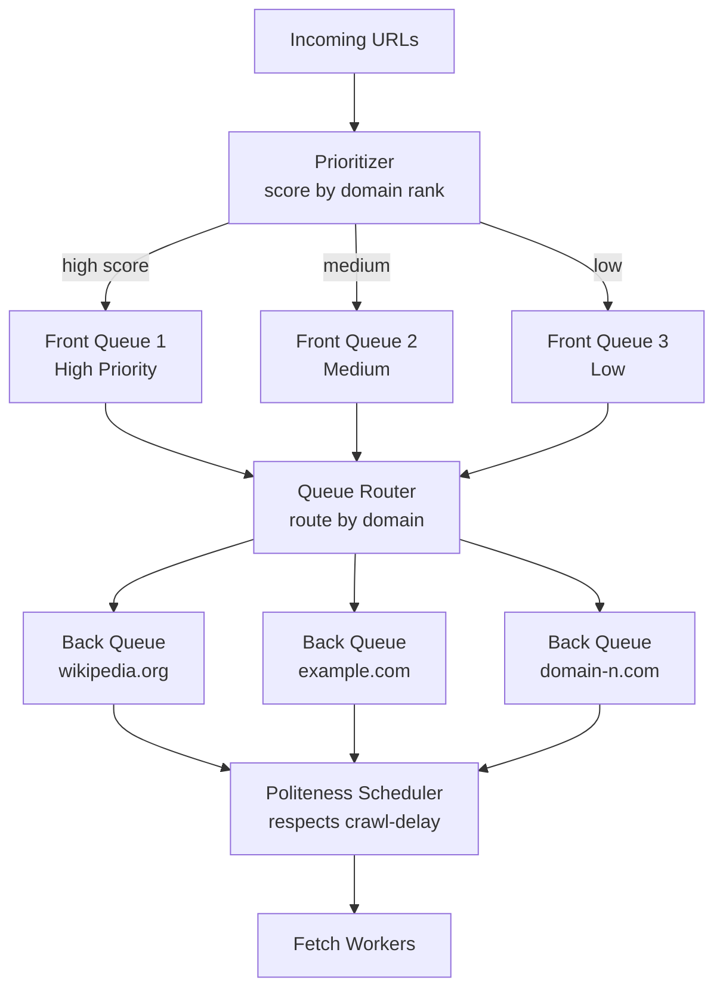
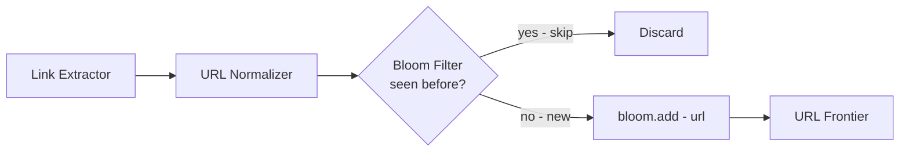
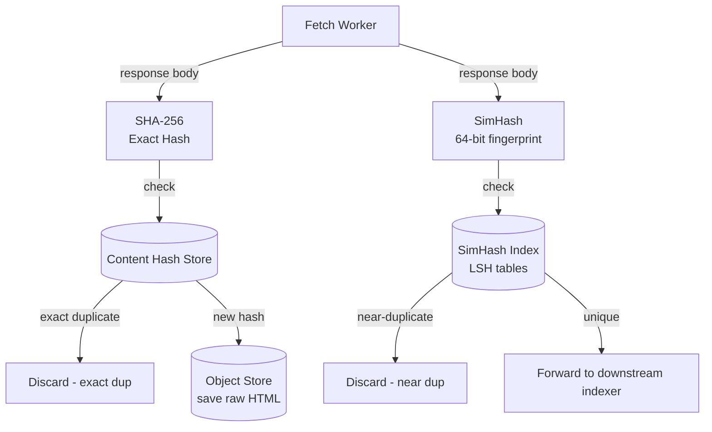

This page evolves the URL frontier from a naive FIFO queue to a two-level priority + politeness design, then hardens URL deduplication with a Bloom filter and adds content-level near-duplicate detection via SimHash.

## Refinement 1 — Two-Level URL Frontier

**Problem.** The v1 single FIFO queue has two critical flaws:

1. **No priority.** A low-value auto-generated page blocks a high-value authoritative page. The crawl budget is finite — spending it wisely on important pages is essential.
2. **No politeness.** Multiple workers can simultaneously dequeue URLs from the same domain, flooding one origin server and violating `robots.txt` Crawl-delay directives.

### Graph Traversal Background — BFS vs DFS

A web crawler is fundamentally a **graph traversal** problem: web pages are nodes, hyperlinks are directed edges, and the crawler explores this graph starting from seed nodes.

**Breadth-First Search (BFS)** visits all nodes reachable in one hop from the seeds before exploring two-hop nodes, and so on. BFS naturally surfaces high-link-count (important) pages early, because popular pages are linked-to by many other pages and appear at shallow depths. The frontier queue grows wide — a seed with 50 outlinks at depth 3 yields up to 125,000 candidates — requiring a large persistent queue. BFS is the natural strategy for general-purpose web crawlers.

**Depth-First Search (DFS)** follows one link chain as deeply as possible before backtracking. It has a much smaller frontier footprint (only the current path is in memory), but it risks getting trapped in deep subtrees — a 10,000-page forum thread or an infinite calendar — while the rest of the web goes uncrawled. Practical crawlers avoid pure DFS for this reason.

Production crawlers implement **priority-weighted BFS**: a frontier queue decorated with importance scores so that high-value pages are always dequeued first, approximating BFS while directing effort toward the most valuable parts of the graph. The two-level design below realises this.

### Modification — Two-Level Frontier Design

Replace the single queue with a **two-level frontier**:

**Front queues (priority tier):** Multiple FIFO queues, one per priority band (High / Medium / Low). URLs are placed into a band based on an estimated importance score — domain rank, inbound link count, or freshness signals. A **prioritizer** selects from front queues proportionally: High-band URLs are dequeued 5× more often than Low-band.

**Back queues (politeness tier):** One FIFO queue per active domain (`wikipedia.org`, `example.com`, …). A **queue router** reads from front queues and routes each URL to its domain's back queue. A **politeness scheduler** tracks the last-fetch timestamp per domain and only dispatches a URL when the domain's crawl delay has elapsed.



**Justification & trade-offs.**

- **Priority ensures crawl budget goes to important pages first.** High-PageRank domains get polled more often; obscure auto-generated pages wait or are dropped if the budget is exhausted.
- **Per-domain back queues enforce politeness by construction.** Only one URL per domain can be in-flight at a time; the scheduler holds the next URL until the domain's delay expires. This implements `robots.txt` Crawl-delay semantics without a distributed lock.
- **Trade-off — queue count.** The number of back queues equals the number of active unique domains — potentially millions. Manage this with a **min-heap of (next-available-time, domain)** pairs: only domains with queued URLs appear in the heap; the scheduler always picks the domain whose delay has soonest elapsed. Empty back queues are evicted.
- **Trade-off — priority inversion.** A low-priority domain with many URLs can starve higher-priority domains if the queue router is not careful. Implement per-band dequeue quotas to prevent this.

The frontier itself is backed by a durable message stream (see {}) so the worker fleet can restart without losing the queue state.

**Priority scoring formula:**

```
def score(url, domain_rank, inbound_links, depth):
    # domain_rank: 0.0-1.0 (normalised PageRank-like signal)
    # inbound_links: estimated count of links pointing to this URL
    # depth: hops from nearest seed
    w_rank   = 0.5
    w_links  = 0.3
    w_depth  = 0.2
    depth_penalty = 1.0 / (1.0 + depth)    # deeper = lower score
    return w_rank * domain_rank + w_links * log1p(inbound_links) / 20 + w_depth * depth_penalty
```

## Refinement 2 — URL Deduplication with Bloom Filters

**Problem.** Every time the link extractor emits a URL, we must check whether it has been seen before. At 1,000 pages/s with 50 outlinks each, that is **~50,000 URL checks per second**. A database round-trip for each check would be prohibitively expensive.

**Modification.** Place an **in-memory Bloom filter** of all seen URLs at the frontier gate. A URL is enqueued only if the filter says it has never been seen. See {} for the internals of the probabilistic data structure.

**Sizing recap (from Capacity Estimation):**

| Parameter | Value |
|---|---|
| Items after 1 year (n) | 12B |
| False-positive rate (p) | 1% |
| Memory | **~14.4 GB** |
| Hash functions (k) | 7 |

**Bloom filter dedup pseudocode:**

```python
# Initialisation
bloom = BloomFilter(capacity=12_000_000_000, error_rate=0.01)

def maybe_enqueue(raw_url, depth):
    url = normalize(raw_url)        # lowercase scheme+host, strip fragment,
                                    # sort query params, strip tracking params
    if url in bloom:
        return                      # seen before (or 1% chance: false positive — acceptable)
    bloom.add(url)
    score = compute_priority(url, depth)
    frontier.push(url, priority=score)

def normalize(url):
    parsed   = parse_url(url)
    STRIP    = {"utm_source", "utm_medium", "utm_campaign",
                "sid", "session_id", "PHPSESSID", "ref", "fbclid"}
    filtered = {k: v for k, v in parsed.query_params if k not in STRIP}
    return rebuild_url(
        scheme = parsed.scheme.lower(),
        host   = parsed.host.lower(),
        path   = parsed.path,
        query  = sorted(filtered.items())   # sorted for canonical form
    )
```

**Justification & trade-offs.**

- **O(k) bit-array probes per URL** — with k = 7 and the 14.4 GB filter fitting in L3/RAM, 50,000 checks/s is trivial.
- **False positives** cause us to occasionally skip a page we should have crawled. At 1%, we skip ~1 in 100 new URLs — an acceptable miss rate for breadth-coverage crawling.
- **False negatives are impossible** — the filter never claims a URL is absent when it has been added. Dedup correctness is guaranteed for all inserted URLs.
- **Persistence:** snapshot the bit-array to object storage every few minutes. On restart, load the snapshot and replay the frontier log from the checkpoint offset to recover recent additions.
- **Distributed partitioning:** if 14.4 GB exceeds one machine, partition the filter by `hash(url) % num_partitions`. Route every URL check to the responsible shard. See {} for handling at-least-once guarantees across restarts.



## Refinement 3 — Content Deduplication via SimHash

**Problem.** Many websites serve identical or near-identical content at multiple URLs — a news article syndicated across 50 subdomains, a product page whose URL differs only in a referral parameter. URL-level dedup (the Bloom filter) does not help here: each URL is unique but the HTML bodies are nearly identical. Crawling and storing all copies wastes bandwidth and pollutes downstream indexes with near-duplicates.

**Modification.** After fetching a page, compute two fingerprints:

1. **Exact content hash (SHA-256):** if the hash matches a previously-seen body, it is an **exact duplicate** — discard immediately. A `content_hash → primary_url` lookup table stores the first-seen URL.
2. **SimHash fingerprint (64-bit):** a locality-sensitive hash such that near-duplicate documents produce fingerprints close in Hamming distance. Pages differing only in boilerplate (navigation bars, ads, footers) have SimHash distance ≤ 3 bits out of 64 and are classified as near-duplicates.

### SimHash Algorithm (inline — no dedicated page exists)

SimHash (Charikar, 2002) was designed specifically for near-duplicate detection at web scale:

1. **Tokenise** the page body into word shingles (consecutive sequences of k=3 words). Each shingle is a feature.
2. **Hash each feature** to a 64-bit value. Treat each bit as +1 (for a 1-bit) or −1 (for a 0-bit).
3. **Weighted column vote:** for each feature, add its term-frequency weight to a running vector of 64 accumulators — positive weight if the hash bit is 1, negative if 0.
4. **Binarise:** if accumulator[i] > 0, SimHash bit i = 1; else 0.

Two pages are near-duplicates if their 64-bit SimHash fingerprints differ in ≤ 3 bits (Hamming distance ≤ 3). Efficient lookups use **Locality-Sensitive Hashing (LSH)** on sub-fingerprints to find close neighbours without comparing all pairs.

```python
def simhash(page_body, b=64):
    v = [0] * b
    for token, weight in term_frequencies(tokenise(page_body)).items():
        h = murmurhash64(token)
        for i in range(b):
            v[i] += weight if (h >> i) & 1 else -weight
    return sum(1 << i for i in range(b) if v[i] > 0)

def is_near_duplicate(fp1, fp2, threshold=3):
    xor = fp1 ^ fp2
    return bin(xor).count('1') <= threshold   # Hamming distance
```



**Justification & trade-offs.**

- **Exact hash runs first** — O(1) lookup, catches perfect duplicates (same content, multiple URLs) before the more expensive SimHash path.
- **SimHash catches boilerplate near-duplicates** — without it, thousands of copies of syndicated articles bloat the index. The threshold of ≤ 3 bits is well-established empirically for web content.
- **Storage for the SimHash index:** 64-bit fingerprint × 12B pages = 96 GB. Feasible on a small set of machines with LSH partitioning. The index is append-only and can be rebuilt from `crawled_pages` if lost.
- **Trade-off:** SimHash can generate false near-duplicates between pages that share lots of stop words. Mitigate by stripping navigation / footer HTML before hashing (boilerplate removal) and by tuning the Hamming threshold.
- **Trade-off:** SimHash does not detect exact duplicates if bits differ by more than the threshold due to minor variations. Run exact hash first to catch these.
