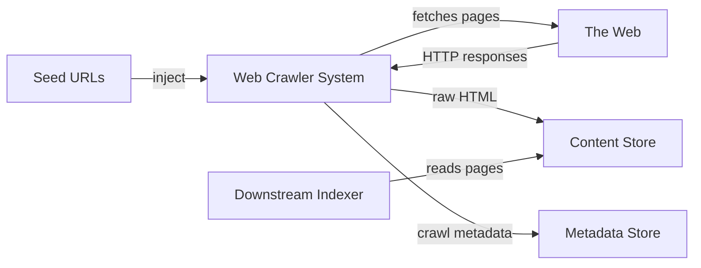
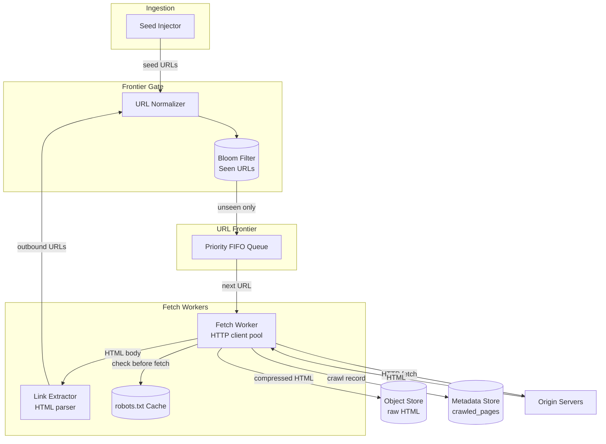

## Capacity Estimation

Start from the requirements and derive everything else — an interviewer wants to see the reasoning.

### Traffic

| Metric | Calculation | Result |
|---|---|---|
| Avg pages/s | 1B ÷ (30 × 86,400 s) | **~385 pages/s** |
| Peak pages/s (2.5× burst) | 385 × 2.5 | **~960 ≈ 1,000 pages/s** |
| Outbound links discovered/s | 385 × 50 links/page | **~19,000 URL checks/s** |

At 1,000 pages/s peak with each worker handling 50 concurrent HTTP connections and a 500 ms average round-trip, a single worker delivers ~100 pages/s. We need roughly **10–15 workers** at peak; deploy **20–30** for redundancy and re-crawl headroom.

### Storage

| Metric | Calculation | Result |
|---|---|---|
| Raw HTML per page (avg) | — | 100 KB |
| After gzip compression (~70% ratio) | 100 KB × 0.30 | **~30 KB/page** |
| Content storage/month | 1B × 30 KB | **~30 TB/month** |
| Content storage/year | 30 TB × 12 | **~360 TB/year** |
| Frontier active entries | 1–5 days of discovered URLs | **~100M–500M rows** |

Raw HTML goes to object storage (see {}); the URL frontier lives in a durable persistent store.

### Bloom Filter for URL Deduplication

A Bloom filter answers "have we seen this URL?" in O(1) with no false negatives (see {}). Sizing for 12 billion cumulative URLs after one year at 1% false-positive rate:

| Parameter | Value |
|---|---|
| Expected items (n) | 12,000,000,000 |
| Target false-positive rate (p) | 1% |
| Bits per element (m/n = ln(1/p) / ln²2) | ≈ 9.6 bits |
| Total filter size | 12B × 9.6 ÷ 8 | **~14.4 GB** |
| Optimal hash functions (k = ln2 × m/n) | ≈ 7 |

14.4 GB fits on a single large memory node, or is partitioned across a small cluster. The filter is snapshotted periodically to object storage so it survives restarts.

### Bandwidth

| Direction | Calculation | Result |
|---|---|---|
| Inbound (page fetch avg) | 385/s × 100 KB | **~38 MB/s** |
| Inbound peak | 1,000/s × 100 KB | **~100 MB/s** |
| Content store writes (compressed) | 385/s × 30 KB | **~12 MB/s** |

### Derived Infrastructure

- **Fetch workers:** 20–30 stateless nodes, each owning a subset of domains via consistent hashing.
- **Bloom filter:** 14.4 GB, sharded across 2–3 nodes if needed; 1–2 snaps/min to object storage.
- **URL frontier store:** persistent partitioned log (Kafka) with one partition per worker.
- **Metadata store (crawled\_pages):** wide-column store sized for ~12B rows/year, partitioned by domain.

## API Design

These are internal control-plane APIs used by operators and seed-injection pipelines, not end users.

```
POST /v1/crawl/seeds
  Headers: Idempotency-Key: <uuid>
  Body:    { "urls": ["https://example.com"], "priority": 0.9, "max_depth": 5 }
  202:     { "enqueued": 1, "already_seen": 0, "request_id": "<uuid>" }
  400:     malformed URL

GET /v1/crawl/url-status?url=https://example.com/page
  200:  { "url": "...", "status": "pending|crawling|done|blocked",
          "last_crawled_at": "...", "http_status": 200 }
  404:  URL not yet seen

GET /v1/pages/{content_hash}
  200:  { "url": "...", "fetched_at": "...", "content_type": "text/html",
          "storage_key": "s3://bucket/..." }

POST /v1/domains/{host}/config
  Body: { "crawl_delay_ms": 2000, "allow_crawl": true }
  200:  acknowledged
```

**Why no public API?** The crawler is a background pipeline. Operator access is authenticated; the output is raw HTML consumed by downstream indexers, not served to users.

## Data Model

Four logical entities, each stored in the system optimised for its access pattern.

**`url_frontier`** — the queue of URLs to crawl, backed by a Kafka topic partitioned by domain:

```
url_hash        CHAR(64)     -- SHA-256 of normalized URL (partition key within domain)
url             TEXT
host            TEXT         -- for routing to the correct Kafka partition / worker
priority        FLOAT        -- 0.0 (low) to 1.0 (high)
depth           INT          -- hops from nearest seed
enqueued_at     TIMESTAMP
available_at    TIMESTAMP    -- earliest time this URL may be fetched (crawl delay)
```

**`crawled_pages`** — metadata about each successful fetch (raw HTML lives in object storage):

```
host            TEXT         -- partition key
url_hash        TEXT         -- clustering key
url             TEXT
http_status     SMALLINT
content_hash    TEXT         -- SHA-256 of response body (exact dedup)
simhash         BIGINT       -- 64-bit near-duplicate fingerprint
storage_key     TEXT         -- path in object store (e.g. s3://bucket/hash)
fetched_at      TIMESTAMP
content_length  INT
change_frequency_s  INT      -- EMA of observed change interval
next_crawl_at   TIMESTAMP    -- for freshness scheduling
```

**`robots_cache`** — per-domain `robots.txt` (Redis, keyed by host, TTL 24 h):

```
host            TEXT         -- key
rules_text      TEXT
fetched_at      TIMESTAMP
expires_at      TIMESTAMP
```

**`domain_metadata`** — per-domain crawl configuration:

```
host            TEXT         -- primary key
crawl_delay_ms  INT          -- from robots.txt Crawl-delay or default 1,000 ms
last_fetched_at TIMESTAMP
worker_id       INT          -- consistent hash assignment
is_blocked      BOOLEAN      -- true if robots.txt disallows all
```

## Architecture v1

### Level 0 — Context



### Level 1 — First-Cut Components



**Component responsibilities and first-order justifications:**

- **Seed Injector.** Accepts operator-supplied or sitemap-discovered seed URLs, normalizes them, and submits to the Bloom filter gate. The entry point for bootstrapping and targeted re-crawls.
- **URL Normalizer.** Canonicalizes scheme and hostname (lowercase), sorts query parameters, strips known tracking parameters, and percent-encodes non-ASCII characters before any downstream comparison. Cheap and high-leverage — many apparent duplicates disappear here.
- **Bloom Filter (Seen URLs).** In-memory probabilistic set of all URLs ever enqueued. Provides O(1) duplicate suppression for the ~19,000 URL checks/s generated by link extraction. False positives occasionally skip a real page — acceptable. False negatives are impossible.
- **URL Frontier.** The persistent queue of URLs awaiting a fetch. In v1 this is a single FIFO queue — the deep dives evolve it into a two-level priority + per-domain structure with a durable Kafka backend.
- **Fetch Workers.** Stateless HTTP clients that pick URLs from the frontier, check `robots.txt`, enforce per-domain rate limits, fetch pages, and emit results. DNS lookups are cached locally per worker (see {}).
- **Link Extractor.** Parses HTML `<a href>` attributes, normalizes each discovered URL, and feeds it back through the Bloom filter gate to enter or be suppressed from the frontier.
- **Object Store.** Durable, cost-effective raw HTML store. Content keyed by `content_hash` enables exact content-level deduplication. See {}.
- **Metadata Store.** Lightweight crawl records used by the freshness scheduler and the control-plane API.

The v1 weaknesses are clear: a single FIFO queue ignores page importance, violates politeness (multiple workers can simultaneously hit the same domain), and has no mechanism for intelligent re-crawl scheduling. The deep-dive pages fix each of these in turn.
