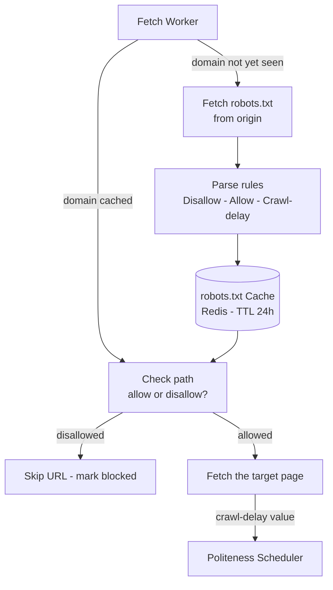
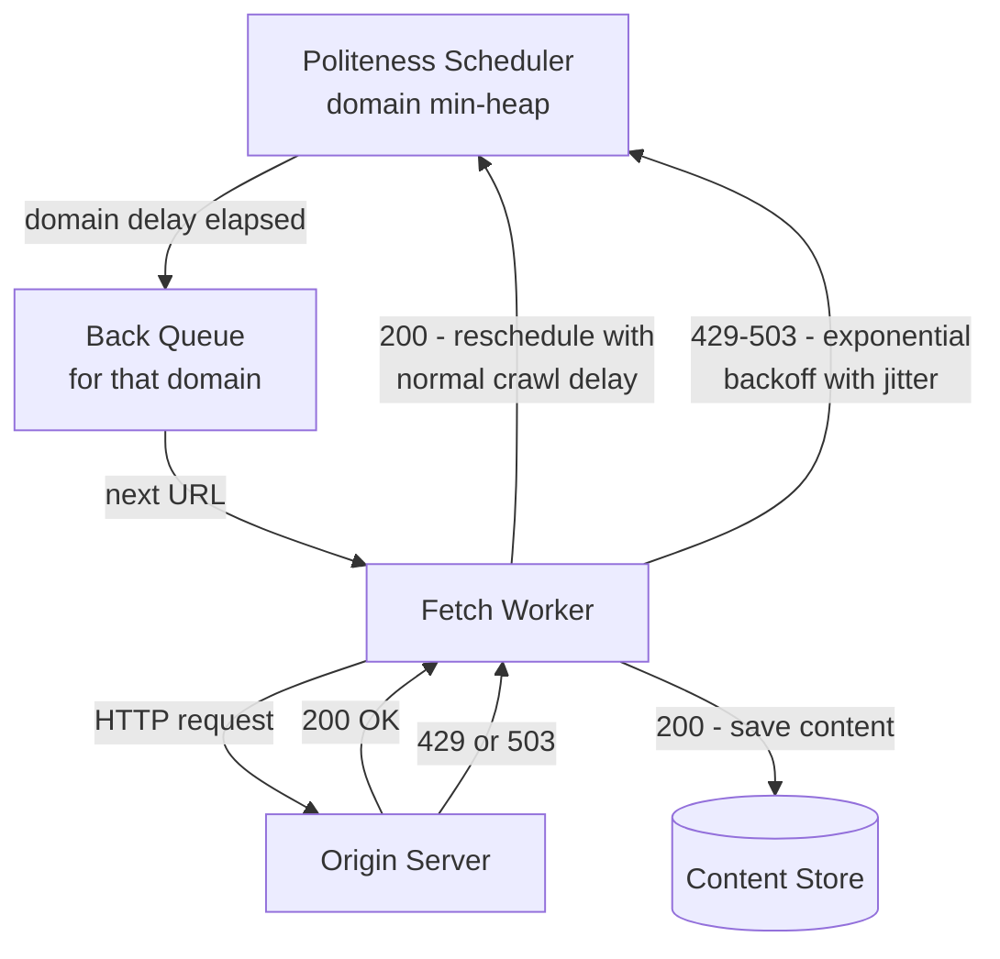
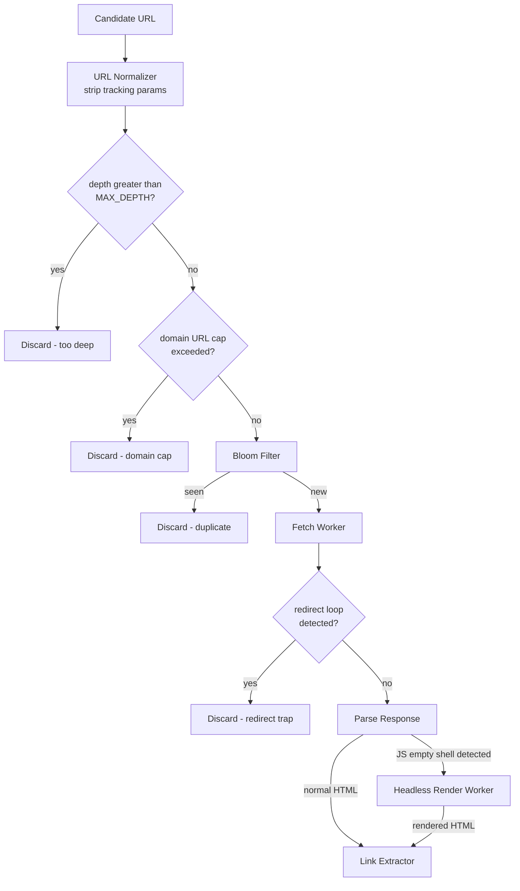

A well-designed crawler is a *good citizen* of the web — it fetches pages at a rate that does not impair origin servers, respects exclusion directives, and recognises URL traps that would consume the entire crawl budget on worthless content.

## Refinement 4 — robots.txt Compliance

**Problem.** Website operators publish a `robots.txt` file at the domain root that declares which paths crawlers may or may not access, and at what rate. Ignoring these directives is both unethical and practically dangerous — origins that detect violations will block the crawler's IP range.

**Modification.** Before the first fetch from any domain, retrieve `https://<host>/robots.txt`, parse the `User-agent` and `Disallow`/`Allow`/`Crawl-delay` rules, and cache the result. Every subsequent fetch from that domain is checked against the cached rules.

**Caching strategy:**

- Store parsed rules in a per-worker in-process LRU cache backed by Redis, keyed by `host`.
- TTL respects the `Cache-Control` / `Expires` header from the server; default to **24 hours**.
- Refresh in the background before TTL expiry so active fetches are never blocked waiting for a robots.txt re-fetch.
- If `robots.txt` returns 404 → treat as **permissive** (all paths allowed), per RFC 9309.
- If `robots.txt` returns 5xx → treat as **permissive temporarily**; retry background refresh after 1 hour.
- Extract `Crawl-delay` and store it in `domain_metadata.crawl_delay_ms`. Feed it directly to the politeness scheduler.



**Justification & trade-offs.**

- **Fetched once per domain, not per URL.** Amortises the overhead across potentially millions of URLs per domain. The Redis cache is shared across all workers on the same machine.
- **Trade-off — TTL staleness.** A domain that changes its `robots.txt` mid-crawl may be under- or over-restricted for up to 24 hours. This is the accepted industry norm (Googlebot uses similar intervals).
- **Trade-off — permissive fallback.** Treating 5xx as permissive risks crawling disallowed paths if the server is temporarily down. An alternative is to hold the domain's queue until robots.txt is available. We choose permissive to avoid stalling the crawl; log these cases for audit.

## Refinement 5 — Per-Domain Rate Limits and Backoff

**Problem.** Even with per-domain back queues and `robots.txt` Crawl-delay, the crawler can still be too aggressive: burst behaviour around delay expiry, no response to server-side 429/503 signals, and no mechanism for adaptive throttling of overloaded origins.

**Modification.** Implement a **politeness scheduler** with three layers:

1. **Static delay:** Enforce at least `max(robots_crawl_delay_ms, configured_default_ms)` between consecutive fetches from the same domain. Default: **1,000 ms**.
2. **Per-domain token bucket:** Even if the static delay has elapsed, a domain must have tokens available (see {} for the token-bucket algorithm).
3. **Adaptive backoff on 429/503:** When the origin returns HTTP 429 (Too Many Requests) or 503 (Service Unavailable), apply **exponential backoff with jitter** before requeueing. The URL is not discarded — it is returned to the back queue with an updated `available_at` timestamp.

**Politeness scheduler logic (pseudocode):**

```python
# Min-heap of (next_available_ms, domain)
heap = MinHeap()
back_queues   = {}     # domain -> deque[url]
backoff_count = {}     # domain -> int

def run_scheduler():
    while True:
        if heap.empty():
            sleep(10)
            continue
        next_ms, domain = heap.peek()
        wait = next_ms - now_ms()
        if wait > 0:
            sleep(min(wait, 10))       # sleep at most 10 ms then re-check
            continue
        heap.pop()
        if not back_queues.get(domain):
            continue                   # queue drained; domain removed from heap
        url = back_queues[domain].popleft()
        dispatch_to_worker(url, domain)

def on_url_received(url, domain):
    if domain not in back_queues:
        back_queues[domain] = deque()
        heap.push((now_ms(), domain))  # domain available immediately
    back_queues[domain].append(url)

def on_fetch_complete(domain, http_status):
    delay = domain_config[domain].crawl_delay_ms    # from robots.txt or default
    if http_status in (429, 503):
        backoff_ms = compute_backoff(domain)
        delay = max(delay, backoff_ms)
    if back_queues.get(domain):
        heap.push((now_ms() + delay, domain))

def compute_backoff(domain):
    attempt = backoff_count.get(domain, 0)
    backoff_count[domain] = attempt + 1
    base = min(60_000, 1_000 * (2 ** attempt))      # cap at 60 seconds
    return base + randint(0, base // 2)              # add jitter to spread retries
```



**Justification & trade-offs.**

- **Exponential backoff prevents thundering herd** immediately after the server recovers. Jitter spreads retries uniformly across the cooldown window.
- **Token bucket** provides burst headroom (e.g. 5 tokens max, 1 refill/s) while still enforcing average rate. This is more realistic than a pure static delay.
- **Trade-off — stalled queue.** A domain under heavy backoff (e.g. maximum 60 s) blocks its back queue slot. Implement a maximum backoff TTL (e.g. 1 hour) after which the domain is deprioritised to a low-priority front queue rather than held in the active heap.
- **Hotspot domain.** A popular domain like `reddit.com` may generate 10× the URL volume of other domains, causing its back queue to grow unboundedly. See {}: split popular domains into sub-queues by path prefix and hash `domain + path_prefix` instead of `domain` alone.

## Refinement 6 — Crawl Trap Avoidance

**Problem.** The web contains URL patterns that can consume an unbounded crawl budget on worthless content:

- **Infinite URL spaces:** Calendar navigation (`?date=2024-01-01`, `?date=2024-01-02`, …), infinite pagination (`?page=1`, `?page=2`, …), session tokens in URLs (`?sid=<uuid>`).
- **Redirect loops:** A → B → A, or A → B → C → A.
- **Link farms:** Pages with thousands of low-value outlinks all pointing within the same domain.
- **JS-rendered SPAs:** Single-Page Applications where the raw HTML fetch returns a near-empty shell with no discoverable links.

**Modifications — four defensive layers:**

### a) URL Normalization and Canonicalization

Strip known tracking/session parameters before Bloom filter insertion. This eliminates the majority of accidental traps at zero compute cost.

```python
STRIP_PARAMS = {
    "utm_source", "utm_medium", "utm_campaign", "utm_content", "utm_term",
    "sid", "session_id", "PHPSESSID", "ref", "fbclid", "gclid",
    "_ga", "mc_eid"
}

def normalize(url):
    parsed = parse_url(url)
    query  = {k: v for k, v in parsed.query_params if k not in STRIP_PARAMS}
    return rebuild_url(
        scheme = parsed.scheme.lower(),
        host   = canonicalize_host(parsed.host),   # strip www. if present
        path   = parsed.path.rstrip('/') or '/',
        query  = sorted(query.items())
    )
```

### b) Crawl Depth Limit

Every URL in the frontier carries a `depth` counter (hops from the nearest seed). URLs with `depth > MAX_DEPTH` (e.g. 10) are discarded. This bounds frontier size and cuts off deep auto-generated paths.

### c) Per-Domain URL Count Cap

Even within the depth limit, cap the total URLs crawled from any single domain (e.g. 500,000 URLs). This prevents a single massive site from consuming the entire crawl budget.

### d) Redirect Loop Detection

Maintain the redirect chain for each in-flight request. If a redirect target has already been visited in the current chain, break the loop and mark the URL as a crawler trap.

### e) Headless Rendering for JS-Heavy Pages

For URLs where the raw fetch returns near-empty HTML — detected by low `<a href>` count combined with framework-specific signatures (`<div id="root"></div>`, `__NEXT_DATA__`, etc.) — route to a **headless render worker** (Chromium via Playwright or Puppeteer) that fully renders the page in a browser sandbox before link extraction.

Headless rendering is expensive (10–20× slower, full browser process per slot) so only a small pool of render workers is maintained; routing is selective based on domain allowlist or JS-detection heuristics.



**Justification & trade-offs.**

- **URL normalization** is the highest-leverage intervention: most "infinite" calendars and session-param URL spaces disappear on stripping. Implement and tune this first.
- **Depth limits** bound the frontier size by construction. Trade-off: legitimate deep content (a long academic article series, a deep product catalogue) may be missed. Tune `MAX_DEPTH` per domain category or seed-type.
- **Headless rendering** makes JS-rendered SPAs (React, Vue, Angular) visible to the crawler. Trade-off: high resource cost and easier detection by bot-protection systems — keep the render worker pool small and route selectively.
- **Per-domain cap** prevents budget monopolisation by any single site. Trade-off: large legitimate sites (Wikipedia, GitHub) may need higher caps via operator configuration.
