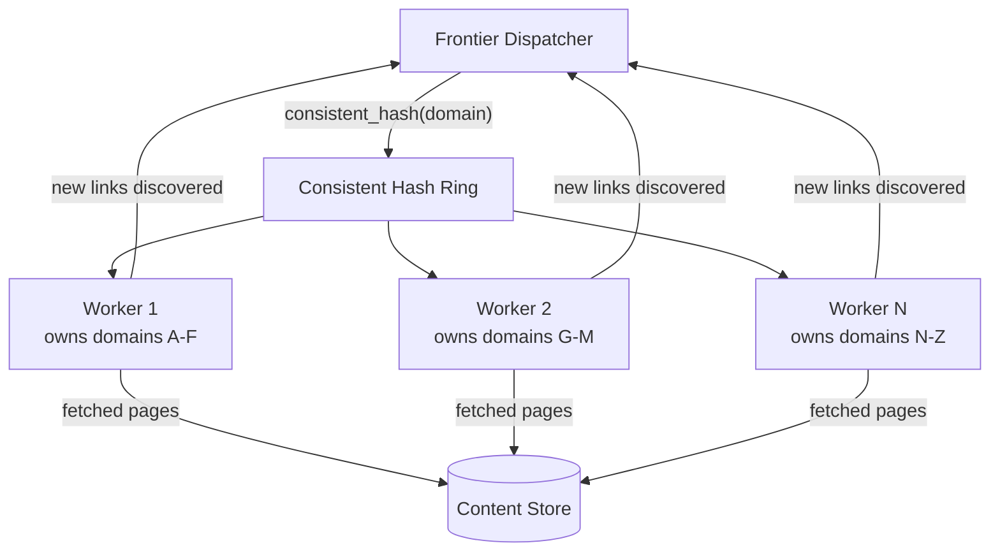
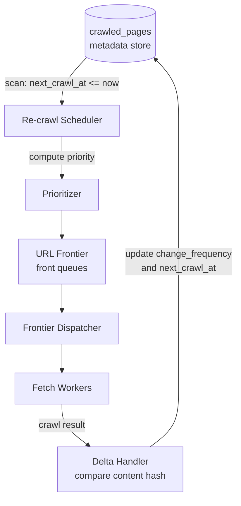
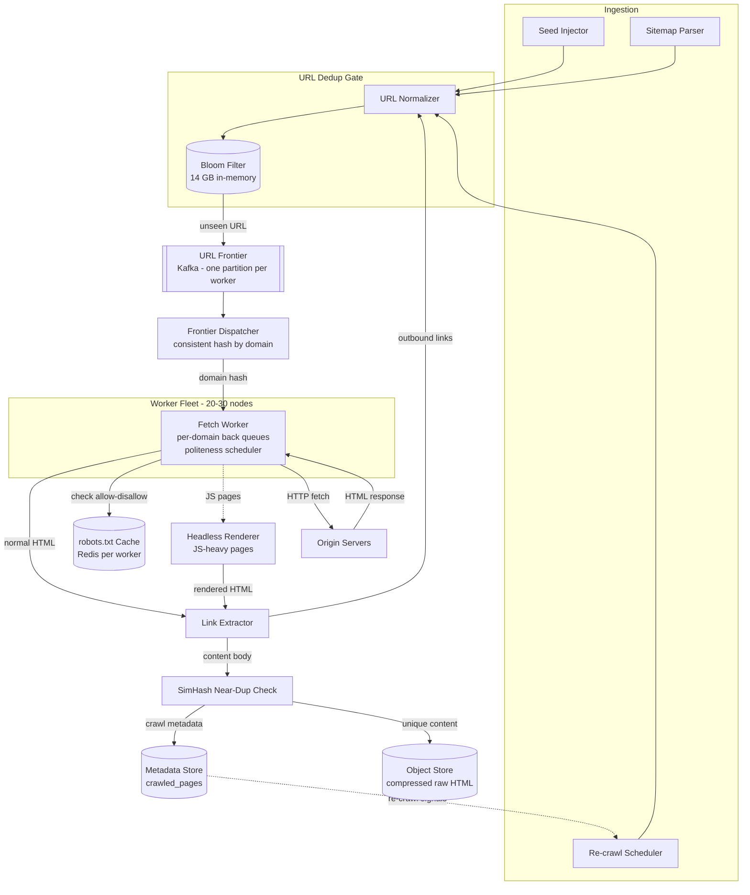

This page addresses the two remaining challenges: how a fleet of workers shares the URL frontier without politeness violations, and how the crawler decides when to re-visit pages it has already crawled.

## Refinement 7 — Distributed Worker Coordination

**Problem.** At peak 1,000 pages/s the crawler fleet has 20–30 workers. If workers independently pick URLs from a shared frontier, multiple workers can simultaneously fetch from the same domain, violating per-domain rate limits and making the politeness scheduler's per-domain back queues meaningless. A global distributed lock per domain is a bottleneck and a single point of failure.

**Modification.** Use **consistent hashing** to assign domains to workers. Every URL is routed to the worker responsible for that domain by computing `worker = consistent_hash(domain)`. All URLs for `example.com` are handled exclusively by the same worker, which then maintains that domain's back queue and rate-limiting state locally — no coordination required.

See {} for the ring algorithm details.



**Justification & trade-offs.**

- **No distributed locks required.** The domain → worker mapping is computed locally by any Frontier Dispatcher using the same hash ring; no coordination protocol is needed.
- **Politeness enforcement per worker.** Each worker runs its own in-process politeness scheduler (min-heap + per-domain back queues from the previous deep dive) with zero cross-worker interaction.
- **Horizontal scaling.** Adding a worker remaps only 1/N of domains; consistent hashing minimises unnecessary rehashing. Domains that migrate inherit their back queue and robots.txt cache via a brief handoff.
- **Worker failure.** If a worker dies, the consistent hash ring is rebalanced and its domains are absorbed by neighbours. URLs that were in-flight are requeued via the at-least-once frontier — see {}.
- **Hot domain hotspot.** `wikipedia.org` alone may generate hundreds of thousands of crawlable URLs. If one worker cannot keep pace, split the domain by path prefix: hash `domain + "/" + path_segment[0]` instead of `domain` alone, distributing one large domain across multiple workers. See {}.

### URL Frontier as a Durable Stream

The URL frontier transitions from an in-memory queue to a **durable partitioned log** — one Kafka topic with one partition per worker. The Frontier Dispatcher writes new URLs to the appropriate partition keyed by `domain`; each worker reads only from its own partition.

See {} and {} for why a stream is preferable to a queue here:

| Property | Queue (traditional) | Stream (Kafka) |
|---|---|---|
| Durability on worker crash | Message lost if un-acked | Offset replayed from last checkpoint |
| Backpressure | Limited buffering | Partition grows; no upstream blocking |
| Replay for Bloom filter sync | Not possible | Replay from any offset |
| Multi-consumer | Competing consumers | Each partition owned by one consumer |

A worker commits its Kafka consumer offset only after the page is **fully processed** (content stored, links extracted, new URLs emitted). An uncommitted offset is replayed on restart — at-least-once delivery. The Bloom filter and content hash dedup ensure replayed URLs are idempotent.

## Refinement 8 — Freshness and Re-Crawl Scheduling

**Problem.** The web is not static. News pages update hourly; marketing landing pages never change; Wikipedia articles are updated daily. A fixed re-crawl interval wastes budget on static pages and misses updates on dynamic ones.

**Modification.** Implement an **adaptive re-crawl scheduler** that estimates each page's update frequency and adjusts the crawl interval accordingly.

For every crawled URL, maintain in `crawled_pages`:

- `last_crawled_at`: timestamp of the most recent successful fetch.
- `last_changed_at`: timestamp of the most recent fetch where `content_hash` changed.
- `change_frequency_s`: exponential moving average (EMA) of observed change intervals.

**Re-crawl interval algorithm:**

```python
ALPHA     = 0.3           # EMA smoothing factor (higher = more reactive to recent changes)
MIN_CRAWL = 3_600         # 1 hour minimum
MAX_CRAWL = 2_592_000     # 30 days maximum

def on_crawl_result(url_record, new_content_hash, now):
    changed = (new_content_hash != url_record.content_hash)
    if changed:
        interval = now - url_record.last_changed_at
        url_record.change_frequency_s = (
            ALPHA * interval + (1 - ALPHA) * url_record.change_frequency_s
        )
        url_record.last_changed_at = now
    url_record.content_hash    = new_content_hash
    url_record.last_crawled_at = now
    url_record.next_crawl_at   = now + clamp(
        url_record.change_frequency_s, MIN_CRAWL, MAX_CRAWL
    )

def compute_priority(url_record, now):
    # Higher domain rank, higher change rate, longer staleness -> higher priority
    staleness = now - url_record.last_crawled_at
    return (
        0.4 * domain_rank(url_record.host)
      + 0.4 * (1.0 / max(1, url_record.change_frequency_s))
      + 0.2 * (staleness / MAX_CRAWL)
    )
```

A dedicated **re-crawl scheduler job** (see {}) runs periodically, queries `crawled_pages` for rows where `next_crawl_at ≤ now`, computes priorities, and injects URLs back into the frontier.

**Sitemap acceleration.** Many sites publish `sitemap.xml` with `<lastmod>` timestamps. Parsing sitemaps provides a lightweight freshness signal that can pre-empt the EMA and schedule re-crawls before the interval estimate would fire.



**Justification & trade-offs.**

- **Adaptive scheduling concentrates budget on changing pages.** A news site with a 1-hour EMA gets re-crawled hourly; a static marketing page with a 30-day EMA gets checked monthly.
- **EMA lags sudden shifts.** A page that was static for months and suddenly starts updating hourly will be under-crawled until the EMA adjusts. Mitigate with a hard cap: any page not checked in > 30 days is re-queued regardless of the EMA.
- **Sitemaps as an override.** When `<lastmod>` in a sitemap is newer than `last_crawled_at`, immediately queue the URL at high priority — bypassing the EMA interval entirely.
- **Trade-off — re-crawl load spikes.** If many pages have similar `next_crawl_at` values (e.g. all set to midnight daily), the re-crawl scheduler emits a burst. Add uniform random jitter of ±10% to `next_crawl_at` to spread the load.

## Final Architecture



## Drill-Down

### Detailed APIs

**Seed injection with idempotency:**
```
POST /v1/crawl/seeds
  Headers: Authorization: Bearer <token>
           Idempotency-Key: <uuid>
  Body:    { "urls": ["https://example.com"], "priority": 0.9, "max_depth": 5 }
  202:     { "enqueued": 1, "already_seen": 0, "request_id": "<uuid>" }
  400:     malformed URL in list
```

**Domain status (internal monitoring and operator tooling):**
```
GET /v1/crawl/domains/{host}/status
  200:  {
    "host":             "example.com",
    "worker_id":        2,
    "crawl_delay_ms":   1000,
    "last_fetched_at":  "2025-07-23T10:00:00Z",
    "next_available_at":"2025-07-23T10:00:01Z",
    "queue_depth":      142,
    "backoff_until":    null,
    "robots_disallowed_paths": ["/admin", "/private"]
  }
```

**Re-crawl schedule override (operator emergency refresh):**
```
POST /v1/crawl/urls/{url_hash}/refresh
  Body: { "priority": 1.0 }
  202:  { "queued": true, "estimated_crawl_at": "2025-07-23T10:05:00Z" }
```

### Database Schema

**`url_frontier`** — backed by Kafka topic `url-frontier`, N partitions (one per worker):

```
Kafka message key:   <domain>                   # determines partition via consistent hash
Kafka message value: {
  "url_hash":     "sha256:abc123...",
  "url":          "https://example.com/page",
  "host":         "example.com",
  "priority":     0.85,
  "depth":        3,
  "enqueued_at":  "2025-07-23T10:00:00Z",
  "available_at": "2025-07-23T10:00:01Z"       # earliest fetch time (crawl delay)
}
```

Consumer offset committed only after full processing (at-least-once delivery).

**`crawled_pages`** — wide-column store (Cassandra-style), see {}:

```
Partition key:   host           -- all pages for a domain co-located
Clustering key:  url_hash       -- point lookups and domain-level scans

Fields:
  url             TEXT
  http_status     SMALLINT
  content_hash    TEXT          -- SHA-256 for exact dedup
  simhash         BIGINT        -- 64-bit near-dup fingerprint
  storage_key     TEXT          -- s3://bucket/<content_hash>
  fetched_at      TIMESTAMP
  content_length  INT
  change_frequency_s  INT       -- EMA of change intervals
  next_crawl_at   TIMESTAMP     -- re-crawl scheduler reads this
```

Partitioned by `host` so the re-crawl scheduler can do efficient per-domain scans (`SELECT WHERE host = ? AND next_crawl_at <= ?`).

**`robots_cache`** — Redis hash, keyed by `host`, TTL 86,400 s:
```
HSET robots:<host>
  rules_text   "<raw robots.txt content>"
  fetched_at   1721728800
  expires_at   1721815200
```

### Data Structures

| Structure | Where | Why |
|---|---|---|
| Bloom filter (14.4 GB) | URL dedup gate | O(7) bit probes for 50K URL checks/s; 1% FP acceptable |
| Min-heap of (next\_avail\_ms, domain) | Politeness scheduler per worker | O(log D) to find soonest-available domain |
| Per-domain FIFO deque | Back queues per worker | One in-flight URL per domain at a time |
| Kafka topic (partitioned by domain) | URL frontier | Durable, replayable, naturally partitioned; no lost URLs on crash |
| Consistent hash ring | Frontier Dispatcher | Domain → worker assignment with minimal rehash on scale-out |
| SimHash + LSH tables | Content dedup | O(1) amortised near-duplicate detection across billions of pages |
| LRU cache (in-process + Redis) | robots.txt per worker | Avoid re-fetching on every URL |
| EMA counter | Freshness scheduler | Adaptive re-crawl interval proportional to observed change rate |

### Key Algorithms

**Consistent hash domain-to-worker routing:**
```python
ring = ConsistentHashRing(workers=25, virtual_nodes_per_worker=150)

def route_url(url):
    domain   = extract_domain(url)
    worker   = ring.get_node(domain)        # O(log W) on sorted virtual-node list
    partition = worker                      # 1:1 worker-to-partition mapping
    kafka_produce(topic="url-frontier", partition=partition,
                  key=domain, value=serialize(url))
```

**Per-worker politeness scheduler (condensed):**
```python
def run():
    while True:
        now = now_ms()
        if heap.empty() or heap.peek().next_ms > now:
            sleep(min(10, heap.peek().next_ms - now if heap else 10))
            continue
        _, domain = heap.pop()
        url = back_queues[domain].popleft()
        result = fetch(url)                 # synchronous within this worker
        handle_result(domain, result)

def handle_result(domain, result):
    extract_links(result)                   # feeds back into URL dedup gate
    store_content(result)                   # object store + metadata
    update_crawl_record(result)             # update change_frequency, next_crawl_at
    delay = max(domain_config[domain].crawl_delay_ms,
                compute_backoff(domain) if result.status in (429, 503) else 0)
    if back_queues[domain]:
        heap.push((now_ms() + delay, domain))
```

### Edge Cases and Failure Handling

- **Worker crash mid-fetch.** Kafka consumer offset is uncommitted; the URL is replayed on restart. The Bloom filter prevents re-enqueuing the URL's outlinks; the content hash dedup prevents re-storing identical content. At-least-once delivery is safe.
- **Bloom filter restart.** The bit-array cannot be reconstructed from Kafka alone. Snapshot to object storage every 5 minutes. On restart: load latest snapshot, then replay Kafka from the checkpoint offset to recover recent additions.
- **robots.txt 5xx.** Treat as permissive; log for audit; retry background refresh after 1 hour. Never stall the entire domain queue.
- **Infinite redirect chain.** Cap redirect follows at 5 hops. If the chain exceeds this, record the URL as a crawler trap, discard, and mark the domain for inspection.
- **Encoding and IDNs.** Normalise URLs to UTF-8; encode internationalized domain names (IDNs) as punycode before Bloom filter insertion to prevent encoding-variant duplicates.
- **Pathologically large pages.** Truncate response bodies at 10 MB. Log the truncation; extract what links are present in the truncated body. This prevents memory exhaustion from tarpit servers serving infinite streams.
- **DNS failures.** Cache NXDOMAIN responses for 1 hour. Do not hammer DNS for non-existent domains. See {} for DNS caching strategies.
- **Consistent hash rebalancing.** When a worker is added or removed, the consistent hash ring remaps ~1/N of domains. The handoff window is brief; in-flight URLs for remapped domains are replayed from Kafka by the new owner.
